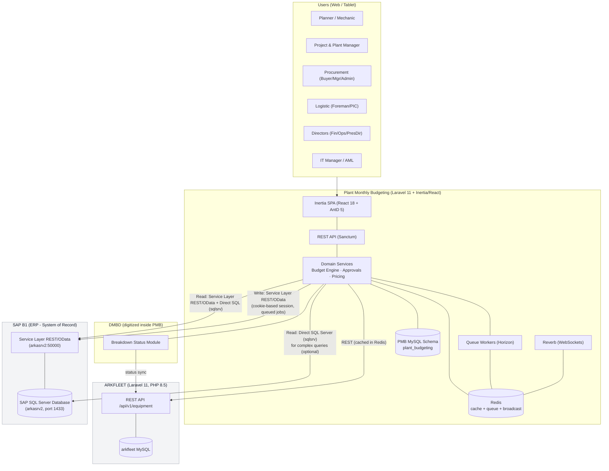
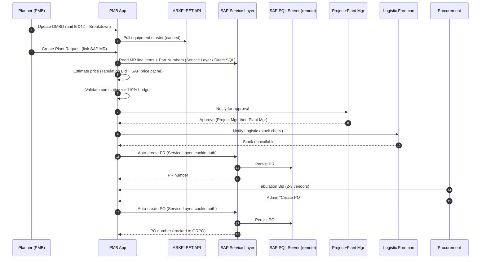
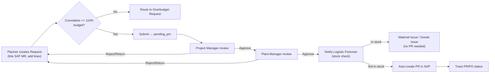
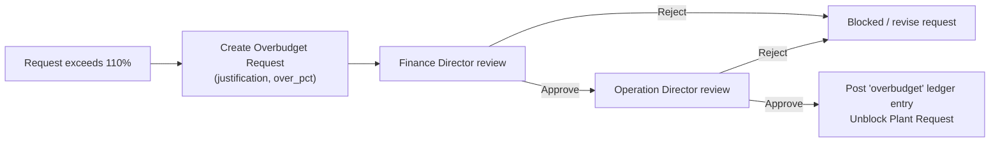
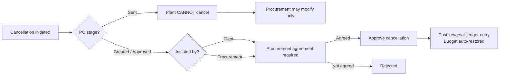
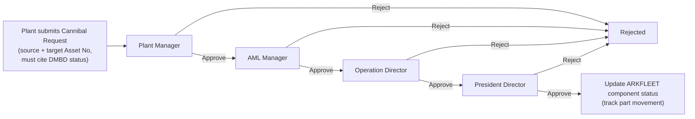
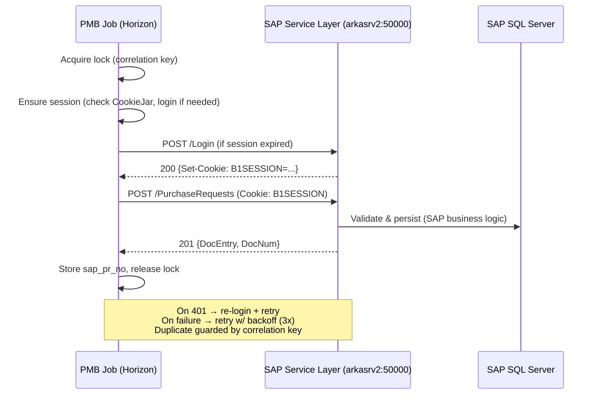

# Plant Monthly Budgeting — Dokumen Konsep & Rekomendasi

> **Status:** Draft untuk review Direksi · **Versi:** 1.0 · **Tanggal:** 3 Agu 2026
> **Penulis:** Senior CPA / Laravel Architect (Iwan)
> **Audiens:** Board of Directors, IT Steering Committee, jajaran manajemen Plant & Procurement
> **Klasifikasi:** Internal — Governance & Financial Controls

---

## Table of Contents (Daftar Isi)

1. [Executive Summary](#1-executive-summary) (Ringkasan Eksekutif)
2. [System Architecture](#2-system-architecture) (Arsitektur Sistem)
3. [ERD (Entity Relationship Diagram)](#3-erd-entity-relationship-diagram) (Diagram Relasi Entitas)
4. [Core Modules & Features](#4-core-modules--features) (Modul & Fitur Utama)
5. [Approval Workflows](#5-approval-workflows) (Alur Persetujuan)
6. [Role & Permission Matrix](#6-role--permission-matrix) (Matriks Peran & Hak Akses)
7. [SAP Integration Specification](#7-sap-integration-specification) (Spesifikasi Integrasi SAP)
8. [ARKFLEET Integration Specification](#8-arkfleet-integration-specification) (Spesifikasi Integrasi ARKFLEET)
9. [UX & Frontend Architecture](#9-ux--frontend-architecture) (Arsitektur UX & Frontend)
10. [Implementation Phases](#10-implementation-phases) (Fase Implementasi)
11. [Technical Decisions & Trade-offs](#11-technical-decisions--trade-offs) (Keputusan Teknis & Trade-off)
12. [Open Questions & Recommendations](#12-open-questions--recommendations) (Pertanyaan Terbuka & Rekomendasi)
13. [Risk Assessment](#13-risk-assessment) (Penilaian Risiko)

---

## 1. Executive Summary (Ringkasan Eksekutif)

### 1.1 Masalah yang Dihadapi

Sebagai kontraktor tambang, biaya operasional terbesar yang dapat kita kendalikan adalah **pemeliharaan dan pengadaan spare parts untuk alat berat** (excavator/DIGGER, haul truck/HAULER, dozer/SUPPORT). Saat ini biaya tersebut — sekitar **20–30% dari total belanja perusahaan** — dikelola melalui kombinasi yang terfragmentasi antara file Excel, rangkaian email, dan input data manual ke SAP B1. Kondisi ini menimbulkan lima kelemahan struktural:

1. **Tidak ada batas anggaran (budget ceiling) yang ditegakkan pada saat pengajuan permintaan.** Planner mengajukan Material Request tanpa sistem yang memvalidasi belanja terhadap alokasi bulanan yang telah disetujui Finance Director. Belanja yang melebihi anggaran baru diketahui *setelah* uang berkomitmen, bukan sebelumnya.
2. **Perbandingan vendor yang terfragmentasi.** **Tabulation Bid** (perbandingan 2–3 vendor) berupa file Excel yang formatnya berbeda-beda untuk setiap Buyer, sehingga governance harga dan audit trail menjadi tidak konsisten.
3. **Lifecycle pengadaan yang tidak transparan.** Rangkaian MR → PQ → PR → PO → GRPO berada di SAP, namun Plant Division tidak memiliki visibilitas terkonsolidasi mengenai *di mana* posisi suatu permintaan, *mengapa* tertunda, atau *berapa besar* anggaran yang terserap.
4. **Status aset manual (DMBD).** Status Ready/Standby/Breakdown peralatan dikirim melalui email dalam bentuk spreadsheet, terputus dari permintaan yang seharusnya dipicu oleh suatu breakdown.
5. **Substitusi & kanibalisasi yang tidak terkontrol.** Interchange part Genuine ↔ OEM dan kanibalisasi antar-unit terjadi secara informal, di luar pencocokan P/N yang persis di SAP, sehingga menimbulkan gap rekonsiliasi dan risiko audit.

### 1.2 Solusi yang Ditawarkan

**Plant Monthly Budgeting (PMB)** adalah aplikasi web on-premise yang menjadi **lapisan governance dan kontrol** di atas sistem-sistem yang sudah ada di perusahaan. PMB **tidak** menggantikan SAP B1 (sistem ERP sebagai system of record) maupun ARKFLEET (sistem aset sebagai system of record). Sebaliknya, PMB:

- **Menegakkan batas anggaran *sebelum* terjadi komitmen** — total permintaan dibatasi tegas pada **≤ 110% dari anggaran yang dialokasikan** (toleransi terkontrol 10%), dengan belanja di atas anggaran dipaksa melalui alur persetujuan terpisah yaitu Finance Director + Operation Director.
- **Menstandarkan Tabulation Bid** menjadi perbandingan vendor yang terstruktur dan auditable, dengan **pembuatan PO otomatis** yang terkontrol dan dikirim ke SAP hanya dengan satu klik.
- **Menyediakan satu tampilan terpadu (single pane of glass)** atas lifecycle pengadaan di SAP, diperkaya dengan status alur kerja Plant Budgeting (persetujuan, komentar keterlambatan, penyerapan anggaran).
- **Mendigitalisasi DMBD**, mengambil master daftar aset dari ARKFLEET dan mengalirkan kejadian breakdown ke dalam alur Work Order → Material Request.
- **Mengatur substitusi dan kanibalisasi** melalui pemetaan Interchange yang eksplisit (disinkronkan ke SAP) dan alur persetujuan Cannibal multi-level (Beta).

### 1.3 Dampak Bisnis

| Value Driver | Mekanisme | Hasil yang Diharapkan |
|---|---|---|
| **Kontrol biaya** | Validasi anggaran 110% sebelum komitmen; carry-forward otomatis dan kalkulasi variance | Menghilangkan pembengkakan biaya yang tidak terduga; setiap rupiah dapat ditelusuri ke alokasi yang telah disetujui |
| **Pencegahan fraud** | Persetujuan PO oleh President Director untuk pengadaan bernilai tinggi; segregation of duties yang ditegakkan oleh matriks peran; audit log yang lengkap dan tidak dapat diubah | PO bernilai tinggi tidak dapat diterbitkan tanpa persetujuan level tertinggi |
| **Efisiensi pengadaan** | Tabulation Bid yang terstandarisasi + auto-PO; auto-creation PR di SAP; pelacakan status real-time | Waktu siklus lebih singkat dari breakdown hingga spare parts tersedia di lokasi; lebih sedikit rework |
| **Governance & kepatuhan** | Alur persetujuan yang ditegakkan; keselarasan dengan Good Mining Practice; jejak audit yang lengkap | Kontrol yang dapat dipertahankan untuk audit internal/eksternal |
| **Kontinuitas operasional** | Keterkaitan DMBD → WO → MR; fleksibilitas interchange & cannibal dengan kontrol | Respons lebih cepat terhadap breakdown tanpa mengorbankan disiplin keuangan |

### 1.4 Metrik Governance Utama

- **Materialitas anggaran:** Plant Division adalah konsumen anggaran utama dengan **~20–30% dari total belanja perusahaan**.
- **Toleransi anggaran:** Kumulatif permintaan yang disetujui **≤ 110%** dari alokasi bulanan (**toleransi tegas 10%**); di luar itu memerlukan alur Overbudget.
- **Siklus anggaran:** Alokasi **rolling 6 bulan**; pengguna dapat melihat bulan sebelumnya / berjalan / berikutnya; **hanya bulan berjalan yang dapat diedit** (Finance Director dapat merevisi bulan berjalan + bulan mendatang).
- **Kedalaman persetujuan:**
  - Plant Request: **2 approver** (Project Manager + Plant Manager) sebelum pembuatan PR.
  - Tabulation Bid → PO: review Procurement Manager → Admin → persetujuan PO oleh **President Director**.
  - Overbudget: **Finance Director + Operation Director**.
  - Cannibal (Beta): **rantai 4 level** (Plant Manager → AML Manager → Operation Director → President Director).

### 1.5 Batasan Lingkup (Yang *Bukan* Merupakan Bagian dari PMB)

- PMB **bukan** ERP. SAP B1 tetap menjadi sistem transaksional yang menjadi system of record untuk MR/PR/PO/GRPO/inventory.
- PMB **bukan** register aset. ARKFLEET tetap menjadi master untuk equipment, status unit, dan pembacaan HM/KM.
- PMB **tidak menduplikasi** tabel equipment atau tabel transaksi SAP. PMB menyimpan foreign key dan field tampilan yang di-cache, serta **memperluas** record tersebut dengan status budgeting/workflow.

---

## 2. System Architecture (Arsitektur Sistem)

### 2.1 Arsitektur Tingkat Tinggi



**Cara membaca diagram di atas:**
- **PMB → ARKFLEET** = **REST API** melalui Tailscale, terautentikasi dengan Laravel Sanctum Bearer token (`abilities:api:read`). Hasilnya di-cache di Redis. PMB tidak pernah mengakses database ARKFLEET secara langsung. Semua endpoint telah dikonfirmasi dari codebase arkfleet-next — lihat §8 untuk katalog lengkapnya.
- **PMB → SAP (read)** = **pendekatan dua tingkat**: (1) **Service Layer REST/OData** (`https://arkasrv2:50000/b1s/v1/`) untuk query entity standar — terdokumentasi, stabil, didukung resmi oleh SAP; (2) **Direct SQL Server** (driver `sqlsrv`, host `arkasrv2`, port 1433) sebagai fallback untuk join yang kompleks dan field UDF yang tidak dapat diakses melalui OData — misalnya `list_ITO.sql` dengan multi-table join dan custom field. Service Layer adalah jalur utama; SQL langsung digunakan saat pemetaan field OData gagal.
- **PMB → SAP (write)** = melalui **Service Layer REST API** (autentikasi berbasis session cookie — lihat §7.2), **tidak pernah** melalui raw SQL INSERT. Semua penulisan data dijalankan sebagai queued job yang idempotent.
- **SAP B1 adalah database SQL Server**, bukan MySQL. SAP berjalan pada host terpisah (`arkasrv2`). Koneksi `sap_sql` menggunakan ekstensi PHP `sqlsrv`, bukan MySQL.

### 2.2 Technology Stack & Alasan Pemilihan

| Layer | Teknologi | Alasan |
|---|---|---|
| Backend framework | **Laravel 11+ (PHP 8.3/8.4)** | Sesuai dengan standar perusahaan (arkfleet-next). Stack queue/broadcast/validation yang matang; dukungan transaksi bergrade akuntansi melalui DB transactions & events. |
| Frontend | **React 18 + Inertia.js + Ant Design 5** | Inertia menghilangkan kebutuhan layer SPA API terpisah untuk halaman internal sambil tetap mempertahankan DX React. **AntD ProTable/ProForm** memberikan tabel, filter, dan scaffolding form bergrade enterprise secara out-of-the-box — ideal untuk approval queue, grid perbandingan vendor, tabel anggaran. |
| **Database** | **MySQL 8.4** (schema milik PMB sendiri `plant_budgeting`) + **SQL Server** (SAP B1, remote host `arkasrv2:1433`, diakses melalui ekstensi PHP `sqlsrv`) | PMB memiliki schema-nya sendiri; data SAP dibaca secara remote — tidak pernah diduplikasi secara lokal. |
| Auth | **Laravel Sanctum** | Autentikasi session SPA untuk Inertia + API token untuk komunikasi machine-to-machine (misalnya mobile di masa depan). Lebih ringan dibandingkan Passport; cukup untuk aplikasi internal on-prem. |
| Queue | **Redis + Laravel Horizon** | Pemrosesan asinkron yang reliable untuk penulisan ke SAP (pembuatan PR/PO), sinkronisasi ARKFLEET, notifikasi. Horizon memberikan visibilitas/retry/monitoring untuk job-job yang kritikal secara finansial. |
| Cache | **Redis** | Cache equipment ARKFLEET dan cache harga SAP; mengurangi beban pada sistem-sistem terkait dan mempercepat form permintaan. |
| Real-time | **Laravel Reverb** | Server WebSocket first-party (cocok untuk on-prem, tanpa pihak ketiga seperti Pusher). Menggerakkan notifikasi persetujuan dan alert ambang batas anggaran. |
| PDF | **barryvdh/laravel-dompdf** | Laporan anggaran, dokumen PO, cetakan Tabulation Bid. Tanpa dependensi biner native; sesuai dengan batasan deployment kita yang hanya berbasis PHP. |
| Deployment | **On-premise Linux** | Keputusan perusahaan yang didorong oleh pertimbangan keamanan. Database lokal, tanpa cloud. |

### 2.3 Aliran Data (End-to-End: Breakdown → Spare Parts Tiba di Lokasi)



### 2.4 Ringkasan Strategi Integrasi

| Titik Integrasi | Arah | Mekanisme | Alasan |
|---|---|---|---|
| Equipment/project ARKFLEET | Read | **REST API** + cache Redis | Menghormati batas kepemilikan layanan (service ownership boundary); menghindari duplikasi tabel aset; API sudah tersedia. |
| MR/PR/PO/GRPO/inventory SAP | Read | **Service Layer REST/OData** (utama) + **Direct SQL Server / sqlsrv** (untuk query kompleks/gap OData) | Service Layer terdokumentasi & stabil; SQL langsung mengisi gap OData (field UDF, multi-table join, ketidaksesuaian nama field). Remote SQL Server host `arkasrv2:1433`. |
| Pembuatan PR/PO di SAP | Write | **Service Layer REST/OData** melalui queued job — **autentikasi session berbasis cookie** (Guzzle CookieJar) | Integritas data — business logic SAP harus tetap berjalan; Service Layer adalah jalur write resmi. Autentikasi cookie (B1SESSION + ROUTEID) dikelola otomatis oleh Guzzle. |
| Harga / vendor master SAP | Read | **Service Layer REST/OData** (utama) + di-cache di Redis | Query entity standar; refresh cache harian dengan fallback saat data basi (stale). |
| Status DMBD → ARKFLEET | Write | **REST API** (sinkronisasi status) | Menjaga ARKFLEET sebagai sumber kebenaran (source of truth) untuk status aset. |
| Persetujuan / alert | Push | **Reverb WebSockets** | UX real-time untuk persetujuan yang sensitif terhadap waktu. |

---

## 3. ERD (Entity Relationship Diagram / Diagram Relasi Entitas)

**Prinsip desain:** Tabel PMB mereferensikan record eksternal melalui ID dan menyimpan cache dari sekumpulan *minimal* field tampilan untuk performa dan stabilitas audit (misalnya, `unit_code` pada saat permintaan dibuat). Tabel sumber kebenaran eksternal (ARKFLEET `equipment`, `projects`; SAP `MR/PR/PO/GRPO`) **tidak dibuat ulang** — melainkan direpresentasikan sebagai ID referensi dan ditampilkan sebagai garis putus-putus/eksternal di bawah ini.

```mermaid
erDiagram
    %% ================= EXTERNAL (NOT created by PMB) =================
    ARK_EQUIPMENT ||--o{ BUDGET_ALLOCATION : "equipment_id (FK, ARKFLEET)"
    ARK_PROJECT   ||--o{ BUDGET_PERIOD : "project_code (FK, ARKFLEET)"
    SAP_MR        ||--o{ PLANT_REQUEST : "sap_mr_id (FK, SAP)"
    SAP_PR        ||--o{ PLANT_REQUEST : "sap_pr_id (FK, SAP)"
    SAP_PO        ||--o{ TABULATION_BID : "sap_po_id (FK, SAP)"

    %% ================= BUDGETING DOMAIN =================
    BUDGET_PERIOD ||--o{ BUDGET_ALLOCATION : contains
    BUDGET_ALLOCATION ||--o{ BUDGET_LEDGER : "posts to"
    BUDGET_ALLOCATION ||--o{ PLANT_REQUEST : "consumed by"
    BUDGET_ALLOCATION ||--o{ OVERBUDGET_REQUEST : "escalated by"

    %% ================= PLANT REQUEST DOMAIN =================
    PLANT_REQUEST ||--o{ PLANT_REQUEST_LINE : has
    PLANT_REQUEST ||--o{ REQUEST_APPROVAL : "routed through"
    PLANT_REQUEST ||--o{ REQUEST_COMMENT : "annotated by"
    PLANT_REQUEST ||--o{ CANCELLATION_REQUEST : "may be cancelled by"
    PLANT_REQUEST_LINE }o--o| INTERCHANGE_MAP : "resolved via"

    %% ================= PROCUREMENT DOMAIN =================
    TABULATION_BID ||--o{ TABULATION_BID_VENDOR : compares
    TABULATION_BID ||--o{ REQUEST_APPROVAL : "authorized via"
    TABULATION_BID_VENDOR ||--o| TABULATION_BID_AWARD : "winner"

    %% ================= DMBD DOMAIN =================
    DMBD_ENTRY }o--|| ARK_EQUIPMENT : "equipment_id (FK, ARKFLEET)"
    DMBD_ENTRY ||--o{ PLANT_REQUEST : "may trigger"

    %% ================= INTERCHANGE DOMAIN =================
    INTERCHANGE_MAP }o--|| USER : "created_by"

    %% ================= CANNIBAL (BETA) =================
    COMPONENT ||--o{ COMPONENT : "parent_id (hierarchy)"
    COMPONENT }o--|| ARK_EQUIPMENT : "installed_on equipment_id"
    CANNIBAL_REQUEST }o--|| ARK_EQUIPMENT : "source_equipment_id"
    CANNIBAL_REQUEST }o--|| ARK_EQUIPMENT : "target_equipment_id"
    CANNIBAL_REQUEST ||--o{ COMPONENT : "moves"
    CANNIBAL_REQUEST ||--o{ REQUEST_APPROVAL : "4-level chain"

    %% ================= IDENTITY & AUDIT =================
    USER ||--o{ ROLE_USER : has
    ROLE ||--o{ ROLE_USER : assigned
    ROLE ||--o{ PERMISSION_ROLE : grants
    PERMISSION ||--o{ PERMISSION_ROLE : granted
    USER ||--o{ REQUEST_APPROVAL : "acts as approver"
    USER ||--o{ AUDIT_LOG : generates

    BUDGET_PERIOD {
        bigint id PK
        string project_code "FK ARKFLEET projects"
        string project_name_cache
        date period_month "1st of month; 6-month cycle"
        enum status "draft|open|locked|closed"
        bigint created_by FK
        timestamp created_at
    }

    BUDGET_ALLOCATION {
        bigint id PK
        bigint budget_period_id FK
        bigint equipment_id "FK ARKFLEET equipment (nullable=division-level)"
        string unit_code_cache
        string plant_type_cache "DIGGER|HAULER|SUPPORT"
        decimal allocated_amount "IDR 18,2"
        decimal tolerance_pct "default 10.00"
        decimal carry_forward_in "from prior month"
        decimal committed_amount "sum approved requests"
        decimal actual_amount "from SAP GRPO"
        bool is_editable "true only for current month"
        timestamp updated_at
    }

    BUDGET_LEDGER {
        bigint id PK
        bigint budget_allocation_id FK
        enum entry_type "allocation|commitment|actual|carry_forward|reversal|overbudget"
        decimal amount "signed IDR 18,2"
        string ref_type "plant_request|po|grpo|cancellation"
        bigint ref_id
        text memo
        bigint posted_by FK
        timestamp posted_at
    }

    PLANT_REQUEST {
        bigint id PK
        string request_no "PMB-REQ-YYYYMM-####"
        bigint budget_allocation_id FK
        bigint equipment_id "FK ARKFLEET"
        string unit_code_cache
        bigint dmbd_entry_id FK "nullable"
        bigint sap_mr_id "FK SAP (required)"
        string sap_pr_no "nullable until PR created"
        enum status "draft|pending_pm|pending_plant_mgr|approved|pr_created|po_created|received|cancelled|rejected"
        decimal estimated_total "IDR 18,2"
        decimal budget_utilization_pct "at submission"
        bigint requested_by FK "Planner"
        timestamp submitted_at
    }

    PLANT_REQUEST_LINE {
        bigint id PK
        bigint plant_request_id FK
        string part_number "P/N from Part Book"
        string material_name
        string uom
        int qty
        decimal unit_price_est "IDR 18,2"
        string price_source "tabulation_bid|sap_price|manual|none"
        bigint interchange_map_id FK "nullable"
        decimal line_total
    }

    REQUEST_APPROVAL {
        bigint id PK
        string approvable_type "PlantRequest|TabulationBid|OverbudgetRequest|CannibalRequest|CancellationRequest"
        bigint approvable_id
        int step_order
        string required_role "e.g. project_manager"
        bigint approver_id FK "nullable until acted"
        enum decision "pending|approved|rejected|returned"
        text remarks
        timestamp acted_at
    }

    REQUEST_COMMENT {
        bigint id PK
        bigint plant_request_id FK
        enum category "delay|indent|constraint|general"
        text body
        bigint author_id FK
        timestamp created_at
    }

    TABULATION_BID {
        bigint id PK
        string bid_no "PMB-BID-YYYYMM-####"
        string sap_pr_id "FK SAP PR"
        enum status "draft|pending_proc_mgr|forwarded_admin|po_created|closed"
        bigint created_by FK "Buyer"
        bigint reviewed_by FK "Procurement Manager"
        string sap_po_id "nullable until PO"
        timestamp created_at
    }

    TABULATION_BID_VENDOR {
        bigint id PK
        bigint tabulation_bid_id FK
        string vendor_code "SAP vendor master"
        string vendor_name
        decimal price "IDR 18,2"
        string payment_terms
        enum stock_availability "ready|indent|partial"
        text remarks "warranty, free parts, etc"
        int rank
    }

    TABULATION_BID_AWARD {
        bigint id PK
        bigint tabulation_bid_id FK
        bigint tabulation_bid_vendor_id FK
        text justification
        bigint awarded_by FK
        timestamp awarded_at
    }

    OVERBUDGET_REQUEST {
        bigint id PK
        string request_no "PMB-OB-YYYYMM-####"
        bigint budget_allocation_id FK
        bigint plant_request_id FK "nullable"
        decimal requested_amount "IDR 18,2"
        decimal over_pct "beyond 110%"
        enum status "pending_fin_dir|pending_ops_dir|approved|rejected"
        text justification
        bigint requested_by FK
        timestamp created_at
    }

    CANCELLATION_REQUEST {
        bigint id PK
        bigint plant_request_id FK
        string sap_po_id "nullable"
        enum po_stage "created|approved|sent"
        enum initiated_by "plant|procurement"
        enum status "pending|approved|rejected"
        decimal budget_reversal_amount
        text reason
        timestamp created_at
    }

    INTERCHANGE_MAP {
        bigint id PK
        string genuine_part_number
        string oem_part_number
        string material_name
        bool sap_synced
        string sap_sync_ref
        bigint created_by FK "Procurement only"
        timestamp created_at
    }

    DMBD_ENTRY {
        bigint id PK
        bigint equipment_id "FK ARKFLEET"
        string unit_code_cache
        date report_date
        enum operational_status "rfu|standby|breakdown"
        text breakdown_note
        bigint reported_by FK "Planner"
        bool synced_to_arkfleet
        timestamp created_at
    }

    COMPONENT {
        bigint id PK
        bigint parent_id FK "self; Housing>Inner>Critical"
        enum level "housing|inner|critical"
        bigint equipment_id "FK ARKFLEET installed_on"
        string component_code
        string description
        enum status "installed|removed|cannibalized|scrapped"
        bigint maintained_by "AML"
        timestamp updated_at
    }

    CANNIBAL_REQUEST {
        bigint id PK
        string request_no "PMB-CAN-YYYYMM-####"
        bigint source_equipment_id "FK ARKFLEET"
        bigint target_equipment_id "FK ARKFLEET"
        bigint dmbd_entry_id FK "must justify via DMBD"
        enum status "pending_plant_mgr|pending_aml_mgr|pending_ops_dir|pending_presdir|approved|rejected"
        text reason
        bigint requested_by FK
        timestamp created_at
    }

    USER {
        bigint id PK
        string name
        string email
        string employee_no
        string division "Plant|AML|Procurement|Finance"
        string project_code_scope "nullable multi-project scoping"
        bool is_active
    }

    ROLE { bigint id PK string name string label }
    PERMISSION { bigint id PK string name string group }
    ROLE_USER { bigint role_id FK bigint user_id FK string project_code "scoped" }
    PERMISSION_ROLE { bigint permission_id FK bigint role_id FK }

    AUDIT_LOG {
        bigint id PK
        string auditable_type
        bigint auditable_id
        string event "created|updated|approved|rejected|synced"
        json old_values
        json new_values
        bigint user_id FK
        string ip_address
        timestamp created_at
    }
```



### 3.1 Pengelompokan Entitas berdasarkan Domain

| Domain | Tabel Baru PMB | Referensi Eksternal |
|---|---|---|
| **Budgeting** | `budget_period`, `budget_allocation`, `budget_ledger`, `overbudget_request` | ARKFLEET `projects` (project_code), `equipment` (equipment_id) |
| **Plant Request** | `plant_request`, `plant_request_line`, `request_approval`, `request_comment`, `cancellation_request` | SAP `MR` (sap_mr_id), SAP `PR` (sap_pr_no) |
| **Procurement** | `tabulation_bid`, `tabulation_bid_vendor`, `tabulation_bid_award` | SAP `PR`, `PO`, vendor master |
| **DMBD** | `dmbd_entry` | ARKFLEET `equipment` + sinkronisasi status |
| **Interchange** | `interchange_map` | SAP part master |
| **Cannibal (Beta)** | `component`, `cannibal_request` | ARKFLEET `equipment` |
| **Identity & Audit** | `users`, `roles`, `permissions`, `role_user`, `permission_role`, `audit_log` | — |

### 3.2 Catatan Desain Utama (kaidah CPA)

- **`budget_ledger` adalah tulang punggung akuntansi.** Daripada memutasi satu running balance, setiap kejadian finansial (allocation, commitment, actual, carry-forward, reversal, overbudget) memposting **entri ledger yang immutable dan signed**. Saldo diturunkan melalui penjumlahan (summation) — ini memberikan jejak audit bergaya double-entry dan memastikan variance/carry-forward dapat dibuktikan kebenarannya.
- **Field yang di-cache memiliki suffix `_cache`** (misalnya `unit_code_cache`, `project_name_cache`) untuk menegaskan bahwa field-field tersebut adalah snapshot denormalized dari sistem eksternal, bukan sumber kebenaran.
- **`request_approval` bersifat polymorphic** (`approvable_type`) sehingga satu approval engine yang auditable dapat melayani Plant Request, Tabulation Bid, Overbudget, Cancellation, dan rantai Cannibal.
- **Semua kolom moneter bertipe `DECIMAL(18,2)` dalam IDR** — tidak pernah float — konsisten dengan persyaratan presisi akuntansi.

---

## 4. Core Modules & Features (Modul & Fitur Utama)

### 4.1 Budget Management (Manajemen Anggaran)

**Tujuan:** Menetapkan dan mengontrol alokasi bulanan Finance Director per project (dan secara opsional per equipment) pada siklus rolling 6 bulan.

**Daftar fitur:**
- Membuat/mengelola **Budget Period** per project dengan **siklus 6 bulan**; melihat bulan sebelumnya / berjalan / berikutnya.
- **Hanya bulan berjalan yang dapat diedit oleh pengguna umum;** **Finance Director** dapat merevisi bulan berjalan + bulan mendatang. Bulan-bulan yang sudah lewat bersifat **locked** (read-only, audit tetap terjaga).
- **Granularitas alokasi:** tingkat project dan opsional tingkat equipment (`equipment_id` nullable).
- **Carry-forward engine:** anggaran yang tidak terpakai pada bulan N secara otomatis di-carry ke bulan N+1 sebagai `carry_forward_in` (entri `budget_ledger` bertipe `carry_forward`).
- **Kalkulasi variance:** over/under-budget ditampilkan sebagai variance yang signed (positif = under, negatif = over), dihitung dari `allocated + carry_forward - committed - actual`.
- **Ambang toleransi:** default **10%** (`tolerance_pct`), dapat dikonfigurasi per alokasi untuk mendukung diferensiasi di masa depan berdasarkan jenis equipment.

**Pola UX:** tabel AntD dengan tab per bulan; **progress bar anggaran** (hijau < 90%, kuning 90–110%, merah > 110%); sel yang dapat diedit inline hanya untuk bulan berjalan; baris bulan yang locked ditampilkan dengan warna abu-abu.

**Titik integrasi:** `project_code` dari ARKFLEET; `actual_amount` direkonsiliasi dari nilai SAP GRPO.

**Aturan bisnis:**
- Mengedit bulan yang locked/sudah lewat akan ditolak pada layer policy.
- Carry-forward berjalan sebagai scheduled job pada tanggal 1 setiap bulan (idempotent, berbasis ledger).
- Total alokasi tidak boleh negatif; revisi memposting entri reversal + entri alokasi baru pada ledger (tidak pernah menimpa secara diam-diam).

### 4.2 Plant Request

**Tujuan:** Memungkinkan Planner mengajukan permintaan spare part terhadap anggaran, terhubung dengan SAP MR, dengan estimasi harga dan validasi anggaran 110% yang ditegakkan.

**Daftar fitur:**
- Mengajukan permintaan part berdasarkan **Serial Number / Material Name / Part Number / atribut lainnya**.
- **Wajib terhubung dengan SAP MR** (`sap_mr_id`) — permintaan tidak dapat disubmit tanpa itu, memastikan setiap belanja dapat ditelusuri ke root-cause Work Order.
- **Cascade estimasi harga:** (1) harga **Tabulation Bid** terakhir yang dimenangkan → (2) cache **database harga SAP** → (3) manual dengan flag → (4) **tidak ada data harga → Procurement dinotifikasi secara otomatis** dan baris diberi tanda `price_source = none`.
- **Validasi anggaran 110%:** pada saat submit, kumulatif committed + permintaan ini harus **≤ 110%** dari alokasi; jika tidak, pengguna diarahkan untuk mengajukan **Overbudget Request**.
- **Persetujuan multi-level:** Project Manager → Plant Manager (lihat §5).
- Timeline status: `draft → pending_pm → pending_plant_mgr → approved → pr_created → po_created → received`.

**Pola UX:** wizard ProForm (pilih equipment → hubungkan MR → tambah baris → review dampak anggaran); **budget impact meter** yang menunjukkan persentase utilisasi secara real-time sebelum submit; auto-import baris MR dari SAP.

**Titik integrasi:** pembacaan SAP MR (line item, P/N); cache harga SAP; harga Tabulation Bid; pemilih equipment ARKFLEET.

**Aturan bisnis:**
- Satu permintaan dipetakan tepat ke satu `budget_allocation` (project+bulan, opsional equipment).
- Substitusi Interchange diperbolehkan per baris (menghubungkan `interchange_map_id`) namun harus menghormati pemetaan yang dimiliki Procurement.
- Submit memposting entri ledger `commitment` (dibalik/reversed jika ditolak/dibatalkan).

### 4.3 Tabulation Bid

**Tujuan:** Menstandarkan perbandingan 2–3 vendor dan memungkinkan pembuatan auto-PO yang terkontrol ke SAP.

**Daftar fitur:**
- Buyer memilih **PR dari SAP**, lalu menambahkan **2–3 vendor**.
- Input per vendor: **Price, Payment Terms, Stock Availability, Remarks** (warranty, free parts, dsb).
- **Alur otorisasi:** Procurement Manager melakukan review → diteruskan ke Procurement Admin.
- **Pembuatan auto-PO:** Admin klik **"Create PO"** → sistem membuat PO dan **mengirimkannya ke SAP** (dijalankan sebagai queued call DI API / Service Layer), menangkap `sap_po_id` yang dikembalikan.
- Record award beserta justifikasi apabila vendor yang dipilih bukan yang menawarkan harga terendah (governance).

**Pola UX:** **tabel perbandingan vendor** (AntD) berdampingan dengan highlight untuk harga/terms terbaik; badge rank; award dengan satu klik; tombol "Create PO" dinonaktifkan sampai review Manager selesai.

**Titik integrasi:** SAP PR (sumber), vendor master SAP, SAP PO (write).

**Aturan bisnis:**
- Minimum 2, maksimum 3 vendor.
- "Create PO" hanya dapat dilakukan oleh Procurement Admin dan hanya setelah review Manager selesai.
- Award vendor yang bukan harga terendah memerlukan justifikasi wajib (kontrol fraud/governance).

### 4.4 Integrasi DMBD

**Tujuan:** Mendigitalisasi Daily Monitoring Breakdown dan menghubungkannya dengan alur request/WO.

**Daftar fitur:**
- Planner memperbarui **status operasional**: **Ready for Use / Standby / Breakdown**.
- **Master daftar aset diambil dari ARKFLEET** (di-cache).
- Kejadian breakdown dicatat lengkap dengan catatan.
- **Beta:** entri DMBD menjadi input untuk **WO → MR**, dan suatu breakdown dapat mengisi otomatis (pre-fill) Plant Request.
- **Sinkronisasi status kembali ke ARKFLEET** sehingga sistem aset merefleksikan kondisi terkini.

**Pola UX:** grid harian (baris equipment × status); chip status dengan kode warna; entri cepat untuk supervisor lapangan pada tablet.

**Titik integrasi:** pembacaan equipment ARKFLEET + penulisan status.

**Aturan bisnis:**
- Satu entri DMBD per equipment per `report_date` (upsert).
- Permintaan Cannibal (Beta) harus mereferensikan status DMBD yang menjustifikasi tindakan tersebut.

### 4.5 Procurement Workflow (Visibilitas Lifecycle)

**Tujuan:** Memberikan Plant satu tampilan atas lifecycle pengadaan SAP yang diperkaya dengan status alur kerja.

**Daftar fitur:**
- **Auto-creation PR** di SAP saat Logistic Foreman mengonfirmasi stok tidak tersedia.
- **Pelacakan PO** (Created / Approved / Sent) dengan gate persetujuan President Director.
- **Verifikasi GRPO** — merekonsiliasi barang yang diterima terhadap PO; mengalirkan `actual_amount` ke budget ledger.
- Visibilitas **rantai transfer inventory**: **ITR → ITO → ITI**, ditambah penerbitan **MI** (non-consumable) dan **GI** (consumable).
- **Pelacakan & pembaruan data:** nomor PR, status PO, dan **komentar delay/indent/constraint** yang terstruktur.

**Pola UX:** stepper lifecycle per permintaan (MR → PR → PO → GRPO → Issued); badge status; thread komentar berdasarkan kategori.

**Titik integrasi:** pembacaan SAP untuk semua dokumen; penulisan SAP untuk PR/PO.

**Aturan bisnis:**
- Posting GRPO mengonversi `commitment` menjadi `actual` pada ledger.
- Keterlambatan memerlukan komentar berkategori untuk keperluan audit.

### 4.6 Overbudget Requests

**Tujuan:** Menyediakan jalur terkontrol untuk belanja di luar toleransi 110%.

**Daftar fitur:**
- Terpicu secara otomatis ketika suatu Plant Request akan melebihi 110%.
- Menangkap `requested_amount`, `over_pct` yang dihitung, dan justifikasi wajib.
- **Alur persetujuan terpisah:** **Finance Director → Operation Director**.
- Setelah disetujui, memposting entri ledger `overbudget` dan membuka blokade permintaan terkait.

**Pola UX:** modal eskalasi terpandu dari permintaan yang terblokir; approval queue director dengan konteks anggaran.

**Aturan bisnis:** tidak dapat dilewati (bypass) — permintaan di atas 110% tidak memiliki jalur ke PR tanpa Overbudget Request yang disetujui.

### 4.7 Cancellation (Pembatalan)

**Tujuan:** Mengizinkan pembatalan/modifikasi permintaan dan PO secara terkontrol dengan pembaruan anggaran otomatis.

**Daftar fitur:**
- **Procurement** dapat memodifikasi PO pada stage **Created / Approved / Sent**.
- **Plant** hanya dapat membatalkan **jika PO BELUM "Sent"** (stage-gated).
- **Pembaruan anggaran otomatis:** pembatalan memposting entri ledger **reversal** yang mengembalikan anggaran committed.

**Pola UX:** modal pembatalan yang menampilkan stage PO, siapa yang dapat bertindak, dan jumlah reversal anggaran secara pasti.

**Aturan bisnis:** stage gate ditegakkan di sisi server; kesepakatan antara Plant dan Procurement direkam (lihat §5).

### 4.8 Interchange

**Tujuan:** Memetakan Part Number Genuine ↔ OEM untuk merekonsiliasi substitusi operasional dengan pencocokan P/N yang persis di SAP.

**Daftar fitur:**
- Pembuatan pemetaan `genuine_part_number ↔ oem_part_number` **hanya oleh Procurement**.
- Flag + referensi **sinkronisasi SAP**; pemetaan harus dapat direkonsiliasi dengan part master SAP.
- Baris Plant Request dapat mereferensikan interchange map untuk mensubstitusi part dalam koridor governance.

**Pola UX:** tabel pemetaan yang dapat dicari; indikator status sinkronisasi; validasi bahwa kedua P/N ada di master SAP.

**Aturan bisnis:** hanya role Procurement yang dapat membuat/mengedit; kegagalan sinkronisasi ditampilkan dan dicoba ulang melalui queue.

### 4.9 Reporting & Analytics (Pelaporan & Analitik)

**Daftar fitur:**
- **Penyerapan anggaran** berdasarkan project/bulan/equipment beserta variance dan carry-forward.
- **Performa vendor** (kompetitivitas harga, keandalan stok, frekuensi indent) dari histori Tabulation Bid.
- **Rincian biaya per equipment** (biaya per unit, per plant_type) menggunakan HM/KM dari ARKFLEET untuk analisis biaya per jam.
- **Analisis variance** (planned vs committed vs actual).
- **Ekspor PDF** (barryvdh/laravel-dompdf) untuk laporan anggaran dan dokumen PO yang siap dipresentasikan ke Direksi.

**Pola UX:** widget dashboard, tabel drill-down (ProTable), tombol ekspor.

**Aturan bisnis:** semua angka harus selalu rekonsiliasi ke `budget_ledger` (satu-satunya sumber kebenaran finansial).

### 4.10 Administration (Administrasi)

**Daftar fitur:**
- **Project Setup:** IT Manager mengonfigurasi akun sistem untuk project yang aktif; penambahan/penghapusan dinamis (project diambil dari ARKFLEET).
- **Manajemen pengguna** dengan scoping division dan **project**.
- **Matriks role–permission** (lihat §6) dengan penegakan segregation-of-duties.

**Aturan bisnis:** SoD — misalnya, seorang Buyer tidak boleh sekaligus menjadi Procurement Admin yang mengklik "Create PO" pada bid miliknya sendiri.

---

## 5. Approval Workflows (Alur Persetujuan)

### 5.1 Persetujuan Plant Request



### 5.2 Tabulation Bid → Auto PO

```mermaid
flowchart LR
    A["Buyer selects SAP PR\n+ 2-3 vendors"] --> B["Enter price/terms/stock/remarks"]
    B --> C["Submit → pending_proc_mgr"]
    C --> D["Procurement Manager review"]
    D -- Reject --> A
    D -- Approve --> E["Forward to Procurement Admin"]
    E --> F["Award vendor\n(justify if not lowest)"]
    F --> G["Admin clicks 'Create PO'"]
    G --> H["Queued job → SAP PO create\n(DI API / Service Layer)"]
    H --> I["President Director PO approval\n(high-value fraud control)"]
    I -- Approve --> J["PO Sent to vendor"]
    I -- Reject --> E
```



### 5.3 Persetujuan Overbudget



### 5.4 Cancellation (stage-gated, Plant + Procurement)



### 5.5 Cannibal (Beta) — Rantai 4 Level



---

## 6. Role & Permission Matrix (Matriks Peran & Hak Akses)

**Keterangan:** ✅ = penuh · 👁 = hanya lihat · ✔ = bertindak/menyetujui · ⚙ = konfigurasi · — = tidak ada

| Kapabilitas / Role | Planner | Mechanic | Project Mgr | Plant Mgr | Buyer | Proc Mgr | Proc Admin | Log Foreman | Log PIC | Finance Dir | Ops Dir | Pres Dir | IT Mgr | AML Mgr | AML Dept Head |
|---|:--:|:--:|:--:|:--:|:--:|:--:|:--:|:--:|:--:|:--:|:--:|:--:|:--:|:--:|:--:|
| Melihat anggaran (semua bulan) | 👁 | 👁 | 👁 | 👁 | 👁 | 👁 | 👁 | 👁 | 👁 | ✅ | 👁 | 👁 | 👁 | 👁 | 👁 |
| Menetapkan/merevisi anggaran (bulan berjalan+mendatang) | — | — | — | — | — | — | — | — | — | ✅ | — | — | — | — | — |
| Membuat Plant Request | ✅ | ✔ | — | — | — | — | — | — | — | — | — | — | — | — | — |
| Menyetujui Plant Request (tahap 1) | — | — | ✔ | — | — | — | — | — | — | — | — | — | — | — | — |
| Menyetujui Plant Request (tahap 2) | — | — | — | ✔ | — | — | — | — | — | — | — | — | — | — | — |
| Memperbarui DMBD | ✅ | 👁 | 👁 | 👁 | — | — | — | 👁 | 👁 | — | 👁 | 👁 | 👁 | 👁 | 👁 |
| Stock check / trigger PR | — | — | — | — | — | — | — | ✅ | ✔ | — | — | — | — | — | — |
| Membuat Tabulation Bid | — | — | — | — | ✅ | 👁 | 👁 | — | — | — | — | — | — | — | — |
| Review Tabulation Bid | — | — | — | — | — | ✔ | 👁 | — | — | — | — | — | — | — | — |
| Membuat PO (otomatis) | — | — | — | — | — | — | ✅ | — | — | — | — | — | — | — | — |
| Menyetujui PO (nilai tinggi) | — | — | — | — | — | — | — | — | — | — | — | ✔ | — | — | — |
| Persetujuan Overbudget (tahap 1) | — | — | — | — | — | — | — | — | — | ✔ | — | — | — | — | — |
| Persetujuan Overbudget (tahap 2) | — | — | — | — | — | — | — | — | — | — | ✔ | — | — | — | — |
| Cancellation (sisi Plant) | ✔ | — | ✔ | ✔ | — | — | — | — | — | — | — | — | — | — | — |
| Cancellation (Procurement) | — | — | — | — | ✔ | ✔ | ✔ | — | — | — | — | — | — | — | — |
| Pemetaan Interchange | — | — | — | — | ✅ | ✅ | ✅ | — | — | — | — | — | — | — | — |
| Verifikasi GRPO | — | — | — | — | — | — | — | ✅ | ✅ | 👁 | — | — | — | — | — |
| Pengelolaan Component DB (Beta) | 👁 | — | — | 👁 | — | — | — | — | — | — | 👁 | 👁 | — | ✅ | ✔ |
| Pembuatan Cannibal request (Beta) | ✅ | ✔ | — | — | — | — | — | — | — | — | — | — | — | — | — |
| Persetujuan Cannibal (Beta) | — | — | — | ✔(1) | — | — | — | — | — | — | ✔(3) | ✔(4) | — | ✔(2) | — |
| Project setup / akun | — | — | — | — | — | — | — | — | — | — | — | — | ⚙ | — | — |
| Manajemen user & role | — | — | — | — | — | — | — | — | — | — | — | 👁 | ⚙ | — | — |
| Reports & analytics | 👁 | 👁 | 👁 | ✅ | 👁 | ✅ | 👁 | 👁 | 👁 | ✅ | ✅ | ✅ | 👁 | ✅ | 👁 |

**Segregation of Duties (kontrol utama):**
- **Buyer** yang membuat suatu Tabulation Bid tidak boleh menjadi **Procurement Admin** yang mengeksekusi "Create PO" pada bid tersebut.
- **Penetapan anggaran** hanya menjadi kewenangan eksklusif **Finance Director**; pemohon (Planner) tidak pernah dapat mengubah alokasi.
- **PO bernilai tinggi** tidak dapat diterbitkan tanpa persetujuan **President Director**.
- Semua role bersifat **project-scoped** melalui `role_user.project_code` pada deployment multi-project.

---

## 7. SAP Integration Specification (Spesifikasi Integrasi SAP)

### 7.1 Arsitektur: Dual Access (Service Layer + Direct SQL Server)

SAP B1 berjalan pada database **SQL Server** di host `arkasrv2`, BUKAN MySQL dan BUKAN pada server fisik yang sama dengan PMB. PMB mengakses SAP melalui dua jalur yang saling melengkapi:

| Jalur | Use Case | Protokol | PHP Driver |
|---------|----------|----------|------------|
| **Service Layer REST/OData** | CRUD standar, write (pembuatan PR/PO), lookup vendor/harga | HTTPS REST/OData (`https://arkasrv2:50000/b1s/v1/`) | Guzzle HTTP (session berbasis cookie) |
| **Direct SQL Server** | Join kompleks, field UDF, gap OData (misalnya `list_ITO.sql`) | SQL over TCP (`arkasrv2:1433`) | Ekstensi PHP `sqlsrv` |

**Prioritas untuk operasi read:** Direct SQL Server sebagai jalur pertama (paling akurat, sesuai persis dengan query SQL yang sudah ada), OData sebagai fallback. Lihat pola sync job di bawah.

### 7.2 Service Layer — Autentikasi Session Berbasis Cookie

SAP B1 Service Layer menggunakan **manajemen session berbasis HTTP cookie** — BUKAN API key, BUKAN Bearer token:

1. **Login request** → `POST /Login` dengan `{CompanyDB, UserName, Password}`
2. **SAP merespons** dengan `Set-Cookie: B1SESSION=...` dan `Set-Cookie: ROUTEID=.node1`
3. **Guzzle CookieJar** secara otomatis menyimpan cookie dan menyertakannya pada semua request berikutnya
4. **Session expired** → SAP mengembalikan `401 Unauthorized` → auto re-login dan retry

```php
// SapService setup — Guzzle handles cookies automatically
$this->cookieJar = new CookieJar();
$this->client = new Client([
    'base_uri' => 'https://arkasrv2:50000/b1s/v1/',
    'cookies'  => $this->cookieJar,   // ← Guzzle stores & sends cookies
    'headers'  => ['Content-Type' => 'application/json'],
]);

public function login(): bool
{
    $response = $this->client->post('Login', [
        'json' => [
            'CompanyDB' => $this->config['db_name'],
            'UserName'  => $this->config['user'],
            'Password'  => $this->config['password'],
        ],
    ]);
    return $response->getStatusCode() === 200;
    // Cookies (B1SESSION, ROUTEID) are now in CookieJar — all subsequent requests
    // automatically include them in the Cookie header.
}
```

**Strategi manajemen session:**
- Daftarkan `SapService` sebagai **Laravel singleton** — satu session SAP per instance aplikasi, digunakan ulang di seluruh request. Mencegah habisnya kuota session (session-limit exhaustion).
- Pada respons `401` → tangkap, panggil `login()`, ulangi request asli. Transparan bagi pemanggil (caller).
- Validasi session sebelum operasi berat: `if (!$this->cookieJar->count()) { $this->login(); }`
- Session bersifat **independen per aplikasi** — beberapa aplikasi dapat menggunakan kredensial SAP yang sama secara bersamaan dengan cookie B1SESSION yang terpisah.

### 7.3 Akses Langsung ke SQL Server

Untuk query yang tidak dapat diekspresikan melalui interface OData Service Layer (join kompleks, field UDF/user-defined, ketidaksesuaian nama field), PMB menggunakan ekstensi PHP `sqlsrv` untuk mengeksekusi SQL yang diparameterisasi secara langsung pada SQL Server milik SAP.

**Koneksi (`config/database.php`):**
```php
'sap_sql' => [
    'driver'    => 'sqlsrv',
    'host'      => env('SAP_SQL_HOST', 'arkasrv2'),
    'port'      => env('SAP_SQL_PORT', '1433'),
    'database'  => env('SAP_SQL_DATABASE'),
    'username'  => env('SAP_SQL_USERNAME'),
    'password'  => env('SAP_SQL_PASSWORD'),
    'charset'   => 'utf8',
    'options'   => ['TrustServerCertificate' => true],
],
```

**Persyaratan:** Ekstensi PHP `sqlsrv` harus terinstal pada server PMB. User SQL read-only direkomendasikan demi keamanan audit.

**Use case:** Query ITO yang kompleks (menggabungkan `OWTR`, `WTR1`, `OITW` dengan field UDF seperti `U_MIS_TransferType`), lookup harga multi-table, join untuk pelaporan yang tidak dapat ditangani secara efisien oleh `$expand` OData.

### 7.4 Strategi Read — Pola Prioritas Sync Job

Untuk scheduled sync job, PMB mencoba metode-metode berikut secara berurutan berdasarkan prioritas:

1. **Direct SQL Server** — paling akurat, sesuai persis dengan query SQL yang sudah ada
2. **Service Layer OData** — fallback jika sqlsrv tidak tersedia
3. **Service Layer Query Execution** — pilihan terakhir jika keduanya gagal

| Dokumen SAP | Fungsi di PMB | Metode Utama | Frekuensi |
|---|---|---|---|
| **MR** (Material Request) | Sumber untuk baris Plant Request | Service Layer | On-demand + cache per jam |
| **PR** (Purchase Request) | Sumber Tabulation Bid; lifecycle | Service Layer | On-demand + per jam |
| **PO** (Purchase Order) | Pelacakan PO, rekonsiliasi GRPO | Service Layer | Poll 15 menit |
| **GRPO** | Commitment → actual pada ledger | Service Layer | Poll 15 menit |
| **ITR/ITO/ITI** | Visibilitas transfer inventory | Direct SQL (fallback OData) | On-demand / terjadwal |
| **MI / GI** | Penutupan issuance | Service Layer | On-demand |
| **Price DB** | Cache estimasi harga | Service Layer | Refresh harian |
| **Vendor master** | Pemilihan vendor Tabulation Bid | Service Layer | Harian |

### 7.5 Operasi Write (Hanya melalui Service Layer)

Semua penulisan data dilakukan **secara eksklusif melalui Service Layer** — tidak pernah melalui raw SQL. Semua penulisan dibungkus dalam **queued job yang idempotent** dengan correlation key.

| Operasi | Trigger | Interface | Idempotency |
|---|---|---|---|
| **Pembuatan PR** | Logistic Foreman mengonfirmasi stok tidak tersedia | `POST /PurchaseRequests` via Service Layer | correlation key `plant_request_id` |
| **Pembuatan PO** | Procurement Admin klik "Create PO" | `POST /Orders` via Service Layer | correlation key `tabulation_bid_id` |
| **Verifikasi GRPO** | Setelah GRPO diposting di SAP | Read via Service Layer | Rekonsiliasi berdasarkan referensi PO |
| **Sinkronisasi Interchange** | Procurement menyimpan pemetaan | Service Layer (part master) | `interchange_map_id` |



### 7.6 Resolusi Part Number (Genuine vs OEM, Interchange)

- SAP mewajibkan **pencocokan P/N yang persis**. PMB menyelesaikan substitusi melalui `interchange_map` **sebelum** membuat PR/PO, menerjemahkan P/N OEM ke P/N Genuine yang dikenali SAP (atau sebaliknya) sesuai pemetaan.
- Jika tidak ada pemetaan dan harga/part tidak dapat diselesaikan → baris diberi flag, **Procurement dinotifikasi**, permintaan tidak dapat diteruskan ke PR untuk baris tersebut.

### 7.7 Visibilitas Lifecycle (MR → PR → PO → GRPO)

Setiap `plant_request` menampilkan **stepper lifecycle** yang digerakkan oleh pembacaan SAP: MR (sumber) → PR (`sap_pr_no`) → PO (`sap_po_id`, stage) → GRPO (received) → Issued (MI/GI). Keterlambatan diberi anotasi melalui komentar berkategori.

### 7.8 Penanganan Error & Resiliensi

| Mode Kegagalan | Penanganan |
|---|---|
| **Service Layer 401 (session expired)** | Tangkap → `login()` → ulangi request asli. Transparan bagi pemanggil. |
| **Service Layer tidak dapat diakses** | Fallback ke cache Redis (harga, vendor) dengan banner data basi (staleness). Queued write job melakukan retry dengan exponential backoff (3 kali percobaan). Kegagalan final → tandai `sap_sync_failed`, kirim alert via Reverb. |
| **Direct SQL Server tidak dapat diakses** | Fallback ke Service Layer OData untuk query tersebut. Jika keduanya gagal → degradasi secara graceful dengan cache terakhir yang valid. |
| **Melampaui batas session** | Singleton `SapService` mencegah proliferasi session. Jika limit masih tercapai → log warning, tunggu, retry dengan session yang sudah ada. |
| **Konflik write (DocNum duplikat)** | SAP menolak duplikat; correlation key PMB mencegah double-submit. Catat log dan kirim alert. |
| **Konflik data (dua aplikasi memodifikasi record yang sama)** | SAP menerapkan last-write-wins. PMB memitigasi dengan membaca `UpdateDate` sebelum melakukan write (optimistic locking). |
| **Rekonsiliasi malam hari** | Scheduled job membandingkan status workflow PMB dengan dokumen SAP; menandai perbedaan (divergence). |

### 7.9 Konfigurasi Koneksi Database SAP

Variabel `.env`:
```env
# SAP Service Layer (REST/OData)
SAP_SERVER_URL=https://arkasrv2:50000
SAP_DB_NAME=your_sap_company_db
SAP_USER=your_sap_username
SAP_PASSWORD=your_sap_password

# SAP Direct SQL Server (for complex queries)
SAP_SQL_HOST=arkasrv2
SAP_SQL_PORT=1433
SAP_SQL_DATABASE=your_sap_database
SAP_SQL_USERNAME=your_sql_username
SAP_SQL_PASSWORD=your_sql_password
```

Koneksi `config/database.php`:
```php
// Service Layer connection (HTTP — not a DB connection, managed by SapService)
// SQL Server direct connection
'sap_sql' => [
    'driver'    => 'sqlsrv',
    'host'      => env('SAP_SQL_HOST', 'arkasrv2'),
    'port'      => env('SAP_SQL_PORT', '1433'),
    'database'  => env('SAP_SQL_DATABASE'),
    'username'  => env('SAP_SQL_USERNAME'),
    'password'  => env('SAP_SQL_PASSWORD'),
    'charset'   => 'utf8',
    'options'   => ['TrustServerCertificate' => true],
],
```

---

## 8. ARKFLEET Integration Specification (Spesifikasi Integrasi ARKFLEET)

> **Sumber kebenaran:** codebase arkfleet-next (`app/Http/Controllers/Api/V1/*`, `app/Models/*`). Seluruh detail endpoint, bentuk response, dan nama field di bawah ini telah dikonfirmasi dari implementasi aktual.

### 8.1 Autentikasi

API ARKFLEET menggunakan **Laravel Sanctum** dengan token abilities:

```
Middleware: auth:sanctum + abilities:api:read + throttle:api
Base URL:   http://arkfleet-next.local/api/v1   (Tailscale-accessible from PMB)
```

PMB memerlukan **Sanctum personal access token** dengan ability `api:read`. Token disimpan pada `.env` milik PMB sebagai `ARKFLEET_API_TOKEN` dan dikirim sebagai `Bearer` token pada header `Authorization`. Token tidak memiliki masa berlaku (expire) secara default — jika menerima 401, regenerasi token melalui panel admin ARKFLEET.

### 8.2 Katalog Endpoint API (Terkonfirmasi)

#### Equipment

| Endpoint | Method | Filter | Response Wrapper | Default Per Page |
|----------|--------|---------|-----------------|------------------|
| `/equipment` | GET | `search`, `is_active` (bool), `project_code`, `unitstatus_id`, `plant_type` (name LIKE), `with_readings` (bool), `per_page` (maks 100) | `{data: [...], meta: {current_page, last_page, per_page, total}}` | 20 |
| `/equipment/{id}` | GET | — | `{data: {...}}` | N/A |
| `/equipment/{id}/hm-km-readings` | GET | `reading_type` (hm/km), `date_from`, `date_to`, `per_page` (maks 100) | `{data: [...], meta: {...}}` | 50 |
| `/equipment/stats` | GET | `project_code` | `{data: {total, by_status, by_plant_type, rfu_count}}` | N/A |

**Bentuk response Equipment** (index, dengan relasi `plantType`, `unitModel`, `department`):
```json
{
  "data": [
    {
      "id": 1042,
      "unit_code": "E 042",
      "description": "Excavator PC2000",
      "serial_no": "KMTPC234...",
      "chasis_no": null,
      "engine_model": "Cummins QSK23",
      "machine_no": null,
      "nomor_polisi": null,
      "bahan_bakar": "Diesel",
      "warna": null,
      "capacity": "20.00",
      "remarks": null,
      "plant_type_id": 1,
      "unitstatus_id": 1,
      "project_code": "PRJ-BRD",
      "is_active": true,
      "is_rfu": true,
      "acquisition_cost": null,
      "acquisition_date": "2021-06-15",
      "unit_model": {"id": 5, "name": "PC2000-8"},
      "department": {"id": 2, "department_name": "Plant BRD"},
      "plant_type": {"id": 1, "name": "Excavator"}
    }
  ],
  "meta": {"current_page": 1, "last_page": 5, "per_page": 20, "total": 94}
}
```

**Equipment show** juga memuat tambahan: `unitstatus` (id, name, color), `assetCategory` (id, name, code), `fixedAsset` (id, equipment_id, status).

**Endpoint Stats** (`/equipment/stats`) — digunakan untuk widget dashboard:
```json
{
  "data": {
    "total": 94,
    "rfu_count": 68,
    "by_status": [
      {"status_id": 1, "status_name": "ACTIVE", "count": 72, "color": "#52c41a"},
      {"status_id": 3, "status_name": "BREAKDOWN", "count": 8, "color": "#ff4d4f"}
    ],
    "by_plant_type": [
      {"plant_type_id": 1, "plant_type_name": "Excavator", "count": 32},
      {"plant_type_id": 2, "plant_type_name": "Dump Truck", "count": 45}
    ]
  }
}
```

Parameter **`with_readings`** menambahkan `latest_hm`, `latest_km`, dan `latest_reading_date` ke setiap record equipment — berguna untuk widget dashboard kesehatan fleet.

#### HM/KM Readings

**Bentuk response:**
```json
{
  "data": [
    {
      "id": 15420,
      "equipment_id": 1042,
      "reading_date": "2026-07-25",
      "reading_type": "hm",
      "reading_value": "15234.50",
      "source": "manual",
      "notes": null
    }
  ],
  "meta": {"current_page": 1, "last_page": 3, "per_page": 50, "total": 120}
}
```

#### Reference Data (Dropdown)

| Endpoint | Response Wrapper | Field | Penggunaan di PMB |
|----------|-----------------|--------|------------|
| `GET /plant-types` | `{data: [{id, name, is_active}]}` | id, name, is_active | Filter jenis equipment, alokasi anggaran per jenis |
| `GET /unit-statuses` | `{data: [{id, name, color, is_active}]}` | id, name, **color**, is_active | Badge status dengan warna standar ARKFLEET |
| `GET /asset-categories` | `{data: [{id, name, code, is_active}]}` | id, name, code, is_active | Kategorisasi equipment |

#### Projects

| Endpoint | Response Wrapper | Filter |
|----------|-----------------|---------|
| `GET /projects` | ⚠️ **RAW paginator** (tanpa wrapper `{data}`!) | `selectable_only`, `active_only` (default true), `search` |
| `GET /projects/{code}` | `{data: {...}}` | — |

**Field Project:** `code` (PK, digunakan sebagai FK pada equipment), `sap_code`, `name`, `bowheer`, `location`, `description`, `is_active`, `is_selectable`, `synced_at`.

⚠️ **Catatan penting (pothole):** endpoint index `projects` adalah **satu-satunya** endpoint yang mengembalikan raw Laravel paginator — TIDAK dibungkus dalam `{data: ...}`. Client ARKFLEET milik PMB harus menangani ketidakkonsistenan ini. Seluruh endpoint list lainnya mengembalikan `{data: [...], meta: {...}}`.

#### Fixed Assets & Depreciation

| Endpoint | Penggunaan di PMB | Response Wrapper |
|----------|-----------|-----------------|
| `GET /fixed-assets` | Konteks lifecycle aset (opsional) | ⚠️ RAW paginator |
| `GET /fixed-assets/{id}` | Detail aset dengan histori depresiasi | `{data: {...}}` |
| `GET /depreciation/runs` | Konteks skedul depresiasi | ⚠️ RAW paginator |
| `GET /depreciation/runs/{id}` | Detail run beserta entri-entrinya | `{data: {...}}` |
| `GET /depreciation/entries` | Analisis biaya (period_from/to, fixed_asset_id) | ⚠️ RAW paginator |

### 8.3 ⚠️ Inkonsistensi Format Response (Wajib Ditangani)

| Grup Endpoint | Wrapper | Yang harus dilakukan client PMB |
|---------------|---------|----------------|
| Equipment (semua), plant-types, unit-statuses, asset-categories, projects/show, fixed-assets/show, depreciation/runs/show | `{data: ...}` | `$response->json('data')` |
| Projects/index, fixed-assets/index, depreciation/runs, depreciation/entries | **RAW** (tanpa wrapper) | `$response->json()` secara langsung |

**Implementasi:** `ArkfleetClient` milik PMB membungkus semua response melalui normalizer yang mendeteksi bentuk response dan selalu mengembalikan data sebagai array. Contoh:
```php
$json = $response->json();
// If response has 'data' key → unwrap; otherwise it's already raw data
return Arr::get($json, 'data', $json);
```

### 8.4 Strategi Caching Equipment (Redis)

- **Cache key:** `ark:equipment:{project_code}` → list; `ark:equipment:id:{id}` → single; `ark:equipment:stats:{project_code}` → stats
- **TTL:** 1 jam untuk list; 6 jam untuk detail single; stats 30 menit; **manual bust** saat terjadi perubahan status DMBD atau saat Plant request membuat alokasi anggaran baru
- PMB hanya menyimpan `equipment_id` (FK) + field tampilan `_cache` (`unit_code_cache`, `plant_type_cache`, `project_code_cache`). Cache adalah lapisan performa, bukan sumber kebenaran — selalu baca ulang dari ARKFLEET untuk operasi finansial.
- Scheduled **warm-up job** melakukan pre-cache equipment aktif per project aktif setiap pagi (06:00 WITA).
- **Cache fallback:** jika ARKFLEET tidak dapat diakses, sajikan cache Redis dengan banner data basi (staleness). Equipment selector, grid DMBD, dan ringkasan anggaran semuanya terdegradasi secara graceful.

### 8.5 Sinkronisasi Status DMBD (PMB → ARKFLEET)

Ketika Planner menetapkan status operasional (RFU/Standby/Breakdown) di PMB, status tersebut harus tercermin di ARKFLEET. Saat ini ARKFLEET belum memiliki endpoint `PATCH /equipment/{id}/status` — PMB akan menggunakan UI admin ARKFLEET yang sudah ada atau mengusulkan endpoint baru.

**Endpoint ARKFLEET yang diusulkan** (perlu dikoordinasikan dengan tim ARKFLEET):
```
PATCH /api/v1/equipment/{id}/status
Body: { "unitstatus_id": 3, "is_rfu": false }
Auth: auth:sanctum + abilities:api:write
```

Sampai endpoint ini tersedia, status DMBD hanya dilacak di PMB. Flag `dmbd_entry.synced_to_arkfleet` menunjukkan status sinkronisasi; scheduled job melakukan retry untuk sinkronisasi yang gagal.

### 8.6 Pembacaan HM/KM untuk Analisis Biaya

- PMB menggabungkan (join) belanja aktual dari `budget_ledger` (per equipment) dengan `hm-km-readings` ARKFLEET untuk menghitung **biaya per jam operasi (cost-per-operating-hour)** dan **biaya per km**.
- Periode: bulanan. Query `GET /equipment/{id}/hm-km-readings?date_from={month_start}&date_to={month_end}`.
- `reading_type=hm` → hours meter; `reading_type=km` → odometer. Keduanya digunakan tergantung jenis equipment.
- **Metrik CPA:** `total_spend / delta_hm` = IDR/jam; `total_spend / delta_km` = IDR/km. Melacak efisiensi pemeliharaan.

### 8.7 (Beta) Component Database & Cannibal API

- PMB memelihara **tabel `component` yang hierarkis** (Housing → Inner Parts → Critical Parts) yang terhubung ke `equipment_id` ARKFLEET, dikelola oleh AML.
- **Pergerakan Cannibal** memperbarui status component di PMB; component mereferensikan ID equipment ARKFLEET.
- **Endpoint ARKFLEET yang diusulkan** (perlu dikoordinasikan dengan tim ARKFLEET):
  - `GET /api/v1/equipment/{id}/components` — daftar component yang terpasang
  - `PATCH /api/v1/components/{id}/status` — memperbarui status setelah perpindahan cannibal

### 8.8 Implementasi Client ARKFLEET (Laravel)

```php
// config/services.php
'arkfleet' => [
    'base_url' => env('ARKFLEET_API_URL', 'http://arkfleet-next.local/api/v1'),
    'token'    => env('ARKFLEET_API_TOKEN'),
    'timeout'  => 10,
    'retries'  => 2,
],

// ArkfleetClient.php
class ArkfleetClient
{
    public function __construct(private Client $http) {
        $this->http = new Client([
            'base_uri' => config('services.arkfleet.base_url'),
            'headers' => [
                'Authorization' => 'Bearer ' . config('services.arkfleet.token'),
                'Accept'        => 'application/json',
            ],
            'timeout' => config('services.arkfleet.timeout'),
        ]);
    }

    public function getEquipment(array $filters = []): array
    {
        $response = $this->http->get('equipment', ['query' => $filters]);
        return $this->unwrap($response); // data wrapper + meta
    }

    public function getEquipmentStats(?string $projectCode = null): array
    {
        $response = $this->http->get('equipment/stats', [
            'query' => array_filter(['project_code' => $projectCode]),
        ]);
        return $this->unwrap($response)['data'];
    }

    private function unwrap(Response $response): array
    {
        $body = json_decode($response->getBody(), true);
        // Generic normalizer — handles both {data:...} and raw responses
        return is_array($body) && array_key_exists('data', $body)
            ? ['data' => $body['data'], 'meta' => $body['meta'] ?? null]
            : ['data' => $body, 'meta' => null];
    }
}
```

### 8.9 Penanganan Error & Resiliensi

| Mode Kegagalan | Penanganan |
|---|---|
| **401 Unauthorized** | Token tidak valid/kedaluwarsa — alert IT, fallback ke cache Redis, blokir operasi finansial sampai teratasi |
| **Connection timeout / 5xx** | Retry hingga 2 kali (dapat dikonfigurasi). Sajikan cache Redis dengan peringatan data basi (staleness). Alert dikirim ke queue untuk tim ops. |
| **Rate limit (429)** | Hormati header `Retry-After`. Lakukan back off. |
| **404 pada equipment/{id}** | Equipment terhapus di ARKFLEET — tandai record cache PMB sebagai `synced_at=null`, keluarkan dari selector |
| **Perubahan format response** | Normalizer pada client mengantisipasi perubahan bentuk data. Catat warning pada perubahan bentuk yang tidak terduga untuk ditinjau tim ops. |

---

## 9. UX & Frontend Architecture (Arsitektur UX & Frontend)

### 9.1 Struktur Halaman berdasarkan Role

| Role | Landing Page | Halaman Utama |
|---|---|---|
| Planner | Dashboard permintaan | Wizard Plant Request baru, grid DMBD, permintaan saya, tampilan dampak anggaran |
| Project/Plant Mgr | Approval queue | Persetujuan tertunda, ringkasan anggaran, detail permintaan |
| Buyer | Bid workspace | Tabulation Bid baru, perbandingan vendor, bid saya |
| Procurement Mgr/Admin | Bid review queue | Review, award, Create PO, interchange, pelacakan PO |
| Logistic Foreman/PIC | Fulfillment | Stock check queue, trigger PR, verifikasi GRPO, transfer |
| Finance Director | Budget console | Penetapan anggaran (6 bulan), persetujuan overbudget, laporan variance |
| Operation Director | Oversight | Persetujuan overbudget/cannibal, analitik ops |
| President Director | Governance | Persetujuan PO, persetujuan final cannibal, dashboard eksekutif |
| IT Manager | Admin | Project setup, user, role/permission |
| AML Mgr/Dept Head | Components | Component DB (Beta), review cannibal, kontrol biaya aset |

### 9.2 Pola UI Utama

- **Widget dashboard:** gauge penyerapan anggaran, jumlah persetujuan tertunda, status fleet breakdown, kesehatan sinkronisasi SAP.
- **Progress bar anggaran:** color-graded (hijau/kuning/merah pada ambang 90%/110%).
- **Approval queue:** AntD ProTable dengan bulk action, filter, dan approve/reject inline lengkap dengan remarks.
- **Tabel perbandingan vendor:** kolom berdampingan dengan highlight nilai terbaik dan badge rank.
- **Stepper lifecycle:** progres visual MR → PR → PO → GRPO per permintaan.

### 9.3 Responsivitas Mobile

Supervisor lapangan di lokasi tambang menggunakan **tablet/ponsel**. Entri DMBD, tindakan persetujuan, dan status permintaan bersifat **mobile-first** dengan target sentuh (touch target) yang besar dan toleransi baca offline (cached). Grid responsif AntD + tampilan tabel yang dipadatkan pada layar kecil.

### 9.4 Notifikasi Real-Time (Reverb)

- Persetujuan ditugaskan / keputusan diambil.
- **Alert ambang batas anggaran** (melintasi 90% / 100% / 110%).
- Kegagalan sinkronisasi SAP untuk Procurement.
- Broadcast pada channel privat per-user dan per-role; in-app toast + notification center; opsional digest email.

### 9.5 Lokalisasi

- **UI dalam Bahasa Indonesia** dengan istilah teknis Inggris yang dipertahankan (P/N, PR, PO, GRPO).
- Format mata uang **IDR** (`Rp 1.234.567.890,00`), locale tanggal/angka Indonesia.
- Penyesuaian terminologi dengan **regulasi pertambangan Indonesia / Good Mining Practice** pada laporan.

---

## 10. Implementation Phases (Fase Implementasi)

> Skala kompleksitas: **S** (small/kecil), **M** (medium/menengah), **L** (large/besar). File path mengikuti konvensi Laravel 11 + Inertia.

### Phase 0 — Scaffold, Auth, Roles, Integrasi ARKFLEET (Kompleksitas: M)
**Deliverable:** Skeleton Laravel 11, autentikasi Sanctum SPA, setup Inertia+React+AntD, roles/permissions, client API ARKFLEET + cache Redis.
**Dependensi:** Akses API ARKFLEET, akses server MySQL.
**File:**
- `config/database.php` (menambahkan koneksi read-only `sap`)
- `app/Models/{User,Role,Permission}.php`; migration `create_roles_table`, `create_permissions_table`, `create_permission_role_table`, `create_role_user_table`
- `app/Services/Arkfleet/ArkfleetClient.php`, `app/Services/Arkfleet/EquipmentCache.php`
- `app/Http/Middleware/EnsureProjectScope.php` (didaftarkan di `bootstrap/app.php`)
- `resources/js/app.tsx`, `resources/js/Layouts/AppLayout.tsx`
- `routes/web.php`, `routes/api.php`

### Phase 1 — Budget Management (Kompleksitas: L)
**Deliverable:** Budget period (6 bulan), alokasi, ledger, job carry-forward, budget console Finance Director, tampilan Plant.
**Dependensi:** Phase 0.
**File:**
- migration: `create_budget_periods_table`, `create_budget_allocations_table`, `create_budget_ledgers_table`
- `app/Models/{BudgetPeriod,BudgetAllocation,BudgetLedger}.php`
- `app/Services/Budget/{BudgetEngine,CarryForwardJob,VarianceCalculator}.php`
- `app/Http/Controllers/BudgetController.php`; `app/Policies/BudgetAllocationPolicy.php`
- `resources/js/Pages/Budget/{Index,Setting}.tsx`

### Phase 2 — Plant Request + Alur Persetujuan (Kompleksitas: L)
**Deliverable:** Wizard permintaan, link MR (read SAP), cascade harga, validasi 110%, persetujuan PM→Plant Mgr.
**Dependensi:** Phase 0–1, koneksi read SAP.
**File:**
- migration: `create_plant_requests_table`, `create_plant_request_lines_table`, `create_request_approvals_table`, `create_request_comments_table`
- `app/Models/{PlantRequest,PlantRequestLine,RequestApproval}.php`; `app/Models/Sap/MaterialRequest.php`
- `app/Services/Approval/ApprovalEngine.php`; `app/Services/Pricing/PricingEstimator.php`
- `app/Http/Controllers/PlantRequestController.php`; `app/Policies/PlantRequestPolicy.php`
- `resources/js/Pages/PlantRequest/{Index,Create,Show}.tsx`

### Phase 3 — Tabulation Bid + Auto PO (Kompleksitas: M)
**Deliverable:** Perbandingan vendor, review Proc Mgr, award, Create PO (queued write ke SAP).
**Dependensi:** Phase 2, interface write SAP.
**File:**
- migration: `create_tabulation_bids_table`, `create_tabulation_bid_vendors_table`, `create_tabulation_bid_awards_table`
- `app/Models/{TabulationBid,TabulationBidVendor,TabulationBidAward}.php`
- `app/Jobs/CreateSapPurchaseOrder.php`; `app/Services/Sap/SapWriteClient.php`
- `resources/js/Pages/TabulationBid/{Index,Create,Review}.tsx`

### Phase 4 — Integrasi SAP (pembuatan PR, pelacakan PO, GRPO) (Kompleksitas: L)
**Deliverable:** Model read SAP, job auto-creation PR, polling PO, rekonsiliasi GRPO ke ledger, dashboard sinkronisasi.
**Dependensi:** Phase 2–3.
**File:**
- `app/Models/Sap/{PurchaseRequest,PurchaseOrder,Grpo,VendorMaster,PriceList}.php`
- `app/Jobs/{CreateSapPurchaseRequest,PollSapPoStatus,ReconcileGrpoToLedger}.php`
- `app/Services/Sap/{SapReadRepository,SapCircuitBreaker}.php`
- entri schedule pada `app/Console/Kernel` (di `routes/console.php` / bootstrap schedule)
- `resources/js/Pages/Sap/SyncDashboard.tsx`

### Phase 5 — Integrasi DMBD (Kompleksitas: M)
**Deliverable:** Grid DMBD, penarikan master ARKFLEET, sinkronisasi status kembali, pre-fill breakdown → request.
**Dependensi:** Phase 0, 2.
**File:**
- migration: `create_dmbd_entries_table`; `app/Models/DmbdEntry.php`
- `app/Jobs/SyncDmbdStatusToArkfleet.php`
- `app/Http/Controllers/DmbdController.php`
- `resources/js/Pages/Dmbd/Index.tsx`

### Phase 6 — Overbudget + Cancellation + Interchange (Kompleksitas: M)
**Deliverable:** Alur Overbudget (Fin Dir→Ops Dir), cancellation stage-gated dengan reversal, interchange khusus Procurement + sinkronisasi SAP.
**Dependensi:** Phase 1–4.
**File:**
- migration: `create_overbudget_requests_table`, `create_cancellation_requests_table`, `create_interchange_maps_table`
- `app/Models/{OverbudgetRequest,CancellationRequest,InterchangeMap}.php`
- `app/Jobs/SyncInterchangeToSap.php`
- `resources/js/Pages/{Overbudget,Cancellation,Interchange}/Index.tsx`

### Phase 7 — Reporting & Analytics (Kompleksitas: M)
**Deliverable:** Penyerapan anggaran, performa vendor, rincian biaya equipment (HM/KM), variance; ekspor PDF.
**Dependensi:** Phase 1–6.
**File:**
- `app/Services/Reporting/{BudgetConsumptionReport,VendorPerformanceReport,EquipmentCostReport}.php`
- `app/Http/Controllers/ReportController.php`
- `resources/views/pdf/{budget,po}.blade.php` (dompdf)
- `resources/js/Pages/Reports/*.tsx`

### Phase 8 — (Beta) Component Database + Cannibal (Kompleksitas: L)
**Deliverable:** Component DB hierarkis (AML), rantai persetujuan cannibal request 4 level, sinkronisasi component ARKFLEET, dashboard monitoring.
**Dependensi:** Phase 0, 5.
**File:**
- migration: `create_components_table`, `create_cannibal_requests_table`
- `app/Models/{Component,CannibalRequest}.php`
- `app/Jobs/SyncComponentMovementToArkfleet.php`
- `resources/js/Pages/{Component,Cannibal}/Index.tsx`

---

## 11. Technical Decisions & Trade-offs (Keputusan Teknis & Trade-off)

| Keputusan | Pendekatan yang Dipilih | Alternatif | Alasan |
|---|---|---|---|
| **Integrasi ARKFLEET** | REST API + cache Redis | Shared DB read | Menghormati batas kepemilikan layanan; API sudah ada; preferensi Iwan; menghindari coupling terhadap schema ARKFLEET. |
| **Read SAP** | **Dua tingkat**: Direct SQL Server (sqlsrv, utama) + Service Layer REST/OData (fallback) | Hanya Service Layer | OData memiliki gap (field UDF, join kompleks, ketidaksesuaian nama field). SQL langsung sesuai persis dengan query yang sudah ada; OData adalah fallback yang terdokumentasi dan stabil. SAP adalah SQL Server, BUKAN MySQL. |
| **Write SAP** | **Service Layer REST/OData** via queued job — session Guzzle CookieJar berbasis cookie | Raw SQL INSERT | Business logic & validasi SAP harus tetap berjalan melalui Service Layer. Autentikasi cookie (B1SESSION + ROUTEID) ditangani otomatis oleh Guzzle. |
| **Manajemen session SAP** | **Singleton SapService** — satu B1SESSION per instance aplikasi, auto-reconnect saat 401 | Session baru per request | Mencegah habisnya kuota session. Guzzle CookieJar menangani lifecycle cookie; tangkap 401 → login() → retry. |
| **Freshness data SAP** | Hybrid: polling (15 menit untuk PO/GRPO) + read on-demand + cache Redis | Real-time murni | Push real-time dari SAP tidak tersedia; kombinasi polling + cache menyeimbangkan freshness vs beban SAP. |
| **Kalkulasi anggaran** | **Materialized ledger** (`budget_ledger`) dengan saldo yang diturunkan | Computed-on-read | Jejak yang auditable dan dapat dibuktikan; saldo dapat direkonstruksi; performa melalui periodic snapshot jika diperlukan. |
| **Multi-tenancy** | Satu database, scoping `project_code` melalui `role_user` + global query scope | Database terpisah per project | Operasional lebih sederhana; pelaporan bersama; isolasi ditegakkan melalui scope/policy. |
| **Real-time** | Laravel Reverb (self-hosted) | Pusher (SaaS) | Mandat on-prem/keamanan; tanpa dependensi eksternal. |
| **PDF** | barryvdh/laravel-dompdf | maatwebsite/excel | Package Excel harus dihindari; dompdf mencakup laporan Direksi/dokumen PO tanpa dependensi biner native. |
| **Ekstensi PHP sqlsrv** | Wajib pada server PMB untuk akses SQL langsung ke SAP | Hanya OData (tanpa sqlsrv) | Query kompleks yang akurat (ITO, field UDF) memerlukan sqlsrv. Jika tidak tersedia, fallback ke Service Layer OData. |

**Catatan kompatibilitas PHP 8.5 sibling** (ARKFLEET berjalan pada PHP 8.5; PMB menargetkan 8.3/8.4):
- `pcre.jit=0` mungkin diperlukan jika validasi regex-heavy mengalami edge case JIT pada host PHP 8.5.
- Hindari **static property pada trait** (terdapat perbedaan behavior) — gunakan class constant atau instance state.
- **Jangan menggunakan `maatwebsite/excel`** — gunakan native CSV writer atau dompdf; menjaga build tetap bersih di berbagai versi PHP.

**Detail spesifik queue/caching:**
- **Queued job** untuk semua write ke SAP (PR/PO), sinkronisasi interchange, sinkronisasi DMBD, carry-forward — dengan idempotency key dan monitoring Horizon.
- **Caching Redis:** equipment ARKFLEET (TTL 1 jam/6 jam, manual bust) dan harga SAP (refresh harian) dengan banner staleness pada saat fallback.

---

## 12. Open Questions & Recommendations (Pertanyaan Terbuka & Rekomendasi)

1. **Transisi DMBD — sepenuhnya menggantikan Excel atau berjalan paralel?**
   *Rekomendasi:* Jalankan **paralel selama satu siklus anggaran (minimum 1 bulan)**, rekonsiliasi harian, kemudian cut over. Mengurangi risiko operasional selagi planner beradaptasi.

2. **Validasi P/N Interchange — siapa yang memiliki kewenangan atas kesetaraan teknis?**
   *Rekomendasi:* **Procurement membuat** pemetaan (sesuai spesifikasi, khusus Procurement), namun mewajibkan **sign-off teknis sekunder dari Plant (atau AML)** yang direkam sebagai tahap persetujuan sebelum sinkronisasi SAP. Mencegah substitusi yang tidak setara.

3. **Rantai 4 level Cannibal — terlalu lambat untuk kondisi darurat?**
   *Rekomendasi:* Perkenalkan jalur cepat **"Emergency Cannibal"**: eksekusi sementara (provisional) dengan persetujuan **Plant Manager + Operation Director**, dengan **ratifikasi retroaktif dari AML Manager + President Director dalam 48 jam**. Menyeimbangkan kontinuitas operasional dengan governance. (Memerlukan persetujuan kebijakan Direksi.)

4. **Toleransi 110% — apakah sesuai untuk semua jenis equipment?**
   *Rekomendasi:* Pertahankan 10% sebagai default namun jadikan `tolerance_pct` **dapat dikonfigurasi per alokasi / plant_type** (DIGGER/HAULER/SUPPORT) — aset kritikal mungkin memerlukan buffer yang lebih tinggi. Sudah dimodelkan pada `budget_allocation.tolerance_pct`.

5. **Versi & protokol SAP B1 — ✅ TERKONFIRMASI:**
   - **Database:** SQL Server (BUKAN MySQL), host `arkasrv2`, port 1433, diakses melalui ekstensi PHP `sqlsrv`.
   - **API:** Service Layer REST/OData pada `https://arkasrv2:50000/b1s/v1/` — autentikasi session berbasis cookie (Guzzle CookieJar dengan B1SESSION + ROUTEID).
   - **Jalur write:** Secara eksklusif melalui Service Layer (POST/PATCH via REST). **Tidak pernah raw SQL INSERT.**
   - **Jalur read:** Direct SQL Server (utama, untuk query kompleks) + Service Layer OData (fallback, untuk entity standar).
   - **Strategi session:** Singleton `SapService`, auto-reconnect saat 401.

6. **User DB read-only & data governance:** konfirmasi bahwa kita dapat menyediakan **user DB SAP yang bersifat read-only** dan bahwa join untuk pelaporan tidak akan mengganggu performa SAP (pertimbangkan read replica jika beban cukup signifikan).

---

## 13. Risk Assessment (Penilaian Risiko)

| # | Risiko | Kemungkinan | Dampak | Mitigasi |
|---|---|:--:|:--:|---|
| R1 | **Keandalan integrasi SAP** (write gagal / interface downtime) | Sedang | Tinggi | Queued job yang idempotent, retry + backoff, circuit breaker, dashboard sinkronisasi, rekonsiliasi malam hari. |
| R2 | **Latensi deteksi overrun anggaran** (data actual terlambat melalui polling GRPO) | Sedang | Tinggi | Commitment diposting saat persetujuan permintaan (sebelum actual); polling GRPO 15 menit; alert ambang batas pada 90/100/110%. |
| R3 | **Ketidaksesuaian Part Number** (Genuine vs OEM) menghambat PR/PO | Sedang | Sedang | Pemetaan Interchange dengan validasi sekunder; blokir + notifikasi Procurement untuk P/N yang belum terselesaikan. |
| R4 | **Kebocoran isolasi data multi-project** | Rendah | Tinggi | Global query scope + policy berdasarkan `project_code`; automated test untuk akses lintas-project. |
| R5 | **Kapabilitas offline di lokasi terpencil** (konektivitas buruk) | Tinggi | Sedang | Mobile-first, cached read, entri DMBD optimistic dengan sync-on-reconnect; pertimbangkan PWA offline queue pada fase berikutnya. |
| R6 | **Downtime API ARKFLEET** | Rendah | Sedang | Fallback cache Redis dengan banner staleness; degradasi secara graceful. |
| R7 | **Fraud melalui bypass persetujuan** | Rendah | Tinggi | SoD yang ditegakkan, gate persetujuan PO President Director, `audit_log` yang immutable, justifikasi wajib untuk harga bukan terendah. |
| R8 | **Perbedaan versi PHP** antara PMB (8.3/8.4) dan ARKFLEET (8.5) | Sedang | Rendah | Batas API (tanpa shared code); CI matrix; caveat 8.5 yang terdokumentasi. |
| R9 | **Data basi (staleness) pada field yang di-cache** (`_cache`) | Sedang | Rendah | Refresh cache terjadwal; sumber kebenaran selalu dibaca ulang untuk tindakan finansial. |
| R10 | **Integritas ledger** (penurunan saldo yang salah) | Rendah | Tinggi | Entri signed yang immutable; job rekonsiliasi; koreksi berbasis reversal (tidak pernah diedit langsung). |

---

## Appendix A — Standar Penamaan & Konvensi

- **Mata uang:** semua nilai moneter `DECIMAL(18,2)` dalam **IDR**; UI diformat sebagai `Rp`.
- **Nomor permintaan:** `PMB-REQ-YYYYMM-####`, `PMB-BID-...`, `PMB-OB-...`, `PMB-CAN-...`.
- **FK eksternal:** `equipment_id` (ARKFLEET), `project_code` (ARKFLEET), `sap_mr_id`/`sap_pr_no`/`sap_po_id` (SAP).
- **Snapshot yang di-cache:** suffix `_cache` (`unit_code_cache`, `project_name_cache`).
- **Migration (pivot table):** urutan alfabetis (misalnya, `create_permission_role_table`, `create_role_user_table`).
- **Skeleton Laravel 11:** middleware & provider didaftarkan di `bootstrap/app.php` / `bootstrap/providers.php`; tanpa `Http/Kernel.php`; tanpa service provider tambahan kecuali diperlukan.

## Appendix B — Glosarium (Referensi Cepat)

WO · MR · PQ · PR · PO · GRPO · ITO · ITI · ITR · MI · GI · P/N · Genuine · OEM · Interchange · Cannibal · DMBD · Tabulation Bid · Carry-forward · Variance · Overbudget · Tolerance (110%).

---

*Akhir dokumen. Disiapkan untuk review Direksi sebelum kickoff pengembangan.*
