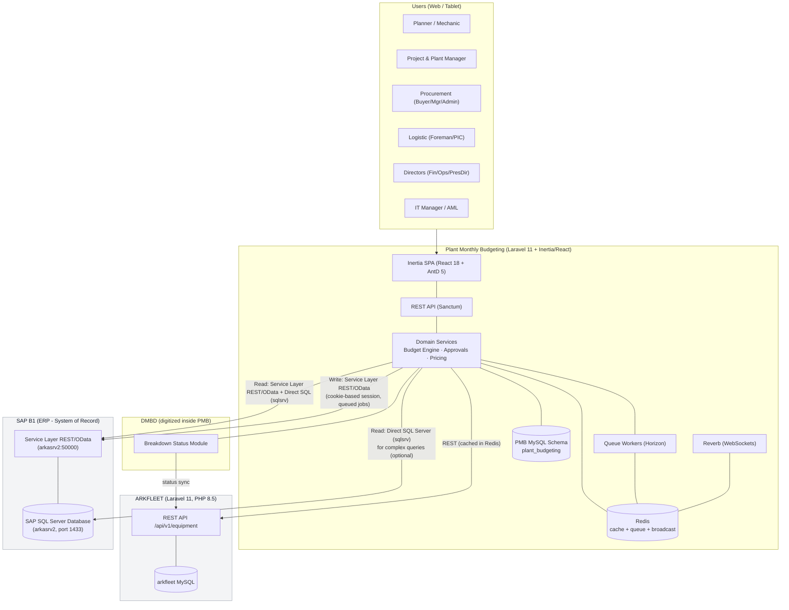
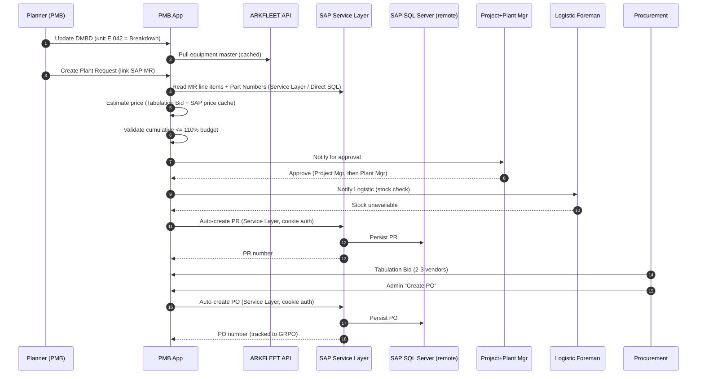
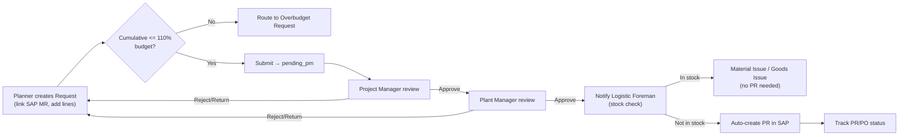
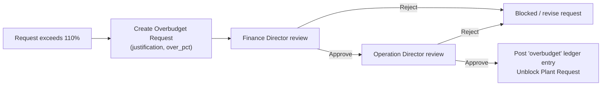
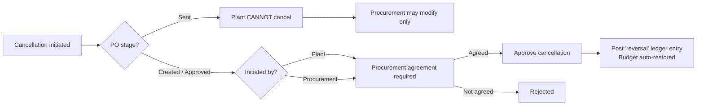
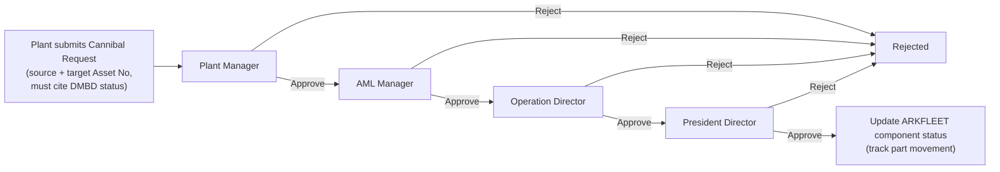
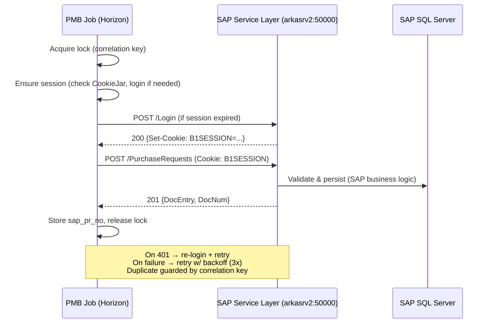

# Plant Monthly Budgeting — Concept & Recommendation Document

> **Status:** Draft for Director review · **Version:** 1.0 · **Date:** 3 Aug 2026
> **Author:** Senior CPA / Laravel Architect (Iwan)
> **Audience:** Board of Directors, IT Steering Committee, Plant & Procurement leadership
> **Classification:** Internal — Governance & Financial Controls

---

## Table of Contents

1. [Executive Summary](#1-executive-summary)
2. [System Architecture](#2-system-architecture)
3. [ERD (Entity Relationship Diagram)](#3-erd-entity-relationship-diagram)
4. [Core Modules & Features](#4-core-modules--features)
5. [Approval Workflows](#5-approval-workflows)
6. [Role & Permission Matrix](#6-role--permission-matrix)
7. [SAP Integration Specification](#7-sap-integration-specification)
8. [ARKFLEET Integration Specification](#8-arkfleet-integration-specification)
9. [UX & Frontend Architecture](#9-ux--frontend-architecture)
10. [Implementation Phases](#10-implementation-phases)
11. [Technical Decisions & Trade-offs](#11-technical-decisions--trade-offs)
12. [Open Questions & Recommendations](#12-open-questions--recommendations)
13. [Risk Assessment](#13-risk-assessment)

---

## 1. Executive Summary

### 1.1 The Problem

As a mining contractor, our single largest controllable operating cost is the **maintenance and spare parts procurement for heavy machinery** (excavators/DIGGER, haul trucks/HAULER, dozers/SUPPORT). Today this cost — roughly **20–30% of total company expenditure** — is governed through a fragmented mix of Excel workbooks, email chains, and manual SAP B1 data entry. This creates five structural weaknesses:

1. **No enforced budget ceiling at the point of request.** Planners raise Material Requests without a system that validates spend against the Finance Director's approved monthly allocation. Over-budget spend is discovered *after* the money is committed, not before.
2. **Fragmented vendor comparison.** The **Tabulation Bid** (2–3 vendor comparison) is an Excel file whose format differs per Buyer, making price governance and audit trails inconsistent.
3. **Opaque procurement lifecycle.** The MR → PQ → PR → PO → GRPO chain lives in SAP, but Plant Division has no consolidated visibility of *where* a request is, *why* it is delayed, or *how much budget it consumes*.
4. **Manual asset status (DMBD).** Equipment Ready/Standby/Breakdown status is emailed as a spreadsheet, disconnected from the request that a breakdown should trigger.
5. **Uncontrolled substitution & cannibalization.** Genuine ↔ OEM part interchange and inter-unit cannibalization happen informally, outside SAP's exact-P/N matching, creating reconciliation gaps and audit risk.

### 1.2 The Solution

**Plant Monthly Budgeting (PMB)** is an on-premise web application that becomes the **governance and control layer** on top of the company's existing systems. It does **not** replace SAP B1 (the ERP system of record) or ARKFLEET (the asset system of record). Instead, it:

- **Enforces the budget ceiling *before* commitment** — total requests are hard-capped at **≤ 110% of allocated budget** (a 10% controlled tolerance), with over-budget spend forced through a separate Finance Director + Operation Director approval workflow.
- **Standardizes the Tabulation Bid** into a structured, auditable vendor comparison with one-click, controlled **auto-PO creation** transmitted to SAP.
- **Provides a single pane of glass** over the SAP procurement lifecycle, enriched with Plant Budgeting workflow state (approvals, delay comments, budget consumption).
- **Digitizes DMBD**, sourcing the master asset list from ARKFLEET and feeding breakdown events into the Work Order → Material Request flow.
- **Governs substitution and cannibalization** through explicit Interchange mappings (synced to SAP) and a multi-level Cannibal approval chain (Beta).

### 1.3 Business Impact

| Value Driver | Mechanism | Expected Outcome |
|---|---|---|
| **Cost control** | Pre-commitment 110% budget validation; automatic carry-forward and variance calculation | Eliminates surprise over-runs; every rupiah is traceable to an approved allocation |
| **Fraud prevention** | President Director PO approval on high-value procurement; segregation of duties enforced by role matrix; full immutable audit log | High-value POs cannot be issued without top-level sign-off |
| **Procurement efficiency** | Standardized Tabulation Bid + auto-PO; SAP PR auto-creation; real-time status tracking | Shorter cycle time from breakdown to parts on site; less rework |
| **Governance & compliance** | Enforced approval chains; Good Mining Practice alignment; complete audit trail | Defensible controls for internal/external audit |
| **Operational continuity** | DMBD → WO → MR linkage; interchange & cannibal flexibility with control | Faster response to breakdowns without losing financial discipline |

### 1.4 Key Governing Metrics

- **Budget materiality:** Plant Division is the primary budget consumer at **~20–30% of total company expenditure**.
- **Budget tolerance:** Cumulative approved requests **≤ 110%** of the monthly allocation (**10% hard tolerance**); anything beyond requires the Overbudget workflow.
- **Budget cycle:** **6-month rolling** allocation; users can view previous / current / next month; **only the current month is editable** (Finance Director may revise current + future months).
- **Approval depth:**
  - Plant Request: **2 approvers** (Project Manager + Plant Manager) before PR creation.
  - Tabulation Bid → PO: Procurement Manager review → Admin → **President Director** PO approval.
  - Overbudget: **Finance Director + Operation Director**.
  - Cannibal (Beta): **4-level chain** (Plant Manager → AML Manager → Operation Director → President Director).

### 1.5 Scope Boundaries (What PMB Is *Not*)

- PMB is **not** an ERP. SAP B1 remains the transactional system of record for MR/PR/PO/GRPO/inventory.
- PMB is **not** an asset register. ARKFLEET remains the master for equipment, unit status, and HM/KM readings.
- PMB **does not duplicate** equipment or SAP transaction tables. It stores foreign keys and cached display fields, and **extends** those records with budgeting/workflow state.

---

## 2. System Architecture

### 2.1 High-Level Architecture



**Reading the diagram:**
- **PMB → ARKFLEET** = **REST API** via Tailscale, authenticated with Laravel Sanctum Bearer token (`abilities:api:read`). Results cached in Redis. PMB never touches ARKFLEET's DB directly. All endpoints confirmed from arkfleet-next codebase — see §8 for full catalog.
- **PMB → SAP (read)** = **two-tier approach**: (1) **Service Layer REST/OData** (`https://arkasrv2:50000/b1s/v1/`) for standard entity queries — documented, stable, SAP-supported; (2) **Direct SQL Server** (`sqlsrv` driver, host `arkasrv2`, port 1433) as fallback for complex joins and UDF fields that OData doesn't expose — e.g., `list_ITO.sql` with multi-table joins and custom fields. Service Layer is the primary path; direct SQL is used when OData field mapping fails.
- **PMB → SAP (write)** = through the **Service Layer REST API** (cookie-based session auth — see §7.2), **never** raw SQL INSERTs. All writes are queued idempotent jobs.
- **SAP B1 is a SQL Server database**, not MySQL. It runs on a separate host (`arkasrv2`). The `sap_sql` connection uses the `sqlsrv` PHP extension, not MySQL.

### 2.2 Technology Stack & Rationale

| Layer | Technology | Rationale |
|---|---|---|
| Backend framework | **Laravel 11+ (PHP 8.3/8.4)** | Matches company standard (arkfleet-next). Mature queue/broadcast/validation stack; strong accounting-grade transaction support via DB transactions & events. |
| Frontend | **React 18 + Inertia.js + Ant Design 5** | Inertia removes the need for a separate API-only SPA layer for internal pages while keeping React DX. **AntD ProTable/ProForm** give us enterprise-grade tables, filters, and form scaffolding out-of-the-box — ideal for approval queues, vendor comparison grids, budget tables. |
| **Database** | **MySQL 8.4** (PMB own schema `plant_budgeting`) + **SQL Server** (SAP B1, remote host `arkasrv2:1433`, accessed via `sqlsrv` PHP extension) | PMB owns its schema; SAP data is read remotely — never duplicated locally. |
| Auth | **Laravel Sanctum** | SPA session auth for Inertia + API tokens for any machine-to-machine (e.g., future mobile). Lightweight vs Passport; sufficient for on-prem internal app. |
| Queue | **Redis + Laravel Horizon** | Reliable async processing for SAP writes (PR/PO creation), ARKFLEET sync, notifications. Horizon gives visibility/retry/monitoring for finance-critical jobs. |
| Cache | **Redis** | ARKFLEET equipment cache and SAP pricing cache; reduces load on sibling systems and speeds up request forms. |
| Real-time | **Laravel Reverb** | First-party WebSocket server (on-prem friendly, no third-party like Pusher). Powers approval notifications and budget-threshold alerts. |
| PDF | **barryvdh/laravel-dompdf** | Budget reports, PO documents, Tabulation Bid printouts. No native binary dependency; works within our PHP-only deployment constraint. |
| Deployment | **On-premise Linux** | Security-driven company decision. Local DB, no cloud. |

### 2.3 Data Flow (End-to-End: Breakdown → Parts on Site)



### 2.4 Integration Strategy Summary

| Integration Point | Direction | Mechanism | Why |
|---|---|---|---|
| ARKFLEET equipment/projects | Read | **REST API** + Redis cache | Service ownership boundary; avoids duplicate asset table; API already exists. |
| SAP MR/PR/PO/GRPO/inventory | Read | **Service Layer REST/OData** (primary) + **Direct SQL Server / sqlsrv** (for complex queries/OData gaps) | Service Layer is documented & stable; direct SQL fills OData gaps (UDF fields, multi-table joins, field name mismatches). Remote SQL Server host `arkasrv2:1433`. |
| SAP PR/PO creation | Write | **Service Layer REST/OData** via queued jobs — **cookie-based session auth** (Guzzle CookieJar) | Data integrity — SAP business logic must run; Service Layer is the official write path. Cookie auth (B1SESSION + ROUTEID) managed automatically by Guzzle. |
| SAP pricing / vendor master | Read | **Service Layer REST/OData** (primary) + cached in Redis | Standard entity queries; daily cache refresh with staleness fallback. |
| DMBD status → ARKFLEET | Write | **REST API** (status sync) | Keeps ARKFLEET the asset-status source of truth. |
| Approvals / alerts | Push | **Reverb WebSockets** | Real-time UX for time-sensitive approvals. |

---

## 3. ERD (Entity Relationship Diagram)

**Design principle:** PMB tables reference external records by ID and cache a *minimal* set of display fields for performance and audit-stability (e.g., the `unit_code` at the time of the request). External source-of-truth tables (ARKFLEET `equipment`, `projects`; SAP `MR/PR/PO/GRPO`) are **not recreated** — they are represented as reference IDs and shown dashed/external below.

```mermaid
erDiagram
    %% ================= EXTERNAL (NOT created by PMB) =================
    ARK_EQUIPMENT ||--o{ BUDGET_ALLOCATION : "equipment_id (FK, ARKFLEET)"
    ARK_PROJECT   ||--o{ BUDGET_PERIOD : "project_code (FK, ARKFLEET)"
    SAP_MR        ||--o{ PLANT_REQUEST : "sap_mr_id (FK, SAP)"
    SAP_PR        ||--o{ PLANT_REQUEST : "sap_pr_id (FK, SAP)"
    SAP_PO        ||--o{ TABULATION_BID : "sap_po_id (FK, SAP)"

    %% ================= BUDGETING DOMAIN =================
    BUDGET_PERIOD ||--o{ BUDGET_ALLOCATION : contains
    BUDGET_ALLOCATION ||--o{ BUDGET_LEDGER : "posts to"
    BUDGET_ALLOCATION ||--o{ PLANT_REQUEST : "consumed by"
    BUDGET_ALLOCATION ||--o{ OVERBUDGET_REQUEST : "escalated by"

    %% ================= PLANT REQUEST DOMAIN =================
    PLANT_REQUEST ||--o{ PLANT_REQUEST_LINE : has
    PLANT_REQUEST ||--o{ REQUEST_APPROVAL : "routed through"
    PLANT_REQUEST ||--o{ REQUEST_COMMENT : "annotated by"
    PLANT_REQUEST ||--o{ CANCELLATION_REQUEST : "may be cancelled by"
    PLANT_REQUEST_LINE }o--o| INTERCHANGE_MAP : "resolved via"

    %% ================= PROCUREMENT DOMAIN =================
    TABULATION_BID ||--o{ TABULATION_BID_VENDOR : compares
    TABULATION_BID ||--o{ REQUEST_APPROVAL : "authorized via"
    TABULATION_BID_VENDOR ||--o| TABULATION_BID_AWARD : "winner"

    %% ================= DMBD DOMAIN =================
    DMBD_ENTRY }o--|| ARK_EQUIPMENT : "equipment_id (FK, ARKFLEET)"
    DMBD_ENTRY ||--o{ PLANT_REQUEST : "may trigger"

    %% ================= INTERCHANGE DOMAIN =================
    INTERCHANGE_MAP }o--|| USER : "created_by"

    %% ================= CANNIBAL (BETA) =================
    COMPONENT ||--o{ COMPONENT : "parent_id (hierarchy)"
    COMPONENT }o--|| ARK_EQUIPMENT : "installed_on equipment_id"
    CANNIBAL_REQUEST }o--|| ARK_EQUIPMENT : "source_equipment_id"
    CANNIBAL_REQUEST }o--|| ARK_EQUIPMENT : "target_equipment_id"
    CANNIBAL_REQUEST ||--o{ COMPONENT : "moves"
    CANNIBAL_REQUEST ||--o{ REQUEST_APPROVAL : "4-level chain"

    %% ================= IDENTITY & AUDIT =================
    USER ||--o{ ROLE_USER : has
    ROLE ||--o{ ROLE_USER : assigned
    ROLE ||--o{ PERMISSION_ROLE : grants
    PERMISSION ||--o{ PERMISSION_ROLE : granted
    USER ||--o{ REQUEST_APPROVAL : "acts as approver"
    USER ||--o{ AUDIT_LOG : generates

    BUDGET_PERIOD {
        bigint id PK
        string project_code "FK ARKFLEET projects"
        string project_name_cache
        date period_month "1st of month; 6-month cycle"
        enum status "draft|open|locked|closed"
        bigint created_by FK
        timestamp created_at
    }

    BUDGET_ALLOCATION {
        bigint id PK
        bigint budget_period_id FK
        bigint equipment_id "FK ARKFLEET equipment (nullable=division-level)"
        string unit_code_cache
        string plant_type_cache "DIGGER|HAULER|SUPPORT"
        decimal allocated_amount "IDR 18,2"
        decimal tolerance_pct "default 10.00"
        decimal carry_forward_in "from prior month"
        decimal committed_amount "sum approved requests"
        decimal actual_amount "from SAP GRPO"
        bool is_editable "true only for current month"
        timestamp updated_at
    }

    BUDGET_LEDGER {
        bigint id PK
        bigint budget_allocation_id FK
        enum entry_type "allocation|commitment|actual|carry_forward|reversal|overbudget"
        decimal amount "signed IDR 18,2"
        string ref_type "plant_request|po|grpo|cancellation"
        bigint ref_id
        text memo
        bigint posted_by FK
        timestamp posted_at
    }

    PLANT_REQUEST {
        bigint id PK
        string request_no "PMB-REQ-YYYYMM-####"
        bigint budget_allocation_id FK
        bigint equipment_id "FK ARKFLEET"
        string unit_code_cache
        bigint dmbd_entry_id FK "nullable"
        bigint sap_mr_id "FK SAP (required)"
        string sap_pr_no "nullable until PR created"
        enum status "draft|pending_pm|pending_plant_mgr|approved|pr_created|po_created|received|cancelled|rejected"
        decimal estimated_total "IDR 18,2"
        decimal budget_utilization_pct "at submission"
        bigint requested_by FK "Planner"
        timestamp submitted_at
    }

    PLANT_REQUEST_LINE {
        bigint id PK
        bigint plant_request_id FK
        string part_number "P/N from Part Book"
        string material_name
        string uom
        int qty
        decimal unit_price_est "IDR 18,2"
        string price_source "tabulation_bid|sap_price|manual|none"
        bigint interchange_map_id FK "nullable"
        decimal line_total
    }

    REQUEST_APPROVAL {
        bigint id PK
        string approvable_type "PlantRequest|TabulationBid|OverbudgetRequest|CannibalRequest|CancellationRequest"
        bigint approvable_id
        int step_order
        string required_role "e.g. project_manager"
        bigint approver_id FK "nullable until acted"
        enum decision "pending|approved|rejected|returned"
        text remarks
        timestamp acted_at
    }

    REQUEST_COMMENT {
        bigint id PK
        bigint plant_request_id FK
        enum category "delay|indent|constraint|general"
        text body
        bigint author_id FK
        timestamp created_at
    }

    TABULATION_BID {
        bigint id PK
        string bid_no "PMB-BID-YYYYMM-####"
        string sap_pr_id "FK SAP PR"
        enum status "draft|pending_proc_mgr|forwarded_admin|po_created|closed"
        bigint created_by FK "Buyer"
        bigint reviewed_by FK "Procurement Manager"
        string sap_po_id "nullable until PO"
        timestamp created_at
    }

    TABULATION_BID_VENDOR {
        bigint id PK
        bigint tabulation_bid_id FK
        string vendor_code "SAP vendor master"
        string vendor_name
        decimal price "IDR 18,2"
        string payment_terms
        enum stock_availability "ready|indent|partial"
        text remarks "warranty, free parts, etc"
        int rank
    }

    TABULATION_BID_AWARD {
        bigint id PK
        bigint tabulation_bid_id FK
        bigint tabulation_bid_vendor_id FK
        text justification
        bigint awarded_by FK
        timestamp awarded_at
    }

    OVERBUDGET_REQUEST {
        bigint id PK
        string request_no "PMB-OB-YYYYMM-####"
        bigint budget_allocation_id FK
        bigint plant_request_id FK "nullable"
        decimal requested_amount "IDR 18,2"
        decimal over_pct "beyond 110%"
        enum status "pending_fin_dir|pending_ops_dir|approved|rejected"
        text justification
        bigint requested_by FK
        timestamp created_at
    }

    CANCELLATION_REQUEST {
        bigint id PK
        bigint plant_request_id FK
        string sap_po_id "nullable"
        enum po_stage "created|approved|sent"
        enum initiated_by "plant|procurement"
        enum status "pending|approved|rejected"
        decimal budget_reversal_amount
        text reason
        timestamp created_at
    }

    INTERCHANGE_MAP {
        bigint id PK
        string genuine_part_number
        string oem_part_number
        string material_name
        bool sap_synced
        string sap_sync_ref
        bigint created_by FK "Procurement only"
        timestamp created_at
    }

    DMBD_ENTRY {
        bigint id PK
        bigint equipment_id "FK ARKFLEET"
        string unit_code_cache
        date report_date
        enum operational_status "rfu|standby|breakdown"
        text breakdown_note
        bigint reported_by FK "Planner"
        bool synced_to_arkfleet
        timestamp created_at
    }

    COMPONENT {
        bigint id PK
        bigint parent_id FK "self; Housing>Inner>Critical"
        enum level "housing|inner|critical"
        bigint equipment_id "FK ARKFLEET installed_on"
        string component_code
        string description
        enum status "installed|removed|cannibalized|scrapped"
        bigint maintained_by "AML"
        timestamp updated_at
    }

    CANNIBAL_REQUEST {
        bigint id PK
        string request_no "PMB-CAN-YYYYMM-####"
        bigint source_equipment_id "FK ARKFLEET"
        bigint target_equipment_id "FK ARKFLEET"
        bigint dmbd_entry_id FK "must justify via DMBD"
        enum status "pending_plant_mgr|pending_aml_mgr|pending_ops_dir|pending_presdir|approved|rejected"
        text reason
        bigint requested_by FK
        timestamp created_at
    }

    USER {
        bigint id PK
        string name
        string email
        string employee_no
        string division "Plant|AML|Procurement|Finance"
        string project_code_scope "nullable multi-project scoping"
        bool is_active
    }

    ROLE { bigint id PK string name string label }
    PERMISSION { bigint id PK string name string group }
    ROLE_USER { bigint role_id FK bigint user_id FK string project_code "scoped" }
    PERMISSION_ROLE { bigint permission_id FK bigint role_id FK }

    AUDIT_LOG {
        bigint id PK
        string auditable_type
        bigint auditable_id
        string event "created|updated|approved|rejected|synced"
        json old_values
        json new_values
        bigint user_id FK
        string ip_address
        timestamp created_at
    }
```



### 3.1 Entity Grouping by Domain

| Domain | New PMB Tables | External References |
|---|---|---|
| **Budgeting** | `budget_period`, `budget_allocation`, `budget_ledger`, `overbudget_request` | ARKFLEET `projects` (project_code), `equipment` (equipment_id) |
| **Plant Request** | `plant_request`, `plant_request_line`, `request_approval`, `request_comment`, `cancellation_request` | SAP `MR` (sap_mr_id), SAP `PR` (sap_pr_no) |
| **Procurement** | `tabulation_bid`, `tabulation_bid_vendor`, `tabulation_bid_award` | SAP `PR`, `PO`, vendor master |
| **DMBD** | `dmbd_entry` | ARKFLEET `equipment` + status sync |
| **Interchange** | `interchange_map` | SAP part master |
| **Cannibal (Beta)** | `component`, `cannibal_request` | ARKFLEET `equipment` |
| **Identity & Audit** | `users`, `roles`, `permissions`, `role_user`, `permission_role`, `audit_log` | — |

### 3.2 Key Design Notes (CPA rigor)

- **`budget_ledger` is the accounting backbone.** Rather than mutating a single running balance, every financial event (allocation, commitment, actual, carry-forward, reversal, overbudget) posts an **immutable, signed ledger entry**. Balances are derived by summation — this gives an auditable double-entry-style trail and makes variance/carry-forward provably correct.
- **Cached fields carry a `_cache` suffix** (e.g., `unit_code_cache`, `project_name_cache`) to make it explicit that they are denormalized snapshots from external systems, not sources of truth.
- **`request_approval` is polymorphic** (`approvable_type`) so a single, auditable approval engine serves Plant Requests, Tabulation Bids, Overbudget, Cancellation, and Cannibal chains.
- **All monetary columns are `DECIMAL(18,2)` in IDR** — never floats — consistent with accounting precision requirements.

---

## 4. Core Modules & Features

### 4.1 Budget Management

**Purpose:** Establish and control the Finance Director's monthly allocation per project (and optionally per equipment) on a 6-month rolling cycle.

**Feature list:**
- Create/maintain **Budget Periods** per project on a **6-month cycle**; view previous / current / next month.
- **Only the current month is editable by general users;** the **Finance Director** may revise current + future months. Past months are **locked** (read-only, audit-preserved).
- **Allocation granularity:** project-level and optional equipment-level (`equipment_id` nullable).
- **Carry-forward engine:** unused budget from month N auto-carries to N+1 as `carry_forward_in` (a `budget_ledger` entry of type `carry_forward`).
- **Variance calculation:** over/under-budget shown as signed variance (positive = under, negative = over), computed from `allocated + carry_forward - committed - actual`.
- **Tolerance thresholds:** default **10%** (`tolerance_pct`), configurable per allocation to support future differentiation by equipment type.

**UX patterns:** AntD table with month tabs; **budget progress bars** (green < 90%, amber 90–110%, red > 110%); inline-editable cells for the current month only; locked-month rows visually greyed.

**Integration points:** `project_code` from ARKFLEET; `actual_amount` reconciled from SAP GRPO values.

**Business rules:**
- Editing a locked/ past month is rejected at the policy layer.
- Carry-forward runs as a scheduled job on the 1st of each month (idempotent, ledger-based).
- Sum of allocations cannot be negative; revisions post reversal + new allocation ledger entries (never silent overwrite).

### 4.2 Plant Request

**Purpose:** Let the Planner request spare parts against budget, linked to a SAP MR, with pricing estimation and enforced 110% budget validation.

**Feature list:**
- Request parts by **Serial Number / Material Name / Part Number / other attributes**.
- **Mandatory link to a SAP MR** (`sap_mr_id`) — the request cannot be submitted without it, ensuring every spend traces to a Work Order root-cause.
- **Pricing estimation cascade:** (1) latest awarded **Tabulation Bid** price → (2) **SAP price database** cache → (3) manual with flag → (4) **no pricing data → auto-notify Procurement** and mark line `price_source = none`.
- **110% budget validation:** on submit, cumulative committed + this request must be **≤ 110%** of the allocation; otherwise the user is routed to raise an **Overbudget Request**.
- **Multi-level approval:** Project Manager → Plant Manager (see §5).
- Status timeline: `draft → pending_pm → pending_plant_mgr → approved → pr_created → po_created → received`.

**UX patterns:** ProForm wizard (Select equipment → link MR → add lines → review budget impact); a live **budget impact meter** showing utilization % before submission; MR line auto-import from SAP.

**Integration points:** SAP MR read (line items, P/N); SAP price cache; Tabulation Bid pricing; ARKFLEET equipment selector.

**Business rules:**
- One request maps to exactly one `budget_allocation` (project+month, optional equipment).
- Interchange substitution allowed per line (links `interchange_map_id`) but must respect Procurement-owned mappings.
- Submitting posts a `commitment` ledger entry (reversed if rejected/cancelled).

### 4.3 Tabulation Bid

**Purpose:** Standardize the 2–3 vendor comparison and enable controlled auto-PO creation into SAP.

**Feature list:**
- Buyer selects a **PR from SAP**, then adds **2–3 vendors**.
- Per-vendor inputs: **Price, Payment Terms, Stock Availability, Remarks** (warranties, free parts, etc.).
- **Authorization flow:** Procurement Manager reviews → forwards to Procurement Admin.
- **Auto-PO creation:** Admin clicks **"Create PO"** → system generates PO and **transmits to SAP** (queued DI API / Service Layer call), captures returned `sap_po_id`.
- Award record with justification when the chosen vendor is not lowest price (governance).

**UX patterns:** side-by-side **vendor comparison table** (AntD) with highlight of best price/terms; rank badges; one-click award; disabled "Create PO" until Manager review complete.

**Integration points:** SAP PR (source), SAP vendor master, SAP PO (write).

**Business rules:**
- Minimum 2, maximum 3 vendors.
- "Create PO" is restricted to Procurement Admin and only after Manager review.
- Non-lowest-price award requires mandatory justification (fraud/governance control).

### 4.4 DMBD Integration

**Purpose:** Digitize the Daily Monitoring Breakdown and connect it to the request/WO flow.

**Feature list:**
- Planner updates **operational status**: **Ready for Use / Standby / Breakdown**.
- **Master asset list retrieved from ARKFLEET** (cached).
- Breakdown occurrences captured with notes.
- **Beta:** DMBD entry becomes input for **WO → MR**, and a breakdown can pre-fill a Plant Request.
- **Status sync back to ARKFLEET** so the asset system reflects current condition.

**UX patterns:** daily grid (equipment rows × status); color-coded status chips; quick-entry for field supervisors on tablets.

**Integration points:** ARKFLEET equipment read + status write.

**Business rules:**
- One DMBD entry per equipment per `report_date` (upsert).
- Cannibal requests (Beta) must reference a DMBD status justifying the action.

### 4.5 Procurement Workflow (Lifecycle Visibility)

**Purpose:** Give Plant a single view of the SAP procurement lifecycle enriched with workflow state.

**Feature list:**
- **PR auto-creation** in SAP when Logistic Foreman confirms stock unavailable.
- **PO tracking** (Created / Approved / Sent) with President Director approval gate.
- **GRPO verification** — reconcile received goods to PO; feed `actual_amount` into budget ledger.
- **Inventory transfer chain** visibility: **ITR → ITO → ITI**, plus **MI** (non-consumable) and **GI** (consumable) issuance.
- **Data tracking & update:** PR number, PO status, and structured **delay/indent/constraint comments**.

**UX patterns:** lifecycle stepper per request (MR → PR → PO → GRPO → Issued); status badges; comment thread by category.

**Integration points:** SAP read for all documents; SAP write for PR/PO.

**Business rules:**
- GRPO posting converts `commitment` to `actual` in the ledger.
- Delays require a categorized comment for audit.

### 4.6 Overbudget Requests

**Purpose:** Provide a controlled path for spend beyond the 110% tolerance.

**Feature list:**
- Triggered automatically when a Plant Request would exceed 110%.
- Captures `requested_amount`, computed `over_pct`, and mandatory justification.
- **Separate approval workflow:** **Finance Director → Operation Director**.
- On approval, posts an `overbudget` ledger entry and unblocks the underlying request.

**UX patterns:** guided escalation modal from the blocked request; director approval queue with budget context.

**Business rules:** cannot bypass — an over-110% request has no path to PR without an approved Overbudget Request.

### 4.7 Cancellation

**Purpose:** Allow controlled cancellation/modification of requests and POs with automatic budget update.

**Feature list:**
- **Procurement** can modify POs in stages **Created / Approved / Sent**.
- **Plant** can cancel **only if the PO is NOT "Sent"** (stage-gated).
- **Budget auto-update:** cancellation posts a **reversal** ledger entry restoring committed budget.

**UX patterns:** cancellation modal showing PO stage, who can act, and the exact budget reversal amount.

**Business rules:** stage gate enforced server-side; agreement between Plant and Procurement recorded (see §5).

### 4.8 Interchange

**Purpose:** Map Genuine ↔ OEM Part Numbers to reconcile operational substitution with SAP's exact-P/N matching.

**Feature list:**
- **Procurement-only** creation of `genuine_part_number ↔ oem_part_number` mappings.
- **SAP sync** flag + reference; mapping must reconcile with SAP part master.
- Plant Request lines can reference an interchange map to substitute parts within governance.

**UX patterns:** searchable mapping table; sync status indicator; validation that both P/Ns exist in SAP master.

**Business rules:** only Procurement roles can create/edit; sync failures are surfaced and retried via queue.

### 4.9 Reporting & Analytics

**Feature list:**
- **Budget consumption** by project/month/equipment with variance and carry-forward.
- **Vendor performance** (price competitiveness, stock reliability, indent frequency) from Tabulation Bid history.
- **Equipment-level cost breakdown** (cost per unit, per plant_type) using HM/KM from ARKFLEET for cost-per-hour analysis.
- **Variance analysis** (planned vs committed vs actual).
- **PDF exports** (barryvdh/laravel-dompdf) for board-ready budget reports and PO documents.

**UX patterns:** dashboard widgets, drill-down tables (ProTable), export buttons.

**Business rules:** figures always reconcile to `budget_ledger` (single source of financial truth).

### 4.10 Administration

**Feature list:**
- **Project Setup:** IT Manager configures system accounts for active projects; dynamic add/remove (projects sourced from ARKFLEET).
- **User management** with division and **project scoping**.
- **Role–permission matrix** (see §6) with segregation-of-duties enforcement.

**Business rules:** SoD — e.g., a Buyer cannot also be the Procurement Admin who clicks "Create PO" on their own bid.

---

## 5. Approval Workflows

### 5.1 Plant Request Approval



### 5.2 Tabulation Bid → Auto PO

```mermaid
flowchart LR
    A["Buyer selects SAP PR\n+ 2-3 vendors"] --> B["Enter price/terms/stock/remarks"]
    B --> C["Submit → pending_proc_mgr"]
    C --> D["Procurement Manager review"]
    D -- Reject --> A
    D -- Approve --> E["Forward to Procurement Admin"]
    E --> F["Award vendor\n(justify if not lowest)"]
    F --> G["Admin clicks 'Create PO'"]
    G --> H["Queued job → SAP PO create\n(DI API / Service Layer)"]
    H --> I["President Director PO approval\n(high-value fraud control)"]
    I -- Approve --> J["PO Sent to vendor"]
    I -- Reject --> E
```



### 5.3 Overbudget Approval



### 5.4 Cancellation (stage-gated, Plant + Procurement)



### 5.5 Cannibal (Beta) — 4-Level Chain



---

## 6. Role & Permission Matrix

**Legend:** ✅ = full · 👁 = view only · ✔ = act/approve · ⚙ = configure · — = none

| Capability / Role | Planner | Mechanic | Project Mgr | Plant Mgr | Buyer | Proc Mgr | Proc Admin | Log Foreman | Log PIC | Finance Dir | Ops Dir | Pres Dir | IT Mgr | AML Mgr | AML Dept Head |
|---|:--:|:--:|:--:|:--:|:--:|:--:|:--:|:--:|:--:|:--:|:--:|:--:|:--:|:--:|:--:|
| View budget (all months) | 👁 | 👁 | 👁 | 👁 | 👁 | 👁 | 👁 | 👁 | 👁 | ✅ | 👁 | 👁 | 👁 | 👁 | 👁 |
| Set/revise budget (curr+future) | — | — | — | — | — | — | — | — | — | ✅ | — | — | — | — | — |
| Create Plant Request | ✅ | ✔ | — | — | — | — | — | — | — | — | — | — | — | — | — |
| Approve Plant Request (step 1) | — | — | ✔ | — | — | — | — | — | — | — | — | — | — | — | — |
| Approve Plant Request (step 2) | — | — | — | ✔ | — | — | — | — | — | — | — | — | — | — | — |
| Update DMBD | ✅ | 👁 | 👁 | 👁 | — | — | — | 👁 | 👁 | — | 👁 | 👁 | 👁 | 👁 | 👁 |
| Stock check / trigger PR | — | — | — | — | — | — | — | ✅ | ✔ | — | — | — | — | — | — |
| Create Tabulation Bid | — | — | — | — | ✅ | 👁 | 👁 | — | — | — | — | — | — | — | — |
| Review Tabulation Bid | — | — | — | — | — | ✔ | 👁 | — | — | — | — | — | — | — | — |
| Create PO (auto) | — | — | — | — | — | — | ✅ | — | — | — | — | — | — | — | — |
| Approve PO (high-value) | — | — | — | — | — | — | — | — | — | — | — | ✔ | — | — | — |
| Overbudget approve (step 1) | — | — | — | — | — | — | — | — | — | ✔ | — | — | — | — | — |
| Overbudget approve (step 2) | — | — | — | — | — | — | — | — | — | — | ✔ | — | — | — | — |
| Cancellation (Plant side) | ✔ | — | ✔ | ✔ | — | — | — | — | — | — | — | — | — | — | — |
| Cancellation (Procurement) | — | — | — | — | ✔ | ✔ | ✔ | — | — | — | — | — | — | — | — |
| Interchange mapping | — | — | — | — | ✅ | ✅ | ✅ | — | — | — | — | — | — | — | — |
| GRPO verification | — | — | — | — | — | — | — | ✅ | ✅ | 👁 | — | — | — | — | — |
| Component DB maintain (Beta) | 👁 | — | — | 👁 | — | — | — | — | — | — | 👁 | 👁 | — | ✅ | ✔ |
| Cannibal request create (Beta) | ✅ | ✔ | — | — | — | — | — | — | — | — | — | — | — | — | — |
| Cannibal approve (Beta) | — | — | — | ✔(1) | — | — | — | — | — | — | ✔(3) | ✔(4) | — | ✔(2) | — |
| Project setup / accounts | — | — | — | — | — | — | — | — | — | — | — | — | ⚙ | — | — |
| User & role management | — | — | — | — | — | — | — | — | — | — | — | 👁 | ⚙ | — | — |
| Reports & analytics | 👁 | 👁 | 👁 | ✅ | 👁 | ✅ | 👁 | 👁 | 👁 | ✅ | ✅ | ✅ | 👁 | ✅ | 👁 |

**Segregation of Duties (key controls):**
- The **Buyer** who creates a Tabulation Bid cannot be the **Procurement Admin** who executes "Create PO" on it.
- **Budget setting** is exclusive to the **Finance Director**; requesters (Planner) can never alter allocations.
- **High-value PO** cannot be issued without **President Director** approval.
- All roles are **project-scoped** via `role_user.project_code` in multi-project deployments.

---

## 7. SAP Integration Specification

### 7.1 Architecture: Dual Access (Service Layer + Direct SQL Server)

SAP B1 runs on a **SQL Server** database on host `arkasrv2`, NOT MySQL and NOT on the same physical server as PMB. PMB accesses SAP through two complementary channels:

| Channel | Use Case | Protocol | PHP Driver |
|---------|----------|----------|------------|
| **Service Layer REST/OData** | Standard CRUD, writes (PR/PO creation), vendor/price lookups | HTTPS REST/OData (`https://arkasrv2:50000/b1s/v1/`) | Guzzle HTTP (cookie-based session) |
| **Direct SQL Server** | Complex joins, UDF fields, OData gaps (e.g., `list_ITO.sql`) | SQL over TCP (`arkasrv2:1433`) | `sqlsrv` PHP extension |

**Priority for read operations:** Direct SQL Server first (most accurate, matches existing SQL queries exactly), OData as fallback. See the sync job pattern below.

### 7.2 Service Layer — Cookie-Based Session Authentication

SAP B1 Service Layer uses **HTTP cookie-based session management** — NOT API keys, NOT Bearer tokens:

1. **Login request** → `POST /Login` with `{CompanyDB, UserName, Password}`
2. **SAP responds** with `Set-Cookie: B1SESSION=...` and `Set-Cookie: ROUTEID=.node1`
3. **Guzzle CookieJar** automatically stores cookies and includes them in all subsequent requests
4. **Session expiry** → SAP returns `401 Unauthorized` → auto-re-login and retry

```php
// SapService setup — Guzzle handles cookies automatically
$this->cookieJar = new CookieJar();
$this->client = new Client([
    'base_uri' => 'https://arkasrv2:50000/b1s/v1/',
    'cookies'  => $this->cookieJar,   // ← Guzzle stores & sends cookies
    'headers'  => ['Content-Type' => 'application/json'],
]);

public function login(): bool
{
    $response = $this->client->post('Login', [
        'json' => [
            'CompanyDB' => $this->config['db_name'],
            'UserName'  => $this->config['user'],
            'Password'  => $this->config['password'],
        ],
    ]);
    return $response->getStatusCode() === 200;
    // Cookies (B1SESSION, ROUTEID) are now in CookieJar — all subsequent requests
    // automatically include them in the Cookie header.
}
```

**Session management strategy:**
- Register `SapService` as a **Laravel singleton** — one SAP session per application instance, reused across requests. Prevents session-limit exhaustion.
- On `401` response → catch, call `login()`, retry the original request. Transparent to callers.
- Validate session before heavy operations: `if (!$this->cookieJar->count()) { $this->login(); }`
- Sessions are **independent per application** — multiple apps can use the same SAP credentials simultaneously with separate B1SESSION cookies.

### 7.3 Direct SQL Server Access

For queries that the Service Layer's OData interface cannot express (complex joins, UDF/user-defined fields, field name mismatches), PMB uses the `sqlsrv` PHP extension to execute parameterized SQL directly on SAP's SQL Server.

**Connection (`config/database.php`):**
```php
'sap_sql' => [
    'driver'    => 'sqlsrv',
    'host'      => env('SAP_SQL_HOST', 'arkasrv2'),
    'port'      => env('SAP_SQL_PORT', '1433'),
    'database'  => env('SAP_SQL_DATABASE'),
    'username'  => env('SAP_SQL_USERNAME'),
    'password'  => env('SAP_SQL_PASSWORD'),
    'charset'   => 'utf8',
    'options'   => ['TrustServerCertificate' => true],
],
```

**Requirements:** PHP `sqlsrv` extension installed on the PMB server. Read-only SQL user recommended for audit safety.

**Use cases:** Complex ITO queries (joining `OWTR`, `WTR1`, `OITW` with UDF fields like `U_MIS_TransferType`), multi-table price lookups, reporting joins that OData `$expand` cannot handle efficiently.

### 7.4 Read Strategy — Sync Job Priority Pattern

For scheduled sync jobs, PMB tries methods in priority order:

1. **Direct SQL Server** — most accurate, matches existing SQL queries exactly
2. **Service Layer OData** — fallback if sqlsrv is unavailable
3. **Service Layer Query Execution** — last-resort if both fail

| SAP Document | Purpose in PMB | Primary Method | Frequency |
|---|---|---|---|
| **MR** (Material Request) | Source for Plant Request lines | Service Layer | On-demand + hourly cache |
| **PR** (Purchase Request) | Tabulation Bid source; lifecycle | Service Layer | On-demand + hourly |
| **PO** (Purchase Order) | PO tracking, GRPO reconciliation | Service Layer | Poll 15 min |
| **GRPO** | Commitment → actual in ledger | Service Layer | Poll 15 min |
| **ITR/ITO/ITI** | Inventory transfer visibility | Direct SQL (OData fallback) | On-demand / scheduled |
| **MI / GI** | Issuance closure | Service Layer | On-demand |
| **Price DB** | Pricing estimation cache | Service Layer | Daily refresh |
| **Vendor master** | Tabulation Bid vendor selection | Service Layer | Daily |

### 7.5 Write Operations (Service Layer Only)

Writes go **exclusively through the Service Layer** — never raw SQL. All writes are wrapped in **idempotent queued jobs** with correlation keys.

| Operation | Trigger | Interface | Idempotency |
|---|---|---|---|
| **PR creation** | Logistic Foreman confirms stock unavailable | `POST /PurchaseRequests` via Service Layer | `plant_request_id` correlation key |
| **PO creation** | Procurement Admin clicks "Create PO" | `POST /Orders` via Service Layer | `tabulation_bid_id` correlation key |
| **GRPO verification** | After GRPO posted in SAP | Read via Service Layer | Reconcile by PO ref |
| **Interchange sync** | Procurement saves mapping | Service Layer (part master) | `interchange_map_id` |



### 7.6 Part Number Resolution (Genuine vs OEM, Interchange)

- SAP requires **exact P/N matching**. PMB resolves substitutions via `interchange_map` **before** creating PR/PO, translating an OEM P/N to the SAP-recognized Genuine P/N (or vice versa) per the mapping.
- If no mapping exists and pricing/part cannot be resolved → line flagged, **Procurement notified**, request cannot proceed to PR for that line.

### 7.7 Lifecycle Visibility (MR → PR → PO → GRPO)

Each `plant_request` renders a **lifecycle stepper** driven by SAP reads: MR (source) → PR (`sap_pr_no`) → PO (`sap_po_id`, stage) → GRPO (received) → Issued (MI/GI). Delays annotated via categorized comments.

### 7.8 Error Handling & Resilience

| Failure Mode | Handling |
|---|---|
| **Service Layer 401 (session expired)** | Catch → `login()` → retry original request. Transparent to caller. |
| **Service Layer unreachable** | Fall back to Redis cache (pricing, vendor) with staleness banner. Queued write jobs retry with exponential backoff (3 attempts). Final failure → mark `sap_sync_failed`, alert via Reverb. |
| **Direct SQL Server unreachable** | Fall back to Service Layer OData for that query. If both fail → degrade gracefully with last-good cache. |
| **Session limit exceeded** | Singleton `SapService` prevents session proliferation. If limit still hit → log warning, wait, retry with existing session. |
| **Write conflict (duplicate DocNum)** | SAP rejects duplicate; PMB correlation key prevents double-submit. Log and alert. |
| **Data conflicts (two apps modify same record)** | SAP's last-write-wins. PMB mitigates by reading `UpdateDate` before writes (optimistic locking). |
| **Nightly reconciliation** | Scheduled job compares PMB workflow state vs SAP documents; flags divergences. |

### 7.9 SAP Database Connection Configuration

`.env` variables:
```env
# SAP Service Layer (REST/OData)
SAP_SERVER_URL=https://arkasrv2:50000
SAP_DB_NAME=your_sap_company_db
SAP_USER=your_sap_username
SAP_PASSWORD=your_sap_password

# SAP Direct SQL Server (for complex queries)
SAP_SQL_HOST=arkasrv2
SAP_SQL_PORT=1433
SAP_SQL_DATABASE=your_sap_database
SAP_SQL_USERNAME=your_sql_username
SAP_SQL_PASSWORD=your_sql_password
```

`config/database.php` connections:
```php
// Service Layer connection (HTTP — not a DB connection, managed by SapService)
// SQL Server direct connection
'sap_sql' => [
    'driver'    => 'sqlsrv',
    'host'      => env('SAP_SQL_HOST', 'arkasrv2'),
    'port'      => env('SAP_SQL_PORT', '1433'),
    'database'  => env('SAP_SQL_DATABASE'),
    'username'  => env('SAP_SQL_USERNAME'),
    'password'  => env('SAP_SQL_PASSWORD'),
    'charset'   => 'utf8',
    'options'   => ['TrustServerCertificate' => true],
],
```

---

## 8. ARKFLEET Integration Specification

> **Source of truth:** arkfleet-next codebase (`app/Http/Controllers/Api/V1/*`, `app/Models/*`). All endpoint details, response shapes, and field names below are confirmed from the actual implementation.

### 8.1 Authentication

ARKFLEET API uses **Laravel Sanctum** with token abilities:

```
Middleware: auth:sanctum + abilities:api:read + throttle:api
Base URL:   http://arkfleet-next.local/api/v1   (Tailscale-accessible from PMB)
```

PMB needs a **Sanctum personal access token** with the `api:read` ability. The token is stored in PMB's `.env` as `ARKFLEET_API_TOKEN` and sent as a `Bearer` token in the `Authorization` header. Tokens do not expire by default — if a 401 is received, regenerate the token via the ARKFLEET admin panel.

### 8.2 API Endpoint Catalog (Confirmed)

#### Equipment

| Endpoint | Method | Filters | Response Wrapper | Default Per Page |
|----------|--------|---------|-----------------|------------------|
| `/equipment` | GET | `search`, `is_active` (bool), `project_code`, `unitstatus_id`, `plant_type` (name LIKE), `with_readings` (bool), `per_page` (max 100) | `{data: [...], meta: {current_page, last_page, per_page, total}}` | 20 |
| `/equipment/{id}` | GET | — | `{data: {...}}` | N/A |
| `/equipment/{id}/hm-km-readings` | GET | `reading_type` (hm/km), `date_from`, `date_to`, `per_page` (max 100) | `{data: [...], meta: {...}}` | 50 |
| `/equipment/stats` | GET | `project_code` | `{data: {total, by_status, by_plant_type, rfu_count}}` | N/A |

**Equipment response shape** (index, with `plantType`, `unitModel`, `department` relations):
```json
{
  "data": [
    {
      "id": 1042,
      "unit_code": "E 042",
      "description": "Excavator PC2000",
      "serial_no": "KMTPC234...",
      "chasis_no": null,
      "engine_model": "Cummins QSK23",
      "machine_no": null,
      "nomor_polisi": null,
      "bahan_bakar": "Diesel",
      "warna": null,
      "capacity": "20.00",
      "remarks": null,
      "plant_type_id": 1,
      "unitstatus_id": 1,
      "project_code": "PRJ-BRD",
      "is_active": true,
      "is_rfu": true,
      "acquisition_cost": null,
      "acquisition_date": "2021-06-15",
      "unit_model": {"id": 5, "name": "PC2000-8"},
      "department": {"id": 2, "department_name": "Plant BRD"},
      "plant_type": {"id": 1, "name": "Excavator"}
    }
  ],
  "meta": {"current_page": 1, "last_page": 5, "per_page": 20, "total": 94}
}
```

**Equipment show** additionally loads: `unitstatus` (id, name, color), `assetCategory` (id, name, code), `fixedAsset` (id, equipment_id, status).

**Stats endpoint** (`/equipment/stats`) — used for dashboard widgets:
```json
{
  "data": {
    "total": 94,
    "rfu_count": 68,
    "by_status": [
      {"status_id": 1, "status_name": "ACTIVE", "count": 72, "color": "#52c41a"},
      {"status_id": 3, "status_name": "BREAKDOWN", "count": 8, "color": "#ff4d4f"}
    ],
    "by_plant_type": [
      {"plant_type_id": 1, "plant_type_name": "Excavator", "count": 32},
      {"plant_type_id": 2, "plant_type_name": "Dump Truck", "count": 45}
    ]
  }
}
```

**`with_readings`** parameter appends `latest_hm`, `latest_km`, and `latest_reading_date` to each equipment record — useful for dashboard fleet health widgets.

#### HM/KM Readings

**Response shape:**
```json
{
  "data": [
    {
      "id": 15420,
      "equipment_id": 1042,
      "reading_date": "2026-07-25",
      "reading_type": "hm",
      "reading_value": "15234.50",
      "source": "manual",
      "notes": null
    }
  ],
  "meta": {"current_page": 1, "last_page": 3, "per_page": 50, "total": 120}
}
```

#### Reference Data (Dropdowns)

| Endpoint | Response Wrapper | Fields | Use in PMB |
|----------|-----------------|--------|------------|
| `GET /plant-types` | `{data: [{id, name, is_active}]}` | id, name, is_active | Equipment type filter, budget allocation per type |
| `GET /unit-statuses` | `{data: [{id, name, color, is_active}]}` | id, name, **color**, is_active | Status badges with ARKFLEET-standard colors |
| `GET /asset-categories` | `{data: [{id, name, code, is_active}]}` | id, name, code, is_active | Equipment categorization |

#### Projects

| Endpoint | Response Wrapper | Filters |
|----------|-----------------|---------|
| `GET /projects` | ⚠️ **RAW paginator** (no `{data}` wrapper!) | `selectable_only`, `active_only` (default true), `search` |
| `GET /projects/{code}` | `{data: {...}}` | — |

**Project fields:** `code` (PK, used as FK in equipment), `sap_code`, `name`, `bowheer`, `location`, `description`, `is_active`, `is_selectable`, `synced_at`.

⚠️ **Pothole:** `projects` index is the **only** endpoint that returns a raw Laravel paginator — NOT wrapped in `{data: ...}`. The PMB ARKFLEET client must handle this inconsistency. All other list endpoints return `{data: [...], meta: {...}}`.

#### Fixed Assets & Depreciation

| Endpoint | Use in PMB | Response Wrapper |
|----------|-----------|-----------------|
| `GET /fixed-assets` | Asset lifecycle context (optional) | ⚠️ RAW paginator |
| `GET /fixed-assets/{id}` | Asset detail with depreciation history | `{data: {...}}` |
| `GET /depreciation/runs` | Depreciation schedule context | ⚠️ RAW paginator |
| `GET /depreciation/runs/{id}` | Run detail with entries | `{data: {...}}` |
| `GET /depreciation/entries` | Cost analysis (period_from/to, fixed_asset_id) | ⚠️ RAW paginator |

### 8.3 ⚠️ Response Format Inconsistencies (Must Handle)

| Endpoint group | Wrapper | PMB client must |
|---------------|---------|----------------|
| Equipment (all), plant-types, unit-statuses, asset-categories, projects/show, fixed-assets/show, depreciation/runs/show | `{data: ...}` | `$response->json('data')` |
| Projects/index, fixed-assets/index, depreciation/runs, depreciation/entries | **RAW** (no wrapper) | `$response->json()` directly |

**Implementation:** PMB's `ArkfleetClient` wraps all responses through a normalizer that detects the shape and always returns data as an array. Example:
```php
$json = $response->json();
// If response has 'data' key → unwrap; otherwise it's already raw data
return Arr::get($json, 'data', $json);
```

### 8.4 Equipment Caching Strategy (Redis)

- **Cache key:** `ark:equipment:{project_code}` → list; `ark:equipment:id:{id}` → single; `ark:equipment:stats:{project_code}` → stats
- **TTL:** 1 hour for lists; 6 hours for single detail; stats 30 min; **manual bust** on DMBD status change or when Plant request creates new budget allocation
- PMB stores only `equipment_id` (FK) + `_cache` display fields (`unit_code_cache`, `plant_type_cache`, `project_code_cache`). The cache is a performance layer, not a source of truth — always re-read from ARKFLEET for financial operations.
- A scheduled **warm-up job** pre-caches active equipment per active project each morning (6 AM WITA).
- **Cache fallback:** if ARKFLEET is unreachable, serve Redis cache with a staleness banner. Equipment selector, DMBD grid, and budget overview all degrade gracefully.

### 8.5 DMBD Status Sync (PMB → ARKFLEET)

When a Planner sets operational status (RFU/Standby/Breakdown) in PMB, the status must be reflected in ARKFLEET. Currently ARKFLEET has no `PATCH /equipment/{id}/status` endpoint — PMB will use the existing ARKFLEET admin UI or propose a new endpoint.

**Proposed ARKFLEET endpoint** (coordinate with ARKFLEET team):
```
PATCH /api/v1/equipment/{id}/status
Body: { "unitstatus_id": 3, "is_rfu": false }
Auth: auth:sanctum + abilities:api:write
```

Until this endpoint exists, DMBD status is tracked in PMB only. `dmbd_entry.synced_to_arkfleet` flag indicates sync state; a scheduled job retries failed syncs.

### 8.6 HM/KM Readings for Cost Analysis

- PMB joins actual spend from `budget_ledger` (per equipment) to ARKFLEET `hm-km-readings` to compute **cost-per-operating-hour** and **cost-per-km**.
- Period: monthly. Query `GET /equipment/{id}/hm-km-readings?date_from={month_start}&date_to={month_end}`.
- `reading_type=hm` → hours meter; `reading_type=km` → odometer. Both used depending on equipment type.
- **CPA metric:** `total_spend / delta_hm` = IDR/hour; `total_spend / delta_km` = IDR/km. Tracks maintenance efficiency.

### 8.7 (Beta) Component Database & Cannibal API

- PMB maintains a **hierarchical `component` table** (Housing → Inner Parts → Critical Parts) linked to ARKFLEET `equipment_id`, maintained by AML.
- **Cannibal movements** update component status in PMB; components reference ARKFLEET equipment IDs.
- **Proposed ARKFLEET endpoints** (coordinate with ARKFLEET team):
  - `GET /api/v1/equipment/{id}/components` — list installed components
  - `PATCH /api/v1/components/{id}/status` — update after cannibal move

### 8.8 ARKFLEET Client Implementation (Laravel)

```php
// config/services.php
'arkfleet' => [
    'base_url' => env('ARKFLEET_API_URL', 'http://arkfleet-next.local/api/v1'),
    'token'    => env('ARKFLEET_API_TOKEN'),
    'timeout'  => 10,
    'retries'  => 2,
],

// ArkfleetClient.php
class ArkfleetClient
{
    public function __construct(private Client $http) {
        $this->http = new Client([
            'base_uri' => config('services.arkfleet.base_url'),
            'headers' => [
                'Authorization' => 'Bearer ' . config('services.arkfleet.token'),
                'Accept'        => 'application/json',
            ],
            'timeout' => config('services.arkfleet.timeout'),
        ]);
    }

    public function getEquipment(array $filters = []): array
    {
        $response = $this->http->get('equipment', ['query' => $filters]);
        return $this->unwrap($response); // data wrapper + meta
    }

    public function getEquipmentStats(?string $projectCode = null): array
    {
        $response = $this->http->get('equipment/stats', [
            'query' => array_filter(['project_code' => $projectCode]),
        ]);
        return $this->unwrap($response)['data'];
    }

    private function unwrap(Response $response): array
    {
        $body = json_decode($response->getBody(), true);
        // Generic normalizer — handles both {data:...} and raw responses
        return is_array($body) && array_key_exists('data', $body)
            ? ['data' => $body['data'], 'meta' => $body['meta'] ?? null]
            : ['data' => $body, 'meta' => null];
    }
}
```

### 8.9 Error Handling & Resilience

| Failure Mode | Handling |
|---|---|
| **401 Unauthorized** | Token invalid/expired — alert IT, fall back to Redis cache, block financial operations until resolved |
| **Connection timeout / 5xx** | Retry up to 2 times (configurable). Serve Redis cache with staleness warning. Queue alert for ops. |
| **Rate limit (429)** | Respect `Retry-After` header. Back off. |
| **404 on equipment/{id}** | Equipment deleted in ARKFLEET — mark PMB cached record as `synced_at=null`, exclude from selectors |
| **Response format change** | Client normalizer guards against shape changes. Log warnings on unexpected shapes for ops review. |

---

## 9. UX & Frontend Architecture

### 9.1 Page Structure by Role

| Role | Landing | Key pages |
|---|---|---|
| Planner | Request dashboard | New Plant Request wizard, DMBD grid, my requests, budget impact view |
| Project/Plant Mgr | Approval queue | Pending approvals, budget overview, request detail |
| Buyer | Bid workspace | New Tabulation Bid, vendor comparison, my bids |
| Procurement Mgr/Admin | Bid review queue | Review, award, Create PO, interchange, PO tracking |
| Logistic Foreman/PIC | Fulfillment | Stock check queue, PR trigger, GRPO verification, transfers |
| Finance Director | Budget console | Budget setting (6-month), overbudget approvals, variance reports |
| Operation Director | Oversight | Overbudget/cannibal approvals, ops analytics |
| President Director | Governance | PO approvals, cannibal final approval, executive dashboard |
| IT Manager | Admin | Project setup, users, roles/permissions |
| AML Mgr/Dept Head | Components | Component DB (Beta), cannibal review, asset cost control |

### 9.2 Key UI Patterns

- **Dashboard widgets:** budget consumption gauges, pending-approval counts, breakdown fleet status, SAP sync health.
- **Budget progress bars:** color-graded (green/amber/red at 90%/110% thresholds).
- **Approval queues:** AntD ProTable with bulk actions, filters, and inline approve/reject with remarks.
- **Vendor comparison tables:** side-by-side columns with best-value highlighting and rank badges.
- **Lifecycle steppers:** MR → PR → PO → GRPO visual progress per request.

### 9.3 Mobile Responsiveness

Field supervisors at mining sites use **tablets/phones**. DMBD entry, approval actions, and request status are **mobile-first** with large touch targets and offline-tolerant read (cached). AntD's responsive grid + condensed table views on small screens.

### 9.4 Real-Time Notifications (Reverb)

- Approval assigned / decision made.
- **Budget threshold alerts** (crossing 90% / 100% / 110%).
- SAP sync failures for Procurement.
- Broadcast on private per-user and per-role channels; in-app toast + notification center; optional email digest.

### 9.5 Localization

- **Bahasa Indonesia UI** with English technical terms preserved (P/N, PR, PO, GRPO).
- **IDR currency** formatting (`Rp 1.234.567.890,00`), Indonesian date/number locale.
- Alignment with **Indonesian mining regulations / Good Mining Practice** terminology in reports.

---

## 10. Implementation Phases

> Complexity scale: **S** (small), **M** (medium), **L** (large). File paths follow Laravel 11 + Inertia conventions.

### Phase 0 — Scaffold, Auth, Roles, ARKFLEET Integration (Complexity: M)
**Deliverables:** Laravel 11 skeleton, Sanctum SPA auth, Inertia+React+AntD setup, roles/permissions, ARKFLEET API client + Redis cache.
**Dependencies:** ARKFLEET API access, MySQL server access.
**Files:**
- `config/database.php` (add `sap` read-only connection)
- `app/Models/{User,Role,Permission}.php`; migrations `create_roles_table`, `create_permissions_table`, `create_permission_role_table`, `create_role_user_table`
- `app/Services/Arkfleet/ArkfleetClient.php`, `app/Services/Arkfleet/EquipmentCache.php`
- `app/Http/Middleware/EnsureProjectScope.php` (registered in `bootstrap/app.php`)
- `resources/js/app.tsx`, `resources/js/Layouts/AppLayout.tsx`
- `routes/web.php`, `routes/api.php`

### Phase 1 — Budget Management (Complexity: L)
**Deliverables:** Budget periods (6-month), allocations, ledger, carry-forward job, Finance Director console, Plant view.
**Dependencies:** Phase 0.
**Files:**
- migrations: `create_budget_periods_table`, `create_budget_allocations_table`, `create_budget_ledgers_table`
- `app/Models/{BudgetPeriod,BudgetAllocation,BudgetLedger}.php`
- `app/Services/Budget/{BudgetEngine,CarryForwardJob,VarianceCalculator}.php`
- `app/Http/Controllers/BudgetController.php`; `app/Policies/BudgetAllocationPolicy.php`
- `resources/js/Pages/Budget/{Index,Setting}.tsx`

### Phase 2 — Plant Request + Approval Workflow (Complexity: L)
**Deliverables:** Request wizard, MR link (SAP read), pricing cascade, 110% validation, PM→Plant Mgr approvals.
**Dependencies:** Phases 0–1, SAP read connection.
**Files:**
- migrations: `create_plant_requests_table`, `create_plant_request_lines_table`, `create_request_approvals_table`, `create_request_comments_table`
- `app/Models/{PlantRequest,PlantRequestLine,RequestApproval}.php`; `app/Models/Sap/MaterialRequest.php`
- `app/Services/Approval/ApprovalEngine.php`; `app/Services/Pricing/PricingEstimator.php`
- `app/Http/Controllers/PlantRequestController.php`; `app/Policies/PlantRequestPolicy.php`
- `resources/js/Pages/PlantRequest/{Index,Create,Show}.tsx`

### Phase 3 — Tabulation Bid + Auto PO (Complexity: M)
**Deliverables:** Vendor comparison, Proc Mgr review, award, Create PO (queued SAP write).
**Dependencies:** Phase 2, SAP write interface.
**Files:**
- migrations: `create_tabulation_bids_table`, `create_tabulation_bid_vendors_table`, `create_tabulation_bid_awards_table`
- `app/Models/{TabulationBid,TabulationBidVendor,TabulationBidAward}.php`
- `app/Jobs/CreateSapPurchaseOrder.php`; `app/Services/Sap/SapWriteClient.php`
- `resources/js/Pages/TabulationBid/{Index,Create,Review}.tsx`

### Phase 4 — SAP Integration (PR creation, PO tracking, GRPO) (Complexity: L)
**Deliverables:** SAP read models, PR auto-creation job, PO poll, GRPO reconciliation to ledger, sync dashboard.
**Dependencies:** Phases 2–3.
**Files:**
- `app/Models/Sap/{PurchaseRequest,PurchaseOrder,Grpo,VendorMaster,PriceList}.php`
- `app/Jobs/{CreateSapPurchaseRequest,PollSapPoStatus,ReconcileGrpoToLedger}.php`
- `app/Services/Sap/{SapReadRepository,SapCircuitBreaker}.php`
- `app/Console/Kernel` schedule entries (in `routes/console.php` / bootstrap schedule)
- `resources/js/Pages/Sap/SyncDashboard.tsx`

### Phase 5 — DMBD Integration (Complexity: M)
**Deliverables:** DMBD grid, ARKFLEET master pull, status sync back, breakdown → request pre-fill.
**Dependencies:** Phases 0, 2.
**Files:**
- migration: `create_dmbd_entries_table`; `app/Models/DmbdEntry.php`
- `app/Jobs/SyncDmbdStatusToArkfleet.php`
- `app/Http/Controllers/DmbdController.php`
- `resources/js/Pages/Dmbd/Index.tsx`

### Phase 6 — Overbudget + Cancellation + Interchange (Complexity: M)
**Deliverables:** Overbudget workflow (Fin Dir→Ops Dir), stage-gated cancellation w/ reversal, Procurement-only interchange + SAP sync.
**Dependencies:** Phases 1–4.
**Files:**
- migrations: `create_overbudget_requests_table`, `create_cancellation_requests_table`, `create_interchange_maps_table`
- `app/Models/{OverbudgetRequest,CancellationRequest,InterchangeMap}.php`
- `app/Jobs/SyncInterchangeToSap.php`
- `resources/js/Pages/{Overbudget,Cancellation,Interchange}/Index.tsx`

### Phase 7 — Reporting & Analytics (Complexity: M)
**Deliverables:** Budget consumption, vendor performance, equipment cost breakdown (HM/KM), variance; PDF exports.
**Dependencies:** Phases 1–6.
**Files:**
- `app/Services/Reporting/{BudgetConsumptionReport,VendorPerformanceReport,EquipmentCostReport}.php`
- `app/Http/Controllers/ReportController.php`
- `resources/views/pdf/{budget,po}.blade.php` (dompdf)
- `resources/js/Pages/Reports/*.tsx`

### Phase 8 — (Beta) Component Database + Cannibal (Complexity: L)
**Deliverables:** Hierarchical component DB (AML), cannibal request 4-level chain, ARKFLEET component sync, monitoring dashboard.
**Dependencies:** Phases 0, 5.
**Files:**
- migrations: `create_components_table`, `create_cannibal_requests_table`
- `app/Models/{Component,CannibalRequest}.php`
- `app/Jobs/SyncComponentMovementToArkfleet.php`
- `resources/js/Pages/{Component,Cannibal}/Index.tsx`

---

## 11. Technical Decisions & Trade-offs

| Decision | Chosen Approach | Alternatives | Rationale |
|---|---|---|---|
| **ARKFLEET integration** | REST API + Redis cache | Shared DB read | Respects service ownership; API exists; Iwan's preference; avoids coupling to ARKFLEET schema. |
| **SAP read** | **Two-tier**: Direct SQL Server (sqlsrv, primary) + Service Layer REST/OData (fallback) | Service Layer only | OData has gaps (UDF fields, complex joins, field name mismatches). Direct SQL matches existing queries exactly; OData is the documented, stable fallback. SAP is SQL Server, NOT MySQL. |
| **SAP write** | **Service Layer REST/OData** via queued jobs — cookie-based Guzzle CookieJar session | Raw SQL INSERT | SAP business logic & validation must run via Service Layer. Cookie auth (B1SESSION + ROUTEID) handled automatically by Guzzle. |
| **SAP session management** | **Singleton SapService** — one B1SESSION per app instance, auto-reconnect on 401 | New session per request | Prevents session-limit exhaustion. Guzzle CookieJar handles cookie lifecycle; 401 catch → login() → retry. |
| **SAP data freshness** | Hybrid: poll (15 min for PO/GRPO) + on-demand read + Redis cache | Pure real-time | Real-time push from SAP not available; polling + cache balances freshness vs SAP load. |
| **Budget calculation** | **Materialized ledger** (`budget_ledger`) with derived balances | Computed-on-read | Auditable, provable trail; balances reconstructable; performance via periodic snapshots if needed. |
| **Multi-tenancy** | Single DB, `project_code` scoping via `role_user` + global query scopes | Separate DB per project | Simpler ops; shared reporting; enforced isolation via scopes/policies. |
| **Real-time** | Laravel Reverb (self-hosted) | Pusher (SaaS) | On-prem/security mandate; no external dependency. |
| **PDF** | barryvdh/laravel-dompdf | maatwebsite/excel | Excel package to be avoided; dompdf covers board reports/PO docs without native binaries. |
| **PHP sqlsrv extension** | Required on PMB server for SAP direct SQL access | OData-only (no sqlsrv) | Accurate complex queries (ITO, UDF fields) need sqlsrv. If unavailable, fall back to Service Layer OData. |

**PHP 8.5 sibling / compatibility notes** (ARKFLEET runs PHP 8.5; PMB targets 8.3/8.4):
- `pcre.jit=0` may be required if regex-heavy validation hits JIT edge cases on 8.5 hosts.
- Avoid **static properties on traits** (behavior differences) — use class constants or instance state.
- **Do not use `maatwebsite/excel`** — use native CSV writers or dompdf; keeps builds clean across PHP versions.

**Queue/caching specifics:**
- **Queued jobs** for all SAP writes (PR/PO), interchange sync, DMBD sync, carry-forward — with idempotency keys and Horizon monitoring.
- **Redis caching:** ARKFLEET equipment (1h/6h TTL, manual bust) and SAP pricing (daily refresh) with staleness banners on fallback.

---

## 12. Open Questions & Recommendations

1. **DMBD transition — replace Excel fully or run parallel?**
   *Recommendation:* Run **parallel for one budget cycle (1 month minimum)**, reconcile daily, then cut over. Reduces operational risk while planners adapt.

2. **Interchange P/N validation — who owns technical equivalence?**
   *Recommendation:* **Procurement creates** the mapping (per spec, Procurement-only), but require a **secondary technical sign-off from Plant (or AML)** captured as an approval step before SAP sync. Prevents non-equivalent substitutions.

3. **Cannibal 4-level chain — too slow for emergencies?**
   *Recommendation:* Introduce an **"Emergency Cannibal"** fast-path: provisional execution on **Plant Manager + Operation Director** approval, with **retroactive AML Manager + President Director ratification within 48h**. Balances continuity vs governance. (Requires Director policy approval.)

4. **110% tolerance — appropriate for all equipment types?**
   *Recommendation:* Keep 10% as default but make `tolerance_pct` **configurable per allocation / plant_type** (DIGGER/HAULER/SUPPORT) — critical assets may warrant a higher buffer. Already modeled in `budget_allocation.tolerance_pct`.

5. **SAP B1 version & protocol — ✅ CONFIRMED:**
   - **Database:** SQL Server (NOT MySQL), host `arkasrv2`, port 1433, accessed via PHP `sqlsrv` extension.
   - **API:** Service Layer REST/OData on `https://arkasrv2:50000/b1s/v1/` — cookie-based session auth (Guzzle CookieJar with B1SESSION + ROUTEID).
   - **Write path:** Service Layer exclusively (POST/PATCH via REST). **Never raw SQL INSERTs.**
   - **Read path:** Direct SQL Server (primary, for complex queries) + Service Layer OData (fallback, for standard entities).
   - **Session strategy:** Singleton `SapService`, auto-reconnect on 401.

6. **Read-only DB user & data governance:** confirm we can provision a **read-only SAP DB user** and that reporting joins won't impact SAP performance (consider a read replica if load is significant).

---

## 13. Risk Assessment

| # | Risk | Likelihood | Impact | Mitigation |
|---|---|:--:|:--:|---|
| R1 | **SAP integration reliability** (writes fail / interface downtime) | Med | High | Queued idempotent jobs, retries + backoff, circuit breaker, sync dashboard, nightly reconciliation. |
| R2 | **Budget overrun detection latency** (actuals lag via GRPO polling) | Med | High | Commitment posted at request approval (pre-actual); 15-min GRPO poll; threshold alerts at 90/100/110%. |
| R3 | **Part Number mismatch** (Genuine vs OEM) blocks PR/PO | Med | Med | Interchange mapping with secondary validation; block + notify Procurement on unresolved P/N. |
| R4 | **Multi-project data isolation** breach | Low | High | Global query scopes + policies keyed on `project_code`; automated tests for cross-project access. |
| R5 | **Offline capability at remote sites** (poor connectivity) | High | Med | Mobile-first, cached reads, optimistic DMBD entry with sync-on-reconnect; consider PWA offline queue in later phase. |
| R6 | **ARKFLEET API downtime** | Low | Med | Redis cache fallback with staleness banner; degrade gracefully. |
| R7 | **Fraud via approval bypass** | Low | High | Enforced SoD, President Director PO gate, immutable `audit_log`, non-lowest-price justification. |
| R8 | **PHP version drift** between PMB (8.3/8.4) and ARKFLEET (8.5) | Med | Low | API boundary (no shared code); CI matrix; documented 8.5 caveats. |
| R9 | **Data staleness in cached display fields** (`_cache`) | Med | Low | Scheduled cache refresh; source-of-truth always re-read for financial actions. |
| R10 | **Ledger integrity** (incorrect balance derivation) | Low | High | Immutable signed entries; reconciliation job; reversal-based corrections (never edits). |

---

## Appendix A — Naming & Convention Standards

- **Currency:** all monetary values `DECIMAL(18,2)` in **IDR**; UI formats as `Rp`.
- **Request numbers:** `PMB-REQ-YYYYMM-####`, `PMB-BID-...`, `PMB-OB-...`, `PMB-CAN-...`.
- **External FKs:** `equipment_id` (ARKFLEET), `project_code` (ARKFLEET), `sap_mr_id`/`sap_pr_no`/`sap_po_id` (SAP).
- **Cached snapshots:** `_cache` suffix (`unit_code_cache`, `project_name_cache`).
- **Migrations (pivot tables):** alphabetical order (e.g., `create_permission_role_table`, `create_role_user_table`).
- **Laravel 11 skeleton:** middleware & providers registered in `bootstrap/app.php` / `bootstrap/providers.php`; no `Http/Kernel.php`; no extra service providers unless necessary.

## Appendix B — Glossary (Quick Reference)

WO · MR · PQ · PR · PO · GRPO · ITO · ITI · ITR · MI · GI · P/N · Genuine · OEM · Interchange · Cannibal · DMBD · Tabulation Bid · Carry-forward · Variance · Overbudget · Tolerance (110%).

---

*End of document. Prepared for Director review prior to development kickoff.*
