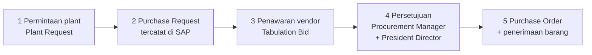

# Panduan Mencoba PMB untuk Tim Procurement

**Versi 1.0 — 28 September 2026**
Disiapkan untuk Tim Procurement (Procurement Admin, Buyer, Procurement Manager, Logistik) sebelum bekerja penuh di PMB menggantikan proc-app.

> **Sifat dokumen ini: panduan mencoba.** Selama masa uji, PMB memakai **perusahaan uji di SAP (`LAB_SBO_20260924`)** — bukan data perusahaan. Dokumen yang kamu buat saat uji coba akan masuk ke perusahaan uji itu, jadi aman. Data pengadaan yang sudah ada (riwayat proc-app dan SAP sungguhan) juga sudah tersalin ke PMB dan bisa kamu lihat.

## Isi

1. Apa yang berubah bagi tim Procurement
2. Cara masuk ke PMB
3. Memilih proyek di bar atas
4. Menu yang dilihat tim Procurement
5. Alur pekerjaan pengadaan dari permintaan sampai barang diterima
6. Melihat daftar Purchase Requests
7. Daily PR — permintaan baru hari itu
8. Bekerja dengan Purchase Order
9. Lampiran dokumen
10. Komentar dan menyebut rekan
11. Mengikuti dokumen (Follow)
12. Persetujuan PO dan batas nilai
13. Tabulation Bid dan pembuatan PO
14. Data induk: Suppliers dan Item Prices
15. Laporan pengadaan
16. Perbandingan singkat: proc-app dan PMB
17. Latihan 30 menit untuk mencoba
18. Bila ada yang tidak berjalan
19. Yang belum tersedia

## 1. Apa yang berubah bagi tim Procurement

PMB adalah satu tempat untuk seluruh perjalanan pengadaan: permintaan dari plant, Purchase Request, penawaran vendor, persetujuan, sampai Purchase Order yang tercatat di SAP. Perbedaan yang paling terasa bagi tim:

- **Riwayat ikut pindah.** 10.996 dokumen Purchase Order dan 14.163 dokumen Purchase Request sejak Juni 2025 sampai September 2026 sudah ada di PMB, termasuk lampiran dokumennya. Jadi kamu tidak perlu membuka dua aplikasi untuk melihat dokumen lama.
- **Nilai pengadaan akhirnya terlihat.** Di proc-app nilai dokumen selalu nol; di PMB nilainya dihitung dari baris item.
- **Satu alur persetujuan.** Peran Procurement Manager dan President Director dinilai langsung di dalam PMB, dengan batas nilai yang bisa diatur tanpa perlu aplikasi dihentikan.
- **Lampiran, komentar, dan tanda ikut tersimpan pada dokumennya**, bukan di berkas terpisah.

## 2. Cara masuk ke PMB

PMB dibuka dari peramban (browser) di alamat `http://192.168.32.149:86`. Dari luar jaringan kantor, aplikasi bisa dibuka melalui `mineops.sbs` bila akses luar sedang dinyalakan.

**Masuk memakai email atau username.** Keduanya diterima pada kolom yang sama: kalau isinya memuat tanda `@` dianggap email, kalau tidak dianggap username. Huruf besar/kecil tidak berpengaruh.

Kata sandi untuk seluruh akun di bawah ini: `password`.

| Username | Email | Peran | Berguna untuk mencoba |
|---|---|---|---|
| adminproc | procurement.admin@pmb.demo | Procurement Admin | membuat PO, mengunggah lampiran, mengubah pengaturan pengadaan |
| buyer | buyer@pmb.demo | Buyer | menyusun tabulation bid, menilai harga vendor |
| procurement.manager | procurement.manager@pmb.demo | Procurement Manager | menyetujui PO (selalu jadi langkah pertama) |
| director | president.director@pmb.demo | President Director | menyetujui PO bernilai besar |
| plant.manager | plant.manager@pmb.demo | Plant Manager | melihat hanya dokumen proyeknya sendiri |
| project.manager | project.manager@pmb.demo | Project Manager | menyetujui Plant Request |
| planner | planner@pmb.demo | Planner | mengajukan permintaan dari sisi plant |
| mechanic | mechanic@pmb.demo | Mechanic | mengajukan permintaan perbaikan |
| logistic.foreman | logistic.foreman@pmb.demo | Logistic Foreman | permintaan gudang dan logistik |
| logistic.pic | logistic.pic@pmb.demo | Logistic PIC | permintaan gudang dan logistik |
| admin | it.manager@pmb.demo | IT Manager | melihat menu sinkronisasi SAP |
| rachmanj | rachmanj@gmail.com | akun Iwan | melihat seluruh proyek |

**Catatan saat mencoba:** bila kamu gagal masuk berkali-kali dengan cepat, PMB membatasi **5 percobaan per menit**. Pesan yang muncul adalah "These credentials do not match our records." Tunggu sekitar satu menit lalu coba lagi — ini pengamanan, bukan kerusakan. Pesan itu juga dipakai untuk kata sandi yang salah maupun akun yang tidak ada, supaya orang luar tidak bisa menebak daftar akun.

## 3. Memilih proyek di bar atas

Di bar atas ada pemilih proyek. Untuk peran plant dan proyek, pilihan itu menentukan dokumen yang terlihat — Plant Manager di proyek tertentu hanya akan melihat dokumen proyeknya. Untuk peran pengadaan yang melihat seluruh perusahaan (Procurement Admin, Buyer, Procurement Manager), pilihan proyek berfungsi sebagai penyaring tampilan.

Halaman yang mengikuti pilihan proyek: **Dashboard, Budget, Plant Requests, DMBD, Reports**. Halaman pengadaan (Purchase Requests, Purchase Orders, Suppliers, Item Prices, Tabulation Bids, Approvals) menampilkan seluruh dokumen, dan bisa kamu saring sendiri lewat kolom **Project**.

## 4. Menu yang dilihat tim Procurement

| Menu | Isi |
|---|---|
| Dashboard | ringkasan pagu, komitmen, dan dokumen terbaru |
| Budget | pagu dan pemakaian per proyek |
| Plant Requests | permintaan dari plant beserta persetujuannya |
| DMBD | status kesiapan unit |
| Approvals | dokumen yang menunggu persetujuanmu, beserta jumlahnya pada lencana merah (hanya untuk peran penyetuju) |
| Purchase Requests | register seluruh Purchase Request |
| Daily PR | jumlah PR per tanggal, untuk pemeriksaan harian |
| Purchase Orders | register seluruh Purchase Order |
| Procurement Settings | batas nilai yang memerlukan persetujuan President Director |
| Suppliers | daftar vendor dari SAP |
| Item Prices | harga item per vendor dan riwayat impornya |
| Tabulation Bids | pembandingan penawaran vendor |
| Reports | laporan pengadaan dan ekspor |

## 5. Alur pekerjaan pengadaan dari permintaan sampai barang diterima

Langkah bernomor:

1. Plant mengajukan permintaan; Project Manager lalu Plant Manager menyetujuinya di dalam PMB.
2. Permintaan yang disetujui menjadi Purchase Request yang tercatat di SAP, dan langsung tampil di register PMB.
3. Buyer mengumpulkan penawaran dua sampai tiga vendor pada halaman Tabulation Bids.
4. Setelah pembandingan selesai, persetujuan berjalan: **Procurement Manager selalu**, dan **President Director** bila nilainya mencapai batas yang diatur.
5. Tombol **Create PO** membuat Purchase Order di SAP. Sesudah itu penerimaan barang mengikuti alur gudang yang biasa.

## 6. Melihat daftar Purchase Requests

Menu **Purchase Requests** menampilkan seluruh PR dalam satu daftar: nomor PR, nomor MR, pemohon, departemen, proyek, jumlah baris, nilai, tanggal dibutuhkan, dan statusnya. Per 28 September 2026 isinya **14.163 dokumen** dengan nilai **Rp 13,5 miliar**.

Yang bisa kamu lakukan:

- **Mencari** dengan satu kolom pencarian: nomor PR, nomor MR, nama pemohon, atau kode item.
- **Menyaring** dengan kotak pilihan **Project**, **Department**, dan **PR status**.
- **Membuka rincian** sebuah PR untuk melihat baris itemnya, dokumen terkait, dan lampirannya.
- **Mengunduh daftar** dalam bentuk berkas CSV untuk diolah di Excel.

## 7. Daily PR — permintaan baru hari itu

Menu **Daily PR** menampilkan jumlah PR per tanggal, berguna untuk pemeriksaan pagi: berapa permintaan masuk kemarin, berapa yang masih terbuka, dan dari departemen mana. Daftarnya juga bisa diunduh sebagai CSV bila kamu ingin membuat rekap bulanan.

## 8. Bekerja dengan Purchase Order

### 8.1 Daftar Purchase Order

Menu **Purchase Orders** menampilkan register seluruh PO: **10.996 dokumen** per 28 September 2026 — berasal dari 6.450 dokumen hasil sinkronisasi SAP dan 4.546 dokumen riwayat proc-app yang sudah tidak ada lagi di SAP (ditandai asalnya, supaya jelas asal datanya).

Setiap baris menampilkan nomor PO, vendor, proyek, tanggal, nilai, jumlah baris, status pengiriman, proyek, dan asal dokumen.

- Kotak pencarian menerima nomor PO, nomor PR, nama vendor, atau kode item: **"Search PO, PR, vendor, item code"**.
- Penyaring yang tersedia: **Project**, **Department**, **Delivery status**, **Origin**, dan **Following**.
- Tanda **"Only POs I follow"** menyaring daftar menjadi hanya dokumen yang kamu ikuti.
- Daftar bisa diunduh sebagai CSV.

**Batas akses proyek juga berlaku di sini.** Peran seperti Plant Manager atau Project Manager hanya melihat PO proyeknya sendiri, dan rincian PO proyek lain akan ditolak.

### 8.2 Halaman rincian Purchase Order

Halaman rincian berisi bagian-bagian berikut:

| Bagian | Isinya |
|---|---|
| Informasi dokumen | nomor PO, vendor, proyek, tanggal, status, nilai |
| Line items | baris barang: kode item, keterangan, jumlah, satuan, harga, dan nilai |
| Attachments | berkas yang menempel pada dokumen |
| Comments | percakapan tim pada dokumen itu |
| Related documents | Purchase Request yang menjadi asalnya |
| Legacy approval history (proc-app) | jejak persetujuan dari aplikasi lama, ditampilkan apa adanya |

## 9. Lampiran dokumen

Pada bagian **Attachments** di halaman rincian PO, kamu bisa mengunggah berkas pendukung.

- Ukuran paling besar **10 MB** per berkas.
- Jenis berkas yang diterima: **PDF, Excel (.xlsx/.xls), Word (.doc/.docx), JPG, dan PNG**.
- Berkas disimpan di ruang privat. Berkas hanya bisa diunduh oleh orang yang berhak membuka dokumennya, dan tidak bisa dibuka langsung dari luar aplikasi.
- Nama berkas asli tetap dipertahankan saat diunduh.

Seluruh lampiran riwayat juga sudah ikut pindah: **25.399 lampiran**. Sebanyak **58 lampiran ditandai "berkas tidak tersedia"** karena berkasnya memang sudah tidak ada di proc-app — barisnya tetap ditampilkan supaya jejak dokumennya tidak hilang, tetapi berkasnya tidak bisa diunduh dan tidak ada pengganti yang dibuat.

## 10. Komentar dan menyebut rekan

Di bagian **Comments** pada halaman rincian, kamu bisa menulis catatan dalam bentuk percakapan. Kolom komentar menuliskan: **"Write a comment. Use @ to mention colleagues."**

- Menulis tanda `@` akan memunculkan daftar rekan kerja yang bisa disebut; pilih namanya untuk mengirim pemberitahuan.
- Komentar bisa dihapus oleh pembuatnya, dan penghapusan juga membersihkan pemberitahuan yang terkait.
- Panjang satu komentar paling banyak 2000 karakter; komentar kosong akan ditolak.

Manfaatkan bagian ini untuk hal yang biasanya hilang di percakapan pribadi: alasan pemilihan vendor, kapan barang dijanjikan datang, atau siapa yang sudah menelpon vendor.

## 11. Mengikuti dokumen (Follow)

Tombol **Follow** pada baris daftar dan pada halaman rincian membuat dokumen masuk ke daftar pengawasanmu. Gunakan **"Only POs I follow"** untuk melihat ringkasannya — cara praktis memantau sepuluh dokumen yang paling kamu tunggu tanpa membaca seluruh register.

## 12. Persetujuan PO dan batas nilai

Persetujuan dinilai langsung di dalam PMB, dan berlaku untuk peran penyetuju saja:

| Dokumen | Siapa menyetujui |
|---|---|
| Plant Request | Project Manager, lalu Plant Manager |
| PO hasil Tabulation Bid | Procurement Manager (selalu) |
| PO bernilai mencapai batas | President Director, setelah Procurement Manager |
| Overbudget | Finance Director, lalu Operation Director |
| Pembatalan | Procurement Manager |
| Interchange penggantian part | Plant Manager, lalu AML Manager, lalu Operation Director, lalu President Director |

**Batas nilai** diatur oleh Procurement Admin pada menu **Procurement Settings**, pada bagian **"PO President Director threshold"** dengan kolom **"Threshold (IDR)"**. Di bawah batas itu, persetujuan cukup sampai Procurement Manager. Karena bisa diatur dari halaman ini, batasnya bisa disesuaikan kapan saja tanpa perlu menunggu perubahan aplikasi.

Halaman **Approvals** berisi dua bagian: **Pending Approvals** (menunggu tindakanmu) dan **My Approvals** (sudah kamu putuskan). Setiap dokumen menampilkan langkah berapa dari berapa, dan pada langkah President Director ditampilkan nilai serta batasnya supaya jelas kenapa dokumen itu naik ke tingkat itu.

## 13. Tabulation Bid dan pembuatan PO

Menu **Tabulation Bids** adalah tempat membandingkan penawaran vendor (dua sampai tiga vendor) sebelum PO dibuat.

- Buyer menyusun pembandingan: vendor, harga, dan catatan teknis.
- Setelah dikirim untuk dinilai, dokumen masuk ke rantai persetujuan.
- Tombol **Create PO** baru aktif setelah persetujuan selesai. Bila ditekan terlalu dini, PMB akan menjelaskan apa yang masih ditunggu — bukan sekadar menolak.

## 14. Data induk: Suppliers dan Item Prices

**Suppliers** berisi daftar vendor yang dipakai bersama SAP: **2.395 vendor aktif** per 28 September 2026. Ada tombol untuk menyegarkan daftar dari SAP; vendor yang tidak lagi aktif ditandai, bukan dihapus, supaya dokumen lama tetap punya rujukan.

**Item Prices** menyimpan harga item per vendor, dan dipakai sebagai perkiraan awal saat menyusun permintaan. Per 28 September 2026 isinya **1.093 harga**. Harga bisa diisi lewat impor berkas CSV (paling besar 5 MB atau 20.000 baris), dan hasil setiap impor diringkas di bagian **Import history** dengan angka **Rows read, Created, Updated, Unchanged, Failed**.

Aturan yang perlu diketahui: **harga yang sudah ada di PMB dan lebih baru tidak akan tertimpa** oleh berkas impor yang lebih lama. Jadi mengimpor berkas lama tidak akan merusak harga yang sudah diperbarui tim.

## 15. Laporan pengadaan

Menu **Reports** memuat lima laporan pengadaan, semuanya bisa diunduh sebagai CSV maupun PDF:

| Laporan | Gunanya |
|---|---|
| Purchase Request Status | berapa banyak PR dan berapa nilainya, per status dan departemen |
| Purchase Order Trend | perkembangan jumlah PO dari bulan ke bulan |
| Top Suppliers | vendor dengan nilai terbesar, beserta pangsanya |
| Approval Turnaround | berapa lama waktu persetujuan dari PR sampai PO |
| PR by Department | permintaan per departemen dan proyek |

Catatan pembacaan: laporan **Purchase Order Trend** membaca data PMB, sedangkan angka pembandingnya berasal dari dokumen SAP. Bila keduanya belum sama, artinya penarikan data terakhir belum selesai — bukan berarti dokumennya hilang.

## 16. Perbandingan singkat: proc-app dan PMB

| Hal | proc-app (aplikasi lama) | PMB |
|---|---|---|
| Nilai dokumen | selalu nol | dihitung dari baris item |
| Riwayat | hanya dokumen yang diunggah ke aplikasi itu | digabung dengan dokumen dari SAP |
| Lampiran | tersimpan, sulit ditelusuri | menempel pada dokumennya, berhak akses |
| Komentar | tidak ada | ada, dengan sebutan rekan |
| Persetujuan | di luar aplikasi | di dalam aplikasi, berjenjang dan tercatat |
| Harga item | daftar terpisah | dipakai otomatis saat menyusun permintaan |
| Laporan | tidak ada | lima laporan pengadaan, bisa diunduh |

## 17. Latihan 30 menit untuk mencoba

Kerjakan berurutan; semuanya aman karena memakai perusahaan uji di SAP.

1. **Masuk** dengan `adminproc` lalu dengan `procurement.admin@pmb.demo` — pastikan keduanya bisa.
2. Buka **Purchase Orders**, cari nomor PO yang biasa kamu tangani, dan buka rinciannya.
3. Periksa bagian **Line items**: apakah harga dan jumlahnya sesuai yang kamu ingat? Inilah yang dulu tidak pernah terlihat di proc-app.
4. Buka **Attachments** dan unggah satu berkas PDF yang tidak berisi data rahasia (di bawah 10 MB).
5. Tulis satu komentar dan sebut seorang rekan dengan tanda `@`.
6. Tekan **Follow** pada PO itu, lalu aktifkan penyaring **"Only POs I follow"**.
7. Buka **Purchase Requests**, saring dengan kotak **Project**, dan unduh CSV-nya.
8. Buka **Reports**, buka **Top Suppliers**, dan unduh versi PDF.
9. Masuk sebagai `director`, buka **Approvals**, dan lihat bagaimana sebuah dokumen ditampilkan pada langkah President Director.
10. Catat hal yang menurutmu menyulitkan: itu yang paling berguna bagi kami sebelum tim pindah penuh.

## 18. Bila ada yang tidak berjalan

| Gejala | Penyebab yang paling sering | Yang dilakukan |
|---|---|---|
| Tidak bisa masuk, padahal kata sandi benar | terlalu banyak percobaan dalam satu menit | tunggu satu menit, lalu coba sekali lagi |
| Pesan "These credentials do not match our records." | kata sandi salah, atau akun memang tidak ada | pastikan kata sandi `password`, dan periksa ejaan username |
| Angka aktual belum muncul pada pagu | dokumen dari sistem lain belum terbaca | tunggu penarikan berikutnya (berkala setiap 15 menit) |
| Lampiran gagal diunggah | berkas lebih dari 10 MB atau jenisnya tidak diizinkan | perkecil berkas, atau ubah ke PDF |
| Dokumen tidak muncul di daftar | penyaring atau pemilih proyek sedang aktif | kosongkan penyaring dan periksa Project di bar atas |
| Rincian dokumen proyek lain ditolak | batas akses proyek pada peranmu | gunakan akun dengan peran pengadaan untuk melihat seluruh proyek |

## 19. Yang belum tersedia

- **Interchange dan Cannibal** masih dalam tahap terbatas dan hanya tampil untuk sebagian peran.
- **proc-app masih hidup** selama masa berdampingan, dan akan dijadikan hanya-baca lalu ditutup setelah tim menyatakan PMB stabil. Sampai saat itu, pekerjaan yang sudah lazim tetap bisa dilakukan di proc-app.
- **Akses dari luar jaringan kantor** (lewat `mineops.sbs`) bisa dinyalakan atau dimatikan; bila sedang mati, gunakan jaringan kantor.

Pertanyaan, temuan, atau usulan perbaikan atas aplikasi ini mohon disampaikan kepada tim kami — setiap catatan dari pemakaian nyata langsung kami tindak lanjuti sebelum aplikasi ini menjadi tempat kerja harian tim Procurement.
