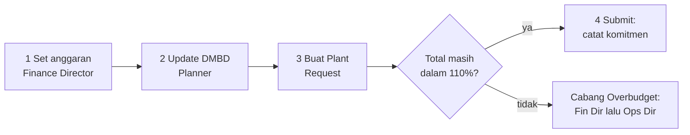
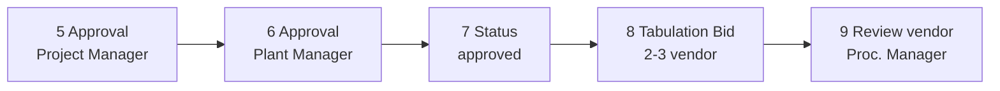
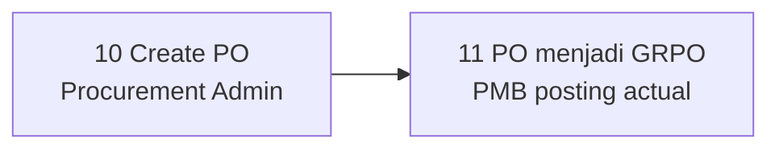
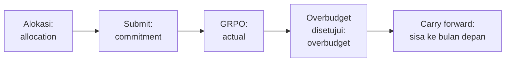

# Manual Simulasi — Plant Budget Tracker (PMB)

**Versi dokumen:** 1.16 · **Tanggal:** 23 September 2026
**Lingkungan uji:** aplikasi internal `http://192.168.32.149:86` (jaringan kantor)
**Versi aplikasi:** 23 September 2026 · **Sumber kebenaran bisnis:** `docs/concept.md` / `docs/concept-id.md`

> **Perubahan v1.16 (23 September 2026):** (a) seluruh tampilan aplikasi kini **bahasa Inggris** —
> kutipan label, tombol, dan judul kolom di manual ini mengikuti teks layar persis; narasi manual
> tetap bahasa Indonesia. (b) Anggaran **global per proyek** (satu pagu per proyek per bulan, bukan
> per unit alat). (c) Pemilih proyek di **topbar** (label **Project**, tooltip *Applies to all pages*)
> berlaku untuk Dashboard, Budget, Plant Requests, DMBD, Reports, dan halaman kerja lainnya.
>
> **Perubahan v1.15 (23 September 2026): anggaran kini GLOBAL per proyek.** Finance Director
> menetapkan **satu pagu untuk satu proyek per bulan** — tidak lagi per unit alat, tidak lagi ada
> baris per divisi. Yang diperiksa saat permintaan diajukan adalah pagu proyek beserta toleransinya.
> Unit alat **tetap dipilih** pada permintaan (untuk riwayat & analisis), dan laporan Konsumsi
> Anggaran tetap menyediakan rincian per unit — diambil dari data permintaan. Perubahan ini
> menggantikan cara lama pada v1.7 (gap B-10). Data anggaran September 2026 sudah digabung menjadi
> satu baris per proyek dengan total tetap.
>
> **Perubahan v1.14:** **konteks proyek**. Akun tanpa ikatan proyek tidak lagi terbuka di `000H`: kini
> default-nya **proyek aktif pertama** dan ada **pemilih proyek** di header yang berlaku untuk semua
> halaman (Anggaran, Permintaan, DMBD, Laporan). Akun yang terikat proyek tetap terkunci. Ini menutup
> batasan terakhir (B-18) — seluruh 19 batasan sudah selesai.
>
> **Perubahan v1.13:** **batas akses per peran**. Menu dan halaman Approvals, Tabulation Bid,
> Overbudget, Pembatalan, dan Interchange kini hanya terbuka untuk peran yang memang terlibat, dan
> pembuatan draf Plant Request khusus Planner/Mechanic. Peran lain tidak melihat menunya sama sekali;
> bila alamatnya dibuka langsung akan ditolak dengan pesan yang jelas. Tabel lengkapnya di bagian 10.
>
> **Perubahan v1.12:** modul **Reports**. Halaman daftar laporan menampilkan **Budget Consumption**,
> **Vendor Performance**, dan **Equipment Cost**; tiap laporan punya tombol **Download PDF** dan
> **Download CSV**. Akun tanpa hak unduh tetap bisa membuka laporan di layar tetapi tombol unduh tidak
> muncul (gap B-12 ditutup).
>
> **Perubahan v1.11:** perbaikan **perhitungan anggaran**. Sebelumnya dua keadaan membuat angka anggaran
> keliru: (1) permintaan yang **dibatalkan** tetap "memakan" anggaran — sekarang anggaran kembali utuh;
> (2) setelah **barang diterima (GRPO)**, pemakaian dihitung dua kali (komitmen + aktual sekaligus) —
> sekarang hanya dihitung sekali. Dengan perbaikan ini, angka **Ceiling / Used / Remaining** di
> **Budget** dan **Dashboard** selalu konsisten dengan catatan transaksinya.
>
> **Perubahan v1.10:** halaman detail Plant Request punya kartu **Procurement History** (MR/PR/PO/GRPO,
> tanggal & penerima) dan tombol **Create PR in SAP** (Procurement Admin/IT Manager) serta **Mark Goods
> Received** (Plant Manager, Project Manager, Logistic Foreman/PIC) sehingga alur setelah disetujui
> bisa dilanjutkan dari aplikasi, tidak hanya di SAP (gap B-8 ditutup).

> **Perubahan v1.9:** **Dashboard** menampilkan angka nyata (Ceiling, Used, Remaining, % Used, jumlah
> permintaan per status, pengadaan, DMBD hari ini, pending actions) — bukan lagi tanda "—". Kartu bisa
> diklik; approver melihat peringatan **Awaiting your decision: N** (gap B-15 ditutup).

> **Perubahan v1.8:** pencarian harga part number kini benar-benar **per part** dari SAP
> (harga PO terakhir → harga beli terakhir item master → harga historis permintaan sebelumnya),
> lengkap dengan **referensi sumber harga** di layar; koneksi baca SAP yang sebelumnya gagal juga
> diperbaiki (gap B-11 ditutup).

> **Perubahan v1.7:** form **alokasi anggaran** kini memakai daftar unit nyata dari ARKFLEET
> (dikelompokkan per tipe plant, SOLD/SCRAP dikecualikan) dan mendukung alokasi tingkat **divisi
> (tanpa unit)**; alokasi ganda untuk unit/periode yang sama ditolak (gap B-10 ditutup).

> **Perubahan v1.6:** layar **DMBD** punya kolom **Breakdown Notes** (catatan wajib saat status
> **Breakdown**) dan daftar unit **berhalaman** dengan pencarian + filter status & proyek (gap B-9 ditutup).

> **Perubahan v1.5:** koreksi tanggal dokumen dan seluruh cap tanggal di dalamnya (semula tertulis
> 17 September 2026 — tanggal tersebut keliru, pekerjaan dan pemeriksaan dilakukan 22 September 2026).

> **Perubahan v1.4:** proyek aktif dikelola dari menu **Projects** (sakelar **Active** / **Off** per
> baris), dan **Sync from ARKFLEET** tidak lagi menimpa pilihan manual. Proyek aktif
> saat ini: **021C, 022C, 025C, APS**. Skenario S-02 ditambah langkah uji kelola proyek aktif.

> **Perubahan v1.3:** bagian **Verifikasi Teknis** dihapus dari dokumen ini (dipindah ke lampiran
> teknis internal) supaya dokumen aman dibagikan ke pengguna non-IT.

> **Perubahan v1.2:** **menu sidebar** untuk Approvals (dengan badge jumlah pending), Overbudget,
> Cancellation, Interchange, dan SAP Sync sudah tersedia, dan **Plant Request draft sekarang bisa
> diedit** (unit, alokasi anggaran, SAP MR ID, dan baris material) selama statusnya masih `draft`
> dan hanya oleh pembuatnya. Gap B-4, B-7, dan B-19 di §10 ditutup.

> **Perubahan v1.1:** lima gap yang membuat alur berhenti sudah diperbaiki dan sudah live di server
> — form Overbudget, tombol Create PO, tombol Create Bid + kelengkapan form vendor,
> tombol pembatalan & Agree, serta form Interchange + Sign-off. Skenario S-07, S-09, S-11, S-12,
> S-13 di bawah sudah memakai alur baru.

> Dokumen ini dipakai untuk **uji simulasi** (user acceptance test berbasis skenario) PMB.
> Semua langkah di bawah sudah diverifikasi terhadap kode yang terpasang di server, bukan asumsi.

---

## 1. Tujuan & Ruang Lingkup

Tujuan simulasi:

1. Membuktikan alur kerja tiap peran berjalan di aplikasi nyata (bukan mock).
2. Membuktikan kontrol anggaran (ledger, toleransi 110%) benar saat dijeda/melebihi batas.
3. Membuktikan pemisahan tugas (segregation of duties) dan pembatasan akses per proyek.
4. Menemukan kekurangan UI/UX sebelum aplikasi dipakai user sesungguhnya.

Yang **di luar** lingkup simulasi ini: perubahan konfigurasi server, pemasangan fitur baru,
dan penulisan ke SAP produksi (PO ke SAP hanya diuji setelah Iwan menyetujui).

---

## 2. Akses Aplikasi & Akun Simulasi

Buka `http://192.168.32.149:86` → diarahkan ke `/login`. Login memakai **email + password**.
Semua akun demo di bawah password: `password` (hanya untuk simulasi internal).

| # | Peran (tampilan) | Email | Scope proyek | Fungsi utama di simulasi |
|---|------------------|-------|--------------|--------------------------|
| 1 | Planner | planner@pmb.demo | 022C | Update DMBD, buat & submit Plant Request |
| 2 | Mechanic | mechanic@pmb.demo | 022C | DMBD lihat saja, buat Plant Request |
| 3 | Project Manager | project.manager@pmb.demo | 022C | Approval tingkat 1 Plant Request |
| 4 | Plant Manager | plant.manager@pmb.demo | 022C | Approval tingkat 2, sign-off interchange |
| 5 | Logistic Foreman | logistic.foreman@pmb.demo | 022C | (izin ada, sebagian UI belum tersedia) |
| 6 | Logistic PIC | logistic.pic@pmb.demo | 022C | (izin ada, sebagian UI belum tersedia) |
| 7 | Buyer | buyer@pmb.demo | global | Tabulation Bids, interchange |
| 8 | Procurement Manager | procurement.manager@pmb.demo | global | Review bid, award vendor |
| 9 | Procurement Admin | procurement.admin@pmb.demo | global | **Create PO** ke SAP |
| 10 | Finance Director | finance.director@pmb.demo | global | Set/revisi anggaran, carry-forward, approval overbudget |
| 11 | Operation Director | operation.director@pmb.demo | global | Approval overbudget tingkat 2 |
| 12 | President Director | president.director@pmb.demo | global | Izin approval PO (belum ada layar khusus) |
| 13 | IT Manager | it.manager@pmb.demo | global | Users, Role & Permission, Projects, SAP Sync |
| 14 | AML Manager / AML Dept Head | aml.manager@pmb.demo / aml.dept.head@pmb.demo | global | Modul Beta (Components & cannibal) |

Akun non-demo: `rachmanj@gmail.com` (IT Manager, milik Iwan).

**Catatan penting:** role disimpan per "team" = `project_code`. User dengan scope 022C hanya
mendapat izin hanya pada konteks proyek 022C. Akun direktur, IT, dan pengadaan tidak terikat
satu proyek sehingga izinnya berlaku untuk semua proyek.

**Dua hal praktis yang sudah terbukti saat uji akses 22 Sep 2026:**

1. **Login dibatasi 5 percobaan per menit** (throttle). Jangan login berulang-ulang di satu menit —
   pakai jendela browser terpisah dan biarkan sesi tetap terbuka, kalau tidak akan muncul
   `429 Too Many Requests`.
2. **User tanpa scope proyek** (direktur, IT Manager, Buyer, Procurement\*) membuka aplikasi pada
   **proyek aktif pertama** (saat ini **021C**). Di **topbar** muncul label **Project** (tooltip
   *Applies to all pages*) — pilih **022C — …** agar Dashboard, Budget, DMBD, dan Reports konsisten
   untuk simulasi 022C. Akun terikat proyek (Planner/Mechanic 022C) **tidak** melihat pemilih ini;
   proyek mereka tetap 022C.

---

## 3. Peta Menu per Role

Menu sidebar muncul otomatis mengikuti izin. Yang **tidak punya menu** tetap bisa dibuka lewat URL.

| Menu (sidebar) | Siapa biasanya melihat | Catatan |
|----------------|------------------------|---------|
| Dashboard | semua yang login | — |
| Budget | semua yang login | Finance Director juga bisa **Edit Allocation** / **Create Allocation** |
| Plant Requests | Planner, Mechanic | tombol **Create Request** |
| DMBD | Planner, Mechanic, manajer (lihat/ubah sesuai peran) | — |
| Approvals | approver (badge jumlah pending) | halaman **My Approvals** |
| Overbudget | Planner, Mechanic, Finance Director, Operation Director, IT Manager | — |
| Cancellation | Plant + Procurement | — |
| Interchange | Procurement + sign-off Plant/AML | — |
| SAP Sync | IT Manager, Procurement Manager, Finance Director | — |
| Tabulation Bids | Buyer, Procurement Manager, Procurement Admin | submenu terkait bid |
| Reports | hampir semua peran | submenu: **Report List**, **Budget Consumption**, **Vendor Performance**, **Equipment Cost** |
| Components | AML (hanya jika fitur Beta aktif) | — |
| Users / Role & Permission / Projects | IT Manager | — |

**Catatan menu:** **Approvals**, **Overbudget**, **Cancellation**, **Interchange**, dan **SAP Sync**
muncul sesuai peran; yang tidak punya menu tetap bisa ditolak dengan jelas bila alamatnya dibuka
langsung (lihat tabel §10).

---

## 4. Ringkasan Alur Kerja

### 4.1 Alur inti — tahap pengajuan

### 4.2 Alur inti — tahap persetujuan

### 4.3 Alur inti — tahap pengadaan ke SAP

### 4.4 Alur anggaran (ledger)

Aturan angka: **semua uang `DECIMAL(18,2)` + bcmath**, saldo **tidak pernah** diubah langsung —
selalu lewat entri ledger baru. Batas pemakaian = alokasi + carry forward, ditoleransi
`tolerance_pct` (default 10% → cap 110%).

---

## 5. Kondisi Data Awal (baseline 22 Sep 2026)

| Objek | Kondisi saat ini |
|-------|------------------|
| Proyek aktif | `021C`, `022C`, `025C`, `APS` (diatur di menu **Projects**) |
| Proyek di cache (dari ARKFLEET) | 000H, 001H, 005P, 017C, 021C, 022C, 023C, 025C, 026C, APS |
| Periode anggaran | `000H` Sep 2026 (open, **satu pagu proyek** Rp 300 jt), `022C` Sep 2026 (open, **satu pagu** Rp 295 jt, toleransi 10%) |
| Pagu 022C Sep 2026 | Satu baris di halaman **Budget** (bukan per unit); unit hanya dipilih di Plant Request |
| Data unit (ARKFLEET) | API aktif; **194 unit untuk proyek 022C**, **992 unit** bila tanpa filter proyek |
| Plant request / bid / DMBD / overbudget / cancellation / interchange | **kosong** (belum ada transaksi) |
| Queue | `queue-plantbudget` jalan, queue kosong, `failed_jobs` kosong |
| Integrasi | ARKFLEET → `http://192.168.32.15/ark-fleet/api` (aktif); SAP Service Layer `https://192.168.32.26:50000/b1s/v1/` (terkonfigurasi, belum diuji tulis) |

Konsekuensi: simulasi dimulai dari nol transaksi. Semua nomor dokumen akan berurut mulai
`PMB-REQ-202609-0001`, `PMB-BID-202609-0001`, `PMB-OB-202609-0001`.

---

## 6. Persiapan Sebelum Simulasi (pre-flight)

| # | Langkah | Cara | Hasil yang diharapkan |
|---|---------|------|------------------------|
| P-1 | Pastikan aplikasi hidup | buka `http://192.168.32.149:86` | redirect ke `/login`, halaman tampil |
| P-2 | Pastikan data unit tersedia | login Planner → `/dmbd` | tabel terisi **194 unit** untuk proyek 022C (dari ARKFLEET). Kalau kosong → integrasi ARKFLEET bermasalah |
| P-3 | Pastikan anggaran ada | login Finance Director → topbar **Project** = 022C → menu **Budget** | tab Sep 2026 status **open** dengan **satu baris** pagu proyek |
| P-4 | Pastikan proses latar belakang hidup | minta Dea memastikan di sisi server | perubahan DMBD & sinkronisasi berjalan, tidak menumpuk |
| P-5 | Siapkan akun per peran | tabel §2 | cukup buka 3–4 browser berbeda (mode incognito) agar sesi tidak tertukar |
| P-6 | Catat angka awal | catat anggaran & jumlah dokumen yang ada sebelum mulai (lihat layar, atau minta Dea cetak ringkasannya) | angka awal tercatat untuk pembanding |

**Saran teknis:** jalankan simulasi dengan minimal 4 jendela browser: Planner, PM, Plant Manager,
Procurement (Buyer/Manager). Approval dua tingkat tidak bisa dilakukan satu akun.

---

## 7. Skenario per Peran

Format: setiap skenario punya **langkah**, **hasil yang diharapkan**, dan **titik verifikasi**.
Kolom temuan dipakai di lembar observasi §9.

### S-01 · Finance Director — Melihat & menyiapkan anggaran

**Login:** `finance.director@pmb.demo`

1. Buka menu **Dashboard** → sapaan (*Good morning/afternoon/evening*), tanggal hari ini, tag kode
   proyek, dan kartu **Budget …** (mis. September 2026) dengan **Ceiling**, **Used**, **Remaining**,
   **% Used** (angka nyata, bukan "—"). Bagian **Requests**, **Procurement** (jika tampil), dan
   **Pending Actions** bernilai 0 sebelum ada transaksi. Kartu bisa diklik.
2. Di **topbar**, pastikan pemilih **Project** menunjukkan proyek yang ingin diuji (mis. **022C — …**).
   Buka menu **Budget** → pemilih **Project:** di halaman (sama dengan konteks topbar).
   - Diharapkan: tab periode Sep 2026 berlabel status **open** berisi **satu baris** pagu proyek
     dengan kolom **Ceiling**, **Carry Fwd**, **Committed**, **Actual**, **Remaining**, **% Used**
     (bisa menampilkan teks **Within limit** / **Near limit** / **Over limit**), **Tolerance**, dan
     **Actions** (Finance Director).
3. Klik **Edit Allocation** atau **Create Allocation** (kanan atas) → halaman **Set Budget Ceiling**.
4. Isi form: **Project** = 022C, **Period Month** = Oktober 2026, **Total Project Budget (IDR)** =
   mis. Rp 250.000.000, **Tolerance (%)** = 10. (Opsional: **Notes (optional)**.)
   - Tidak ada pilihan unit — anggaran global per proyek.
5. Klik **Save Budget Ceiling**.
   - Diharapkan: kembali ke **Budget**, tab **2026-10** dengan satu baris **Ceiling** Rp 250.000.000
     dan **Tolerance** 10%.
6. Uji **revisi** periode yang sama: buka lagi **Edit Allocation** untuk Oktober 2026.
   - Diharapkan: banner *This period already has a ceiling. Saving will revise that period (not add a new row).*
   - Ubah **Total Project Budget (IDR)** menjadi Rp 240.000.000 → klik **Save Ceiling Revision**.
   - Diharapkan: **Ceiling** berubah menjadi Rp 240.000.000, **baris tetap satu** (revisi resmi,
     bukan baris baru).
   - Alternatif: di tabel **Budget**, klik **Revise** pada baris periode yang masih bisa diedit →
     ubah angka → **Save** / **Cancel**.
7. Uji batas pagu: minta Planner menjalankan S-04 dengan total masih dalam pagu + toleransi → **Submit**
   berhasil. Bila total melebihi batas, muncul peringatan *Exceeds …% cap — submit will trigger
   Overbudget workflow* dan alur **Overbudget** (S-11).
8. (Opsional) Sebagai Planner, **Create Request** → bagian **2. Project Budget** menampilkan
   **Project budget remaining**; unit dipilih di **1. Unit / Equipment** hanya untuk riwayat/analisis.
9. Menu **Reports** → **Budget Consumption** → ringkasan per proyek; rincian per unit dari data
   permintaan (kosong jika belum ada permintaan).
10. Pada tab periode status **open**, klik **Run Carry Forward**.
   - Diharapkan: periode berstatus **locked**; periode berikutnya terbentuk dengan **Carry Fwd**
     terisi sisa anggaran.

**Cara memastikan (tanpa alat teknis)**
- Kolom **Committed** / **Actual** / **Remaining** di **Budget** berubah setelah revisi atau transaksi.
- Setelah carry forward, tab bulan tersebut berlabel **locked** dan tidak bisa direvisi lagi.

**Uji negatif**
- Coba buka `/budget/setting` dengan akun Planner → harus **403** (bukan 404).

---

### S-02 · IT Manager — Administrasi & integrasi

**Login:** `it.manager@pmb.demo`

1. Menu **Users**, **Role & Permission**, dan **Projects** tampil di sidebar.
2. Buka **Projects** → klik **Sync from ARKFLEET**.
   - Diharapkan: daftar proyek terbarui; yang **Active** saat ini `021C`, `022C`, `025C`, `APS`.
   - Bila ARKFLEET tidak terjangkau, muncul peringatan **ARKFLEET unreachable**; daftar tetap tampil
     dari data tersimpan.
3. Uji kelola proyek aktif: pada baris `023C`, aktifkan sakelar **Active** (notifikasi aktivasi);
   lalu **Sync from ARKFLEET** lagi.
   - Diharapkan: `023C` **tetap Active** (pilihan manual tidak tertimpa). Kemudian nonaktifkan lagi (**Off**).
4. Buka **Users** → **Add User**: nama "Uji Planner 025C", email `uji.planner@pmb.demo`,
   password ≥ 8 karakter, division plant, project scope 025C, aktif.
5. Assign peran user baru: peran **Planner** dengan scope proyek 025C → simpan.
6. Uji login akun baru itu di jendela lain → berhasil, menu Plant Requests + DMBD muncul.
7. `/admin/roles` → lihat daftar permission per role → tambah/hapus satu permission pada role
   `planner`, lalu login ulang sebagai planner untuk melihat efeknya.
8. `/sap/sync-dashboard` → halaman terbuka (untuk IT Manager, Procurement Manager, dan
   Finance Director); tabel Sync Logs masih kosong karena belum ada aktivitas ke SAP.

**Uji negatif:** buka `/admin/users` sebagai Planner → **403**. Buka `/sap/sync-dashboard`
sebagai Planner atau Plant Manager → **403** (yang boleh: IT Manager, Procurement Manager,
Finance Director).

**Hati-hati:** hapus user (`DELETE /admin/users/{id}`) bersifat permanen — gunakan hanya akun uji.

---

### S-03 · Planner / Mechanic — DMBD harian

**Login:** `planner@pmb.demo` (untuk ubah status), lalu ulangi sebagai `mechanic@pmb.demo` (uji batas)

1. Buka menu **DMBD** → judul menampilkan tanggal laporan dan nama proyek yang sedang dilihat.
2. Kenali filter: **Search unit code / description**, filter status (**All Statuses** / **Ready for Use**
   / **Standby** / **Breakdown**), filter proyek (**All Projects** bila tersedia), dan ringkasan
   **Today:** dengan tag jumlah per status.
3. Daftar unit sekarang **berhalaman** (25/50/100 per halaman, bisa diganti di bawah tabel) —
   tidak lagi menampilkan ratusan unit sekaligus. Coba pindah halaman dan pakai kotak pencarian
   untuk menemukan **E 062**.
4. Ubah status unit lain menjadi **Standby** lewat dropdown → tersimpan otomatis.
5. Ubah status **E 062** menjadi **Breakdown**:
   - Diharapkan: modal **Breakdown Cause Note** dengan field **Note** (wajib, minimal 5 karakter).
     Isi mis. "Hose bocor, menunggu part" → **Save**.
   - Kolom **Breakdown Notes** pada baris E 062 terisi; teks panjang bisa dibaca lewat tooltip.
6. Klik **Edit Note** (atau **Add Note**) pada baris yang sama → ubah catatan → **Save**.
7. Filter status **Breakdown** → hanya unit breakdown; ringkasan **Today:** tetap total seluruh unit.
8. Login sebagai `mechanic@pmb.demo` → DMBD **hanya lihat**: status sebagai tag (tanpa dropdown),
   **Breakdown Notes** terbaca, kolom **Actions** tidak muncul.

**Cara memastikan (tanpa alat teknis)**
- Buka ulang halaman **DMBD**: status dan catatan yang baru diisi tetap ada untuk tanggal hari ini.
- Aturan satu unit satu status per hari: mengubah ulang unit yang sama akan menimpa, bukan menambah baris.
- Sinkronisasi balik ke ARKFLEET berjalan di latar belakang; minta Dea memeriksa bila perlu.

---

### S-04 · Planner — Membuat & submit Plant Request (alur utama)

**Login:** `planner@pmb.demo` (scope 022C)

1. Pastikan topbar **Project** = 022C. Menu **Plant Requests** → **Create Request**.
2. Bagian **1. Unit / Equipment**: **Select Unit** → pilih `E 062 — …` (cari "E 062").
   - **Unit Code** dan **Plant Type** terisi otomatis (read-only).
3. **SAP MR ID** > 0, mis. `900001` (bantuan layar: *Enter after MR is created in SAP — use 0 for draft*).
   - MR wajib sebelum **Submit**; MR = 0 hanya untuk draf.
4. Bagian **2. Project Budget**: panel **Ceiling (allocation + carry forward)**, **Committed + Actual**,
   **Project budget remaining**, **Utilization** (progress bar).
5. Bagian **3. Line Items**:
   - **Part Number** mis. `SP-A30T` → **Look up price** (atau otomatis saat field ditinggalkan).
     Tag sumber: **SAP Price** / **Tabulation** / **Manual** / **None**; referensi harga di samping.
   - Part tanpa harga: tag **None**, teks *Price not found — enter manually* — bukan error.
   - Isi **Material Name**, **UOM**, **Qty**, **Estimated Price** bila perlu.
   - **Add line** untuk baris kedua.
6. Bagian **4. Summary**: **Estimated Total**, **Projected Budget Utilization** (progress + **Within limit**
   / **Near limit** / **Over limit**).
7. **Save Draft** → detail request `PMB-REQ-202609-0001`.
8. Klik **Submit** → status **Pending Project Manager**, lalu menunggu **Pending Plant Manager**.

**Cara memastikan (tanpa alat teknis)**
- Daftar **Plant Requests**: nomor, **Unit**, **Total Est.**, status berlabel Inggris (mis. **Draft**).
- **Budget** proyek yang sama: kolom **Committed** naik sesuai total request.

**Uji negatif 1 — melewati batas 110%**
Buat request baru dengan **Estimated Total** mendekati seluruh pagu 022C (mis. total besar yang
membuat **Projected Budget Utilization** melebihi cap) lalu coba **Submit**.
- Diharapkan: diarahkan ke alur **Overbudget** dengan form **Submit Overbudget Request** (S-11).

**Uji negatif 2 — submit tanpa MR**
Draf dengan SAP MR ID = 0 → **Submit** ditolak. Perbaiki lewat **Edit Draft** → isi MR / baris →
**Save Changes** → **Submit** lagi. Draf hanya bisa diedit **pembuat** dan selama status **Draft**
(setelah submit, **Edit Draft** hilang).

**Uji batas scope proyek:** setelah login sebagai planner 022C, coba buka
`/plant-requests/create?project_code=021C` → daftar unit/alokasi mengikuti konteks proyek;
catat apakah user bisa bekerja di luar scope-nya (temuan penting untuk audit).

---

### S-05 · Project Manager — Approval tingkat 1

**Login:** `project.manager@pmb.demo` (022C)

1. Buka menu **Approvals** di sidebar (menu ini muncul untuk role approver, dengan badge jumlah
   approval yang menunggu).
2. Tabel **Pending Approvals**: satu baris tipe PlantRequest, kolom **Role** **Project Manager**.
3. **Decide** → modal **Approval Decision** → **Approve** → **Remarks** → OK.
4. Buka detail Plant Request → status **Pending Plant Manager**; langkah Project Manager disetujui.
5. Uji **Return** pada request lain → status kembali **Draft**; komitmen anggaran dibalik.
6. Uji **Reject** → status **Rejected**; komitmen dibalik.
7. Uji negatif: Project Manager tidak bisa memutuskan baris yang memerlukan **Plant Manager**.

---

### S-06 · Plant Manager — Approval tingkat 2

**Login:** `plant.manager@pmb.demo` (022C)

1. Menu **Approvals** → baris PlantRequest, **Role** **Plant Manager** → **Decide** → **Approve**.
2. Detail request → status **Approved**; siap ke pengadaan.
3. Perhatikan tombol **Create PR in SAP** (Procurement Admin/IT Manager) dan **Mark Goods Received**
   (peran logistic/plant sesuai izin) serta kartu **Procurement History** — jalur lanjutan setelah
   approved (lihat juga B-8 di §10).

---

### S-07 · Buyer — Tabulation Bid

**Login:** `buyer@pmb.demo`

1. Menu **Tabulation Bids** → **Create Bid** (hanya Buyer).
2. **SAP PR ID** (mis. `PR-100001`). Per vendor: **Vendor Code**, **Vendor Name**, **Price**,
   **Stock Availability** (**Ready** / **Indent** / **Partial**), **Payment Terms**, **Remarks**.
3. Mulai dengan 2 vendor. **Add Vendor** (maks. 3) atau **Remove** pada vendor ke-3.
4. Klik **Save**.
   - Diharapkan berhasil: nomor `PMB-BID-202609-0001`, status `pending_proc_mgr`, vendor otomatis
     diurutkan menurut harga (rank 1 = termurah), dan satu approval untuk `procurement_manager`.
   - Kalau ada field yang kosong, pesan validasi muncul di bawah field (tidak lagi gagal senyap).
5. Buka detail bid (`/tabulation-bids/{id}`) → tabel perbandingan vendor tampil, lengkap dengan
   ketersediaan stok tiap vendor.

**Uji negatif:** sebagai Buyer coba klik Award / Create PO → tidak muncul (hanya Procurement Manager
yang bisa review & award; Create PO untuk Procurement Admin).

---

### S-08 · Procurement Manager — Review & Award

**Login:** `procurement.manager@pmb.demo`

1. `/approvals` → baris `TabulationBid` role `procurement_manager` → **Approve**.
   - Diharapkan: status bid → `forwarded_admin`.
2. Buka `/tabulation-bids/{id}` → tombol **Award Lowest** muncul (karena belum ada award).
3. Klik **Award Lowest**.
   - Diharapkan: award tercatat untuk vendor termurah, status tetap `forwarded_admin`.
4. Uji aturan "bukan harga termurah wajib justifikasi": di luar UI, aturan ini memerlukan
   justifikasi ≥ 1 karakter; UI saat ini hanya menyediakan tombol Award Lowest — catat temuan.

---

### S-09 · Procurement Admin — Create PO ke SAP

**Login:** `procurement.admin@pmb.demo`

1. Buka bid yang sudah di-award (`/tabulation-bids/{id}`). Halaman menampilkan **vendor pemenang**
   beserta harga, dan tombol **Create PO** (muncul hanya untuk Procurement Admin yang bukan pembuat
   bid — pemisahan tugas).
2. **Create PO** → konfirmasi **Create Purchase Order in SAP?** dengan teks *This will create a real
   Purchase Order in SAP B1 via the sync queue…* → **Create PO** hanya setelah Iwan menyetujui tulis SAP.
3. Buka menu **SAP Sync** (IT Manager / Procurement Manager / Finance Director) → log aktivitas
   **create_po** sukses atau gagal.
4. Bila SAP belum siap, sinkron gagal — catat pesan error di lembar temuan (perilaku normal, bukan crash).

**Uji negatif:** login sebagai Buyer (pembuat bid) lalu buka bid yang sama → tombol **Create PO**
tidak muncul; memaksa URL/aksi tetap ditolak server.

---

### S-10 · President Director & Logistics — izin tanpa layar

**Login:** `president.director@pmb.demo`, lalu `logistic.foreman@pmb.demo`

1. Sebagai President Director: buka **Dashboard**, **Budget**, **Reports**.
   - Hak menyetujui PO ada di sistem tetapi **belum ada layar approval PO** (approval PO di SAP).
     Catat sebagai temuan.
2. Sebagai Logistic Foreman: menu **Dashboard**, **Budget**, **DMBD**, **Reports**.
   Sebagian hak logistic (cek stok, verifikasi GRPO) belum punya layar — catat sebagai temuan.

---

### S-11 · Overbudget (Planner mengajukan → Finance Director → Operation Director)

1. Dari **S-04 uji negatif 1** sistem mengarahkan ke `/overbudget/create?...` dengan data terisi
   otomatis (plant request, alokasi, jumlah, % kelebihan).
2. Kartu **Submit Overbudget Request** dengan ringkasan angka + field **Justification** (wajib, min. 10
   karakter).
3. Isi justifikasi → **Submit Overbudget** → nomor `PMB-OB-202609-0001`, status **Pending Finance
   Director**, lalu menunggu **Operation Director**.
4. Login **Finance Director** → **Approvals** → OverbudgetRequest → **Approve** (uji **Reject** pada
   request kedua → **Rejected**).
5. Login **Operation Director** → **Approve**.
   - Setelah keduanya: status **Approved**; plant request tertahan lanjut ke **Pending Project Manager**
     (S-05); pagu efektif naik.
6. Sebagai Planner, menu **Overbudget** → tabel **Overbudget Requests** (kolom **Amount**, **Over %**,
   **Status**); tombol **New Overbudget Request**.

**Cara memastikan (tanpa alat teknis)**
- **Budget** menunjukkan penyesuaian pagu/pemakaian setelah overbudget disetujui.

---

### S-12 · Cancellation (Plant ↔ Procurement)

1. Detail Plant Request yang sudah disetujui → **Request Cancellation** (peran plant/procurement
   sesuai izin).
2. Modal **Request Cancellation**: **PO Stage** (**Created** / **Approved** / **Sent**), **Reason**
   (wajib) → **Submit**. Peringatan: *Plant cannot cancel after PO is Sent — the server will reject the request.*
3. Menu **Cancellation** → baris **Cancellation Requests** (**Initiated By**, **PO Stage**,
   **Reversal Amount**, **Status** **Pending**).
4. Login pihak lawan (Plant mengajukan → Procurement) → **Agree**.
   - Plant Request **Cancelled**; **Committed** di **Budget** turun.
5. Uji **PO Stage** = **Sent** sebagai Plant → ditolak (pesan server bahwa PO sudah **Sent**).
6. Planner tidak melihat **Agree** pada permintaan yang harus disetujui Procurement.

**Cara memastikan (tanpa alat teknis)**
- Status Plant Request **Cancelled**; angka **Budget** konsisten setelah pembatalan.

---

### S-13 · Interchange (Procurement + sign-off Plant)

1. Menu **Interchange** sebagai **Buyer** → kartu **Add Mapping**.
2. **Genuine P/N**, **OEM P/N**, **Material Name** → **Add Mapping**.
   - Baris baru: kolom **SAP** tag **Pending**; **Signed off by** kosong.
3. Login **Plant Manager** atau **AML Manager** → **Technical Sign-off** pada baris tersebut.
   - **Signed off by** terisi; **SAP** menjadi **Synced** setelah sinkronisasi berhasil.
4. Buyer (pembuat mapping) tidak melihat **Technical Sign-off**.

---

### S-14 · Laporan, unduh PDF/CSV, dan batas izin unduh (v1.12)

1. Menu **Reports** → **Report List** — teks *Select a report to view details and download data.*
   Tiga tautan: **Budget Consumption**, **Vendor Performance**, **Equipment Cost**.
2. **Budget Consumption** (konteks proyek 022C, bulan 2026-09) → ringkasan per proyek; rincian per
   unit dari permintaan.
3. **Equipment Cost** dan **Vendor Performance** — buka masing-masing layar laporan.
4. Sebagai **Finance Director** (boleh unduh): **Download PDF** dan **Download CSV** pada ketiga
   laporan → berkas terunduh berisi data.
5. Sebagai **Planner** (tanpa hak unduh): laporan tetap terbuka; tombol **Download PDF** / **Download CSV**
   **tidak muncul**; percobaan unduh langsung ditolak.
6. Jenis laporan tidak dikenal → pesan **Report type not found.** (bukan halaman rusak).

---

### S-15 · Modul Beta (Component & Cannibal) — opsional

Modul ini **nonaktif** secara default di lingkungan uji (halaman Components tidak tersedia).

1. Catat kondisi default: AML Manager membuka menu **Components** → halaman tidak ditemukan.
2. Bila Iwan ingin menguji: minta IT mengaktifkan fitur Beta di server, lalu ulangi:
   - AML Manager: `/components` → pohon komponen (housing → inner → critical) — perlu data
     terlebih dahulu (belum ada form input di UI).
   - Planner/Mechanic: `/cannibal-requests/create` → form memakai **Equipment ID & DMBD Entry ID
     dalam bentuk angka** (belum ada pemilih unit). Alur: hanya DMBD berstatus **breakdown** dan
     cocok dengan unit asal yang boleh dipakai.
   - Approval 4 tingkat: Plant Manager → AML Manager → Operation Director → President Director.

---

### S-16 · Dashboard — angka nyata & peringatan keputusan (semua role)

Tujuan: angka Dashboard **sama** dengan **Budget**, dan peringatan approver terlihat.

1. Login `finance.director@pmb.demo` → **Dashboard** (pilih proyek di topbar bila perlu).
   - Kartu **Budget …**: **Ceiling**, **Used**, **Remaining**, **% Used** konsisten dengan menu **Budget**.
   - **DMBD Today** tidak muncul untuk peran ini — normal.
2. Login `project.manager@pmb.demo` → topbar/tag **022C** → **Ceiling** ≈ Rp 295 jt (satu pagu proyek);
   **DMBD Today** → *194 active units* bila data unit tersedia.
   - Bagian **Requests** tampil untuk approver; bila ada tugas, peringatan **Awaiting your decision: N**
     (klik → **Approvals**).
3. Login `planner@pmb.demo` → **Requests**: **Draft**, **Waiting for Approval**, **Approved This Month**,
   **Rejected**; **DMBD Today**: **Ready for Use**, **Standby**, **Breakdown**.
4. Bandingkan **Ceiling / Used / Remaining** Dashboard dengan **Budget** — harus sama. Bila beda, catat
   di lembar observasi.
5. Klik kartu → navigasi ke **Budget**, **Plant Requests**, **DMBD**, **Procurement**, **Overbudget**,
   **Cancellation**, **Interchange**.
6. **Konteks proyek:** Finance Director membuka di **021C** (proyek aktif pertama); topbar **Project**
   (tooltip *Applies to all pages*) → ganti **022C** → Dashboard/Budget/DMBD/Reports ikut. Planner 022C:
   pemilih **Project** tidak muncul.
7. Bila master unit tidak tersedia: Dashboard **DMBD Today** → *Unit data is currently unavailable*;
   form Plant Request bisa memperingatkan *Unit data unavailable (check ARKFLEET connection)*.

---

## 8. Skenario End-to-End (agenda simulasi ± 120 menit)

| Waktu | Pelaku | Kegiatan | Skenario |
|-------|--------|----------|----------|
| 00:00–00:10 | Dea/moderator | Pre-flight §6, bagikan akun & URL | P-1…P-6 |
| 00:10–00:25 | Finance Director | Periksa Budget 022C, buat periode Okt, revisi pagu proyek | S-01 |
| 00:25–00:35 | Planner | Update DMBD (1 breakdown, 2 standby) | S-03 |
| 00:35–00:55 | Planner | Buat 2 plant request (satu wajar, satu melewati 110%) | S-04 |
| 00:55–01:05 | Project Manager | Approve 1, return 1 | S-05 |
| 01:05–01:15 | Plant Manager | Approve lanjutan sampai status **Approved** | S-06 |
| 01:15–01:30 | Buyer → Proc. Manager | Buat bid 3 vendor, approve, award termurah | S-07, S-08 |
| 01:30–01:40 | IT Manager | Sinkron proyek, tambah user, cek SAP dashboard | S-02 |
| 01:40–01:55 | Semua | Laporan + ekspor, catat temuan | S-14 |
| 01:55–02:00 | Moderator | Rekap temuan & prioritas perbaikan | §9 |

Hasil yang diharapkan di akhir sesi: **2 permintaan suku cadang** (1 berstatus **Approved**,
1 kembali ke **Draft** atau **Rejected**), **1 perbandingan vendor** yang sudah diteruskan ke
Procurement Admin beserta pemenangnya, **minimal 3 catatan DMBD**, **catatan anggaran** proyek
yang bertambah (pagu, komitmen, dan pembatalan bila ada), **1 periode Oktober 2026** pada halaman
Budget, dan **daftar temuan** terisi.

---

## 9. Lembar Observasi & Temuan

Isi saat simulasi (satu baris per temuan). Kolom "Bukti" bisa berupa nomor dokumen / screenshot.

| # | Skenario | Peran | Yang terjadi | Diharapkan | Severity (Tinggi/Sedang/Rendah) | Bukti |
|---|----------|-------|--------------|------------|-------------------------------|-------|
| 1 | | | | | | |
| 2 | | | | | | |
| 3 | | | | | | |

Ringkasan keputusan di akhir simulasi:

| Temuan | Keputusan (perbaiki / terima / tunda) | Penanggung jawab | Target |
|--------|---------------------------------------|------------------|--------|
| | | | |

---

## 10. Batasan yang Sudah Diketahui (bukan bug baru — tapi perlu dicatat)

Daftar ini hasil pemeriksaan aplikasi (22 September 2026) supaya penguji tidak salah tafsir.
**Sudah diperbaiki:** B-1, B-2, B-3, B-5, B-6 (v1.1); B-4, B-7, B-19 (v1.2); B-9 (v1.6); B-10 (v1.7); B-11 (v1.8); B-15 (v1.9); B-8 (v1.10); B-12 (v1.12); B-16 & B-17 (v1.13); B-18 (v1.14). Yang sengaja dibiarkan: **B-13** (SAP Sync memang terbatas 3 peran) dan **B-14** (modul Components/Cannibal masih tahap Beta, hanya aktif bila fitur dinyalakan). Semuanya sudah live
di server, jadi skenario terkait kini normal, bukan temuan.

| # | Modul | Kondisi |
|---|-------|---------|
| B-1 | ✅ Overbudget | **Diperbaiki 22 Sep 2026** — form pengajuan (prefill + justifikasi) sudah tersedia; sebelumnya alur berhenti di halaman daftar |
| B-2 | ✅ Cancellation | **Diperbaiki 22 Sep 2026** — tombol **Request Cancellation** di Plant Request + **Agree** di **Cancellation Requests** |
| B-3 | ✅ Interchange | **Diperbaiki 22 Sep 2026** — **Add Mapping** + **Technical Sign-off** |
| B-4 | ✅ Approvals | **Diperbaiki 22 Sep 2026 (v1.2)** — menu sidebar dengan badge jumlah pending, muncul untuk role approver |
| B-5 | ✅ Tabulation Bids | **Diperbaiki 22 Sep 2026** — **Create Bid** + form vendor (**Stock Availability**, **Payment Terms**, **Remarks**); sebelumnya penyimpanan gagal validasi |
| B-6 | ✅ Tabulation Bid | **Diperbaiki 22 Sep 2026** — tombol Create PO tersedia (Procurement Admin, bukan pembuat bid) |
| B-7 | ✅ Plant Request | **Diperbaiki 22 Sep 2026 (v1.2)** — **Edit Draft** / **Save Changes**: unit, SAP MR ID, baris material; hanya pembuat & status **Draft** |
| B-8 | ✅ Status lanjutan | **Diperbaiki 22 Sep 2026 (v1.10)** — kartu **Procurement History**; **Create PR in SAP** dan **Mark Goods Received** memajukan alur setelah **Approved**. **Catatan:** **Actual** di **Budget** bisa menyusul setelah GRPO terbaca dari SAP |
| B-9 | ✅ DMBD | **Diperbaiki 22 Sep 2026** — kolom **Breakdown Notes** + paginasi 25/50/100, **All Statuses**, **All Projects**, ringkasan **Today:** |
| B-10 | ⤴️ Digantikan | **22 Sep 2026** pilihan unit memakai daftar nyata ARKFLEET per proyek (SOLD/SCRAP dikecualikan) plus alokasi tingkat divisi. **Sejak 23 Sep 2026 cara ini DIGANTIKAN** oleh aturan baru: anggaran ditetapkan **global per proyek** — lihat catatan v1.15 di atas dan skenario S-01 |
| B-11 | ✅ Harga | **Diperbaiki 22 Sep 2026** — **Look up price** per part dari SAP dengan referensi di layar; sumber **SAP Price** / **Tabulation** / **Manual** / **None**; teks *Price not found — enter manually* bila kosong |
| B-12 | ✅ Reports | **Diperbaiki 22 Sep 2026** — **Download PDF** dan **Download CSV** pada **Budget Consumption**, **Vendor Performance**, **Equipment Cost**; tanpa hak unduh tombol tidak muncul |
| B-13 | SAP Sync | Hanya bisa dibuka IT Manager, Procurement Manager, dan Finance Director |
| B-14 | Beta | Modul **Components** dan **Cannibal** (fitur tahap Beta) belum diaktifkan, jadi halamannya belum bisa dibuka |
| B-15 | ✅ Dashboard | **Diperbaiki 22 Sep 2026** — **Ceiling/Used/Remaining/% Used**, **Requests**, **Procurement**, **DMBD Today**, **Pending Actions**, peringatan **Awaiting your decision**; angka selaras dengan **Budget** |
| B-16 | ✅ Batas akses | **Diperbaiki 22 Sep 2026** — membuat draf Plant Request kini hanya bisa dilakukan **Planner** dan **Mechanic** (menunya pun hanya muncul untuk mereka). Akun lain yang membuka alamat pembuatan draf akan ditolak dengan pesan yang jelas |
| B-17 | ✅ Batas akses | **Diperbaiki 22 Sep 2026** — kelima halaman itu kini **hanya bisa dibuka peran yang terlibat** (lihat tabel menu per peran di bawah); role lain tidak melihat menunya dan alamatnya ditolak. Hak aksi tetap seperti sebelumnya |ibatasi adalah tindakannya (menyetujui, menetapkan vendor, menyimpan) |
| B-18 | ✅ Proyek bawaan | **Diperbaiki 22 Sep 2026 (v1.14)** — akun global terbuka di proyek aktif pertama (**021C**); topbar **Project** (*Applies to all pages*) untuk 021C/022C/025C/APS. DMBD ikut proyek terpilih. Akun terikat proyek: pemilih tidak muncul. Di DMBD, **All Projects** hanya untuk yang boleh ganti proyek |
| B-19 | ✅ Menu sidebar | **Diperbaiki 22 Sep 2026 (v1.2)** — Approvals, Overbudget, Cancellation, Interchange, dan SAP Sync sudah punya menu |

### Tabel menu per peran (setelah v1.13) — dipakai saat simulasi

Tanda ✓ = menu muncul dan halaman bisa dibuka. Tanda — = menu **tidak muncul** dan bila alamatnya
dibuka langsung akan **ditolak** dengan pesan yang jelas.

| Peran | Approvals | Tabulation Bids | Overbudget | Cancellation | Interchange | Create Request |
|-------|-----------|-----------------|------------|--------------|-------------|----------------|
| Planner & Mechanic | — | — | ✓ | ✓ | — | ✓ |
| Project Manager | ✓ | — | ✓ | ✓ | ✓ | — |
| Plant Manager | ✓ | — | ✓ | ✓ | ✓ | — |
| Buyer | — | ✓ | — | ✓ | ✓ | — |
| Procurement Manager & Procurement Admin | ✓ | ✓ | — | ✓ | ✓ | — |
| Finance Director & Operation Director | ✓ | — | ✓ | — | — | — |
| President Director | ✓ | ✓ | — | — | — | — |
| AML Manager | ✓ | — | — | — | ✓ (sign-off) | — |
| IT Manager | ✓ | ✓ | ✓ | ✓ | ✓ | — |
| Logistic Foreman & Logistic PIC | — | — | — | — | — | — |

Sumber aturan: rantai persetujuan dan pemisahan tugas di dokumen konsep. Bila kamu (penguji) merasa
sebuah peran seharusnya boleh membuka salah satu halaman di atas, catat di lembar observasi — daftar
peran diambil dari satu tempat saja sehingga mudah disesuaikan.

---

## 11. Troubleshooting

| Gejala | Sebab yang paling mungkin | Tindakan |
|--------|---------------------------|----------|
| Login gagal / muncul peringatan "terlalu banyak percobaan" | sistem membatasi 5 kali login per menit | tunggu 1 menit, lalu login lagi — jangan login berulang cepat |
| Halaman Budget/DMBD menampilkan proyek atau unit yang tidak diharapkan | akun direktur/pengadaan tidak terikat satu proyek | pilih **022C — …** di pemilih **Project** di topbar (tooltip *Applies to all pages*) |
| Daftar unit kosong / peringatan *Unit data is currently unavailable* atau *Unit data unavailable (check ARKFLEET connection)* | koneksi ke ARKFLEET bermasalah | laporkan ke Dea/IT; unit tidak bisa dipilih sampai koneksi pulih |
| Halaman putih atau muncul "Page expired" | sesi login kedaluwarsa | refresh halaman, login ulang |
| Muncul "403" / akses ditolak padahal seharusnya boleh | akun tidak punya izin untuk proyek tersebut | laporkan ke Dea — periksa penempatan proyek akun Anda |
| **Submit** Plant Request tidak jalan | **SAP MR ID** masih 0, atau total melebihi batas toleransi | **Edit Draft** → isi MR; bila melebihi cap, ikuti alur **Overbudget** |
| Periode **Budget** tidak bisa direvisi | tab periode berlabel **locked** | hanya periode terbuka yang bisa **Revise** / **Edit Allocation** (Finance Director) |
| Tombol yang dicari tidak muncul | tombol memang hanya tampil untuk peran tertentu/pada status tertentu | cek tabel §3 (peran) dan status dokumen di §12.1, lalu catat di lembar temuan bila menurut Anda seharusnya muncul |

---

## 12. Referensi Cepat

### 12.1 Status dokumen

| Dokumen | Status di layar | Arti |
|---------|-----------------|------|
| Plant Request | Draft | baru dibuat, masih bisa diubah pembuatnya |
| Plant Request | Pending Project Manager | menunggu persetujuan Project Manager |
| Plant Request | Pending Plant Manager | menunggu persetujuan Plant Manager |
| Plant Request | Approved | kedua persetujuan selesai; anggaran tercatat sebagai komitmen |
| Plant Request | PR Created / PO Created / Received | sudah masuk tahap pengadaan di SAP; nomor PR/PO/GRPO tampil di kartu **Riwayat Pengadaan** |
| Plant Request | Rejected / Cancelled | ditolak atau dibatalkan; komitmen anggaran dibalik |
| Tabulation Bid | Draft → Pending Procurement Manager → Forwarded to Procurement Admin → PO Created → Closed | urutan pengadaan |
| Overbudget | Pending Finance Director → Pending Operation Director → Approved / Rejected | jalur permintaan yang melebihi pagu |
| Cancellation | Pending → Approved / Rejected | jalur pembatalan |
| DMBD | Ready for Use / Standby / Breakdown | kondisi unit harian |

### 12.2 URL penting

| Fungsi | URL |
|--------|-----|
| Login | `/login` |
| Dashboard | `/dashboard` |
| Budget | `/budget` · `/budget/setting` |
| Plant Request | `/plant-requests` · `/plant-requests/create` |
| DMBD | `/dmbd` |
| Approval | `/approvals` |
| Tabulation Bids | `/tabulation-bids` · `/tabulation-bids/create` |
| Overbudget | `/overbudget` |
| Cancellation | `/cancellation` |
| Interchange | `/interchange` |
| Reports | `/reports/budget-consumption` · `/reports/vendor-performance` · `/reports/equipment-cost` |
| Admin | `/admin/users` · `/admin/roles` · `/admin/projects` |
| SAP | `/sap/sync-dashboard` |

### 12.3 Aturan bisnis yang wajib dipegang penguji

1. **Anggaran = ledger.** Tidak ada perubahan saldo langsung; koreksi = reversal + entri baru.
2. **Batas pemakaian 110%** (alokasi + carry forward, toleransi 10%) dihitung saat submit.
3. **Bulan berjalan saja** yang bisa dipakai/direvisi; bulan lampau terkunci (Finance Director
   boleh merevisi bulan berjalan & ke depan).
4. **Pemisahan tugas:** Buyer ≠ Procurement Admin untuk pembuatan PO; pembuat interchange tidak
   boleh menandatangani sendiri; sign-off teknis interchange oleh Plant/AML.
5. **Approval berjenjang** dan bersifat berurutan: step berikutnya tidak bisa dilompati.
6. **Satu DMBD per unit per hari** (entri ulang menimpa, tidak menggandakan).

---

## Lampiran A — Skenario Negatif Wajib (uji batas)

| # | Uji | Cara | Hasil yang benar |
|---|-----|------|------------------|
| N-1 | Planner buka anggaran setting | `/budget/setting` sebagai planner | 403 |
| N-2 | Finance Director buat plant request? | menu Plant Requests tidak muncul | halaman tetap bisa dibuka lewat URL, submit ditolak (catat temuan) |
| N-3 | Request melebihi 110% | total > cap pada alokasi | diarahkan ke alur Overbudget, komitmen tidak diposting |
| N-4 | Double approve | approve step 2 sebelum step 1 | ditolak ("not the current approval step") |
| N-5 | Award bukan termurah tanpa alasan | pilih vendor rank 2 | ditolak, minta justification |
| N-6 | Plant batalkan PO `sent` | pilih po_stage `sent` | ditolak (422) |
| N-7 | Mechanic update DMBD | ubah status di `/dmbd` | ditolak (tanpa izin `dmbd.update`) |
| N-8 | User scope 022C bekerja di 021C | buka create dengan `project_code=021C` | catat perilaku aktual sebagai temuan audit |

---

*Dokumen ini dibuat dari pemeriksaan aplikasi dan data pada 23 September 2026 (v1.16).
Setiap kali aplikasi diperbarui, daftar batasan (§10) perlu diperiksa ulang oleh Dea.*
