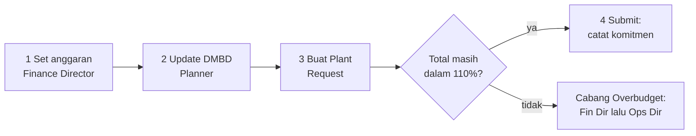
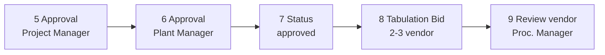
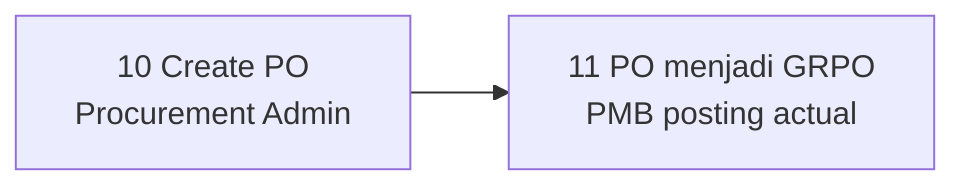
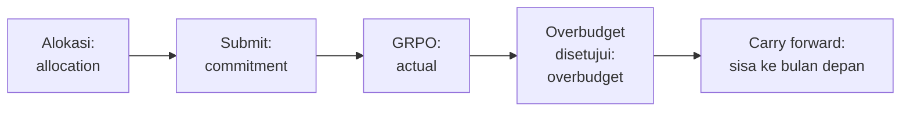

# Manual Simulasi — Plant Budget Tracker (PMB)

**Versi dokumen:** 1.8 · **Tanggal:** 22 September 2026
**Lingkungan uji:** aplikasi internal `http://192.168.32.149:86` (jaringan kantor)
**Versi aplikasi:** 22 September 2026 · **Sumber kebenaran bisnis:** `docs/concept.md` / `docs/concept-id.md`

> **Perubahan v1.8:** pencarian harga part number kini benar-benar **per part** dari SAP
> (harga PO terakhir → harga beli terakhir item master → harga historis permintaan sebelumnya),
> lengkap dengan **referensi sumber harga** di layar; koneksi baca SAP yang sebelumnya gagal juga
> diperbaiki (gap B-11 ditutup).

> **Perubahan v1.7:** form **alokasi anggaran** kini memakai daftar unit nyata dari ARKFLEET
> (dikelompokkan per tipe plant, SOLD/SCRAP dikecualikan) dan mendukung alokasi tingkat **divisi
> (tanpa unit)**; alokasi ganda untuk unit/periode yang sama ditolak (gap B-10 ditutup).

> **Perubahan v1.6:** layar **DMBD** kini punya kolom **Catatan Breakdown** (wajib diisi saat status
> Breakdown) dan daftar unit **berhalaman** dengan pencarian + filter status & proyek (gap B-9 ditutup).

> **Perubahan v1.5:** koreksi tanggal dokumen dan seluruh cap tanggal di dalamnya (semula tertulis
> 17 September 2026 — tanggal tersebut keliru, pekerjaan dan pemeriksaan dilakukan 22 September 2026).

> **Perubahan v1.4:** proyek aktif sekarang **dikelola dari halaman Admin → Proyek** (tombol aktif/
> non-aktif per proyek), dan **sinkronisasi ARKFLEET tidak lagi menimpa** pilihan manual. Proyek aktif
> saat ini: **021C, 022C, 025C, APS**. Skenario S-02 ditambah langkah uji kelola proyek aktif.

> **Perubahan v1.3:** bagian **Verifikasi Teknis** dihapus dari dokumen ini (dipindah ke lampiran
> teknis internal) supaya dokumen aman dibagikan ke pengguna non-IT.

> **Perubahan v1.2:** **menu sidebar** untuk Approvals (dengan badge jumlah pending), Overbudget,
> Cancellation, Interchange, dan SAP Sync sudah tersedia, dan **Plant Request draft sekarang bisa
> diedit** (unit, alokasi anggaran, SAP MR ID, dan baris material) selama statusnya masih `draft`
> dan hanya oleh pembuatnya. Gap B-4, B-7, dan B-19 di §10 ditutup.

> **Perubahan v1.1:** lima gap yang membuat alur berhenti sudah diperbaiki dan sudah live di server
> — form Overbudget, tombol Create PO, tombol Buat Bid + kelengkapan form vendor,
> tombol pembatalan & Agree, serta form Interchange + Sign-off. Skenario S-07, S-09, S-11, S-12,
> S-13 di bawah sudah memakai alur baru.

> Dokumen ini dipakai untuk **uji simulasi** (user acceptance test berbasis skenario) PMB.
> Semua langkah di bawah sudah diverifikasi terhadap kode yang terpasang di server, bukan asumsi.

---

## 1. Tujuan & Ruang Lingkup

Tujuan simulasi:

1. Membuktikan alur kerja tiap peran berjalan di aplikasi nyata (bukan mock).
2. Membuktikan kontrol anggaran (ledger, toleransi 110%) benar saat dijeda/melebihi batas.
3. Membuktikan pemisahan tugas (segregation of duties) dan pembatasan akses per proyek.
4. Menemukan kekurangan UI/UX sebelum aplikasi dipakai user sesungguhnya.

Yang **di luar** lingkup simulasi ini: perubahan konfigurasi server, pemasangan fitur baru,
dan penulisan ke SAP produksi (PO ke SAP hanya diuji setelah Iwan menyetujui).

---

## 2. Akses Aplikasi & Akun Simulasi

Buka `http://192.168.32.149:86` → diarahkan ke `/login`. Login memakai **email + password**.
Semua akun demo di bawah password: `password` (hanya untuk simulasi internal).

| # | Peran (role) | Email | Scope proyek | Fungsi utama di simulasi |
|---|--------------|-------|--------------|--------------------------|
| 1 | `planner` | planner@pmb.demo | 022C | Update DMBD, buat & submit Plant Request |
| 2 | `mechanic` | mechanic@pmb.demo | 022C | DMBD lihat saja, buat Plant Request |
| 3 | `project_manager` | project.manager@pmb.demo | 022C | Approval step 1 Plant Request |
| 4 | `plant_manager` | plant.manager@pmb.demo | 022C | Approval step 2, sign-off interchange |
| 5 | `logistic_foreman` | logistic.foreman@pmb.demo | 022C | (izin ada, UI belum tersedia) |
| 6 | `logistic_pic` | logistic.pic@pmb.demo | 022C | (izin ada, UI belum tersedia) |
| 7 | `buyer` | buyer@pmb.demo | global | Buat Tabulation Bid, interchange |
| 8 | `procurement_manager` | procurement.manager@pmb.demo | global | Review bid, award vendor |
| 9 | `procurement_admin` | procurement.admin@pmb.demo | global | Create PO (ke SAP) |
| 10 | `finance_director` | finance.director@pmb.demo | global | Set/revisi anggaran, carry-forward, approval overbudget |
| 11 | `operation_director` | operation.director@pmb.demo | global | Approval overbudget step 2 |
| 12 | `president_director` | president.director@pmb.demo | global | Izin approval PO (belum ada UI) |
| 13 | `it_manager` | it.manager@pmb.demo | global | Admin user/role/proyek, SAP sync dashboard |
| 14 | `aml_manager` / `aml_dept_head` | aml.manager@pmb.demo / aml.dept.head@pmb.demo | global | Modul Beta (component & cannibal) |

Akun non-demo: `rachmanj@gmail.com` (role `it_manager`, milik Iwan).

**Catatan penting:** role disimpan per "team" = `project_code`. User dengan scope 022C hanya
mendapat izin hanya pada konteks proyek 022C. Akun direktur, IT, dan pengadaan tidak terikat
satu proyek sehingga izinnya berlaku untuk semua proyek.

**Dua hal praktis yang sudah terbukti saat uji akses 22 Sep 2026:**

1. **Login dibatasi 5 percobaan per menit** (throttle). Jangan login berulang-ulang di satu menit —
   pakai jendela browser terpisah dan biarkan sesi tetap terbuka, kalau tidak akan muncul
   `429 Too Many Requests`.
2. **User tanpa scope proyek** (director, IT Manager, buyer, procurement\*) tidak punya proyek
   bawaan. Halaman anggaran/DMBD/plant request akan terbuka pada proyek default `000H`
   (Head Office) atau menampilkan **semua** unit (992 unit, lintas proyek). Untuk simulasi 022C,
   user tersebut harus memilih proyek **022C** pada dropdown Proyek di `/budget`, atau menambah
   parameter `?project_code=022C` pada halaman plant request.

---

## 3. Peta Menu per Role

Menu sidebar muncul otomatis mengikuti izin. Yang **tidak punya menu** tetap bisa dibuka lewat URL.

| Menu | URL | Izin yang dibutuhkan | Role pemilik |
|------|-----|----------------------|--------------|
| Dashboard | `/dashboard` | login | semua |
| Anggaran | `/budget` | `budget.view` | semua role |
| Buat/Revisi anggaran | `/budget/setting` | role `finance_director` | Finance Director |
| Plant Requests | `/plant-requests` | `plant_request.create` | Planner, Mechanic |
| DMBD | `/dmbd` | `dmbd.view` / `dmbd.update` | Planner, Mechanic, (lihat: manager, director) |
| Tabulation Bid | `/tabulation-bids` | `tabulation_bid.create` / `review` | Buyer, Procurement Manager |
| Reports | `/reports/...` | `reports.view` | hampir semua role |
| Components | `/components` | `component.view` + flag beta | AML |
| Pengguna / Role / Proyek | `/admin/users`, `/admin/roles`, `/admin/projects` | `user.manage` | IT Manager |
| Approvals | `/approvals` | menu muncul bila role Anda termasuk approver (badge = jumlah pending) | semua approver |
| Overbudget | `/overbudget` | izin `plant_request.create` atau `overbudget.approve.*` | Planner/Mechanic + Fin Dir + Ops Dir |
| Cancellation | `/cancellation` | izin `cancellation.plant` / `cancellation.procurement` | Plant + Procurement |
| Interchange | `/interchange` | izin `interchange.manage` atau role `plant_manager`/`aml_manager` | Procurement (+ sign-off Plant/AML) |
| SAP Sync Dashboard | `/sap/sync-dashboard` | khusus peran tertentu | IT Manager, Procurement Manager, Finance Director |

**Catatan menu (v1.2):** semua halaman kerja kini punya menu di sidebar — **Approvals** (badge jumlah
pending, hanya untuk role approver), **Overbudget**, **Cancellation**, **Interchange**, dan **SAP Sync**
(muncul sesuai izin/role), selain Dashboard, Anggaran, Plant Requests, DMBD, Tabulation Bid, Reports,
dan menu Admin untuk IT Manager.

---

## 4. Ringkasan Alur Kerja

### 4.1 Alur inti — tahap pengajuan

### 4.2 Alur inti — tahap persetujuan

### 4.3 Alur inti — tahap pengadaan ke SAP

### 4.4 Alur anggaran (ledger)

Aturan angka: **semua uang `DECIMAL(18,2)` + bcmath**, saldo **tidak pernah** diubah langsung —
selalu lewat entri ledger baru. Batas pemakaian = alokasi + carry forward, ditoleransi
`tolerance_pct` (default 10% → cap 110%).

---

## 5. Kondisi Data Awal (baseline 22 Sep 2026)

| Objek | Kondisi saat ini |
|-------|------------------|
| Proyek aktif | `021C`, `022C`, `025C`, `APS` (diatur di **Admin → Proyek**) |
| Proyek di cache (dari ARKFLEET) | 000H, 001H, 005P, 017C, 021C, 022C, 023C, 025C, 026C, APS |
| Periode anggaran | `000H` Sep 2026 (open, 2 alokasi, Rp 300 jt), `022C` Sep 2026 (open, 3 alokasi, Rp 295 jt) |
| Alokasi 022C | AC 035 / SUPPORT Rp 25 jt · ADT 001 / HAULER Rp 150 jt · E 062 / DIGGER Rp 120 jt (toleransi 10%) |
| Data unit (ARKFLEET) | API aktif; **194 unit untuk proyek 022C**, **992 unit** bila tanpa filter proyek |
| Plant request / bid / DMBD / overbudget / cancellation / interchange | **kosong** (belum ada transaksi) |
| Queue | `queue-plantbudget` jalan, queue kosong, `failed_jobs` kosong |
| Integrasi | ARKFLEET → `http://192.168.32.15/ark-fleet/api` (aktif); SAP Service Layer `https://192.168.32.26:50000/b1s/v1/` (terkonfigurasi, belum diuji tulis) |

Konsekuensi: simulasi dimulai dari nol transaksi. Semua nomor dokumen akan berurut mulai
`PMB-REQ-202609-0001`, `PMB-BID-202609-0001`, `PMB-OB-202609-0001`.

---

## 6. Persiapan Sebelum Simulasi (pre-flight)

| # | Langkah | Cara | Hasil yang diharapkan |
|---|---------|------|------------------------|
| P-1 | Pastikan aplikasi hidup | buka `http://192.168.32.149:86` | redirect ke `/login`, halaman tampil |
| P-2 | Pastikan data unit tersedia | login Planner → `/dmbd` | tabel terisi **194 unit** untuk proyek 022C (dari ARKFLEET). Kalau kosong → integrasi ARKFLEET bermasalah |
| P-3 | Pastikan anggaran ada | login Finance Director → `/budget` pilih 022C | tab Sep 2026 dengan 3 alokasi |
| P-4 | Pastikan proses latar belakang hidup | minta Dea memastikan di sisi server | perubahan DMBD & sinkronisasi berjalan, tidak menumpuk |
| P-5 | Siapkan akun per peran | tabel §2 | cukup buka 3–4 browser berbeda (mode incognito) agar sesi tidak tertukar |
| P-6 | Catat angka awal | catat anggaran & jumlah dokumen yang ada sebelum mulai (lihat layar, atau minta Dea cetak ringkasannya) | angka awal tercatat untuk pembanding |

**Saran teknis:** jalankan simulasi dengan minimal 4 jendela browser: Planner, PM, Plant Manager,
Procurement (Buyer/Manager). Approval dua tingkat tidak bisa dilakukan satu akun.

---

## 7. Skenario per Peran

Format: setiap skenario punya **langkah**, **hasil yang diharapkan**, dan **titik verifikasi**.
Kolom temuan dipakai di lembar observasi §9.

### S-01 · Finance Director — Melihat & menyiapkan anggaran

**Login:** `finance.director@pmb.demo`

1. Buka `/dashboard` → nama user + tag role `finance_director`.
2. Buka `/budget` → pilih proyek **022C** pada dropdown Proyek.
   - Diharapkan: tab periode Sep 2026 status `open`, 3 baris alokasi (AC 035, ADT 001, E 062)
     dengan kolom Alokasi / Carry Fwd / Komitmen / Aktual / Varians / Toleransi %.
3. Klik tombol **Buat Alokasi** (kanan atas) → halaman `/budget/setting`.
4. Isi: Proyek = `022C`, Bulan Periode = **Oktober 2026**.
   - Pilih unit pada kolom **Unit** (bisa dicari, dikelompokkan per tipe plant, label
     `kode unit — deskripsi (status)`). Unit berstatus **SOLD/SCRAP tidak muncul** karena tidak
     mungkin dianggarkan lagi. Tipe plant terisi otomatis bila tipenya dikenali
     (`DIGGER`/`HAULER`/`SUPPORT`); untuk unit bertipe `HEAVY EQUIPMENT` atau `n/a`, pilih tipe plant
     manual.
   - Kolom **Tingkat** menunjukkan **Per unit** atau **Divisi**.
   - Contoh: `E 062` DIGGER Rp 100.000.000; `ADT 001` HAULER Rp 80.000.000; toleransi 10%.
5. Tambah satu baris lagi lalu pilih **— Divisi (tanpa unit) —** (mis. tipe plant SUPPORT
   Rp 50.000.000) → baris ini menganggarkan tingkat divisi, bukan unit tertentu.
6. Klik **Simpan Anggaran**.
   - Diharapkan: kembali ke `/budget`, muncul tab **2026-10** berisi 3 alokasi (2 per unit + 1 divisi).
7. Coba simpan unit yang sama dua kali (tambahkan baris `E 062` lagi) → ditolak dengan pesan
   *"Unit ini dialokasikan lebih dari sekali dalam satu periode."* Begitu pula bila unit itu sudah
   punya alokasi pada periode 2026-10 → *"Unit ini sudah punya alokasi pada periode tersebut."*
8. Buat permintaan plant request (dari S-04) sampai total komitmen terpakai, lalu kembali ke sini.
9. Klik **Revisi** pada baris E 062 → ubah Alokasi menjadi Rp 90.000.000 → **Simpan**.
   - Diharapkan: nilai berubah, kolom Varians & Penggunaan ikut berubah.
10. Klik **Jalankan Carry Forward** pada tab periode yang masih `open`.
   - Diharapkan: periode menjadi `locked`, alokasi bulan berikutnya dibuat otomatis dengan
     kolom **Carry Fwd** terisi sebesar sisa anggaran.

**Cara memastikan (tanpa alat teknis)**
- Tabel **Anggaran** menampilkan angka Komitmen / Aktual / Varians yang berubah setelah revisi.
- Periode yang sudah di-carry forward tampil dengan penanda status **locked** pada tab bulannya,
  dan tombol revisi tidak muncul lagi.
- Bila ingin melihat jejak perubahan angkanya (reversal lalu alokasi baru), minta Dea menampilkan
  riwayat anggaran.

**Uji negatif**
- Coba buka `/budget/setting` dengan akun Planner → harus **403** (bukan 404).

---

### S-02 · IT Manager — Administrasi & integrasi

**Login:** `it.manager@pmb.demo`

1. Menu **Pengguna / Role & Permission / Proyek** tampil di sidebar.
2. `/admin/projects` → klik **Sinkronkan dari ARKFLEET**.
   - Diharapkan: daftar proyek dari ARKFLEET masuk; status aktif saat ini `021C`, `022C`, `025C`, `APS`.
   - Catat: daftar proyek dan status aktif diambil dari data aplikasi, jadi tetap tampil walau ARKFLEET
     sedang tidak bisa dihubungi (ada peringatan di atas tabel).
3. Uji kelola proyek aktif: geser tombol **Aktif** pada proyek `023C` menjadi aktif → muncul notifikasi;
   lalu klik **Sinkronkan dari ARKFLEET** lagi.
   - Diharapkan: `023C` **tetap aktif** setelah sinkronisasi (pilihan manual tidak tertimpa). Setelah itu
     kembalikan `023C` ke non-aktif.
4. `/admin/users` → **Tambah pengguna**: nama "Uji Planner 025C", email `uji.planner@pmb.demo`,
   password ≥ 8 karakter, division `plant`, project scope `025C`, aktif.
5. Assign role user baru: pilih role `planner` dengan project code `025C` → simpan.
6. Uji login akun baru itu di jendela lain → berhasil, menu Plant Requests + DMBD muncul.
7. `/admin/roles` → lihat daftar permission per role → tambah/hapus satu permission pada role
   `planner`, lalu login ulang sebagai planner untuk melihat efeknya.
8. `/sap/sync-dashboard` → halaman terbuka (untuk IT Manager, Procurement Manager, dan
   Finance Director); tabel Sync Logs masih kosong karena belum ada aktivitas ke SAP.

**Uji negatif:** buka `/admin/users` sebagai Planner → **403**. Buka `/sap/sync-dashboard`
sebagai Planner atau Plant Manager → **403** (yang boleh: IT Manager, Procurement Manager,
Finance Director).

**Hati-hati:** hapus user (`DELETE /admin/users/{id}`) bersifat permanen — gunakan hanya akun uji.

---

### S-03 · Planner / Mechanic — DMBD harian

**Login:** `planner@pmb.demo` (untuk ubah status), lalu ulangi sebagai `mechanic@pmb.demo` (uji batas)

1. Buka menu **DMBD** → judul menampilkan tanggal laporan dan nama proyek yang sedang dilihat.
2. Kenali baris filternya: kotak **cari unit** (kode/deskripsi), filter **status**
   (Semua/RFU/Standby/Breakdown), filter **proyek** (termasuk **Semua proyek**), dan ringkasan
   jumlah RFU / Standby / Breakdown hari ini.
3. Daftar unit sekarang **berhalaman** (25/50/100 per halaman, bisa diganti di bawah tabel) —
   tidak lagi menampilkan ratusan unit sekaligus. Coba pindah halaman dan pakai kotak pencarian
   untuk menemukan **E 062**.
4. Ubah status unit lain menjadi **Standby** lewat dropdown → tersimpan otomatis.
5. Ubah status **E 062** menjadi **Breakdown**:
   - Diharapkan: muncul jendela **Catatan Breakdown** (wajib, minimal 5 karakter). Isi penyebabnya,
     mis. "Hose bocor, menunggu part" → simpan.
   - Kolom **Catatan Breakdown** pada baris E 062 kini terisi; klik teksnya untuk melihat catatan penuh.
6. Klik tombol **Ubah Catatan** pada baris yang sama → ubah isi catatan (status tidak berubah) → simpan.
7. Pakai filter **status = Breakdown** → hanya unit berstatus breakdown yang tampil; ringkasan di atas
   tabel tetap menunjukkan total seluruh unit (bukan hanya halaman/filter aktif).
8. Login sebagai `mechanic@pmb.demo` → layar DMBD **hanya bisa dilihat**: status tampil sebagai label
   (tanpa dropdown), kolom catatan tetap terbaca, dan tombol Aksi tidak muncul.

**Cara memastikan (tanpa alat teknis)**
- Buka ulang halaman **DMBD**: status dan catatan yang baru diisi tetap ada untuk tanggal hari ini.
- Aturan satu unit satu status per hari: mengubah ulang unit yang sama akan menimpa, bukan menambah baris.
- Sinkronisasi balik ke ARKFLEET berjalan di latar belakang; minta Dea memeriksa bila perlu.

---

### S-04 · Planner — Membuat & submit Plant Request (alur utama)

**Login:** `planner@pmb.demo` (scope 022C)

1. Menu **Plant Requests** → tombol **Buat Request** → halaman `/plant-requests/create`.
2. Bagian **1. Unit / Equipment**: pilih unit `E 062 — …` (ketik "E 062" pada dropdown pencarian).
   - Diharapkan: field **Unit Code** dan **Plant Type** terisi otomatis (read-only).
3. Isi **SAP MR ID** dengan angka > 0, mis. `900001`.
   - Penting: nomor MR adalah **syarat submit**; draft dengan MR ID 0 tidak bisa di-submit.
4. Bagian **2. Budget Allocation**: pilih `E 062 · DIGGER` (alokasi Rp 120 jt, sisa penuh),
   perhatikan panel ringkas Alokasi / Komitmen+Aktual / Sisa / Penggunaan.
5. Bagian **3. Line Items**: baris pertama sudah tersedia.
   - Part Number: masukkan kode item SAP yang benar, mis. `SP-A30T` → klik **Cari harga** (atau
     biarkan; harga juga dicari otomatis saat field ditinggalkan). Perhatikan **tag sumber harga**
     (SAP Price / Tabulation / Manual / Belum ada) dan **referensi harga** di sampingnya, mis.
     `PO 260206551 · 2026-09-22` atau `Harga beli terakhir (item master SAP)`.
   - Uji juga part yang tidak punya harga di SAP (mis. `CE-SMALLFILTER`): hasilnya 0,00 dengan
     penanda "Belum ada" dan pesan *Harga tidak ditemukan — isi manual*. Ini bukan error.
   - Nama Material, UOM (EA/PCS/SET/…), Qty, Harga Estimasi (boleh diisi manual).
   - Klik **Tambah baris** untuk item kedua (mis. P/N `SEAL-KIT-002`, qty 2), lalu isi harganya.
6. Bagian **4. Ringkasan**: sekaligus cek **Estimasi Total** dan **Proyeksi Penggunaan Budget**
   (bar progress: hijau < 90%, kuning 90–110%, merah > 110%).
7. Klik **Simpan Draft** → diarahkan ke halaman detail request dengan nomor `PMB-REQ-202609-0001`.
8. Pada halaman detail klik **Submit**.
   - Diharapkan: status berubah `draft` → `pending_pm`, muncul baris approval step 1
     (`project_manager`) dan step 2 (`plant_manager`) dengan keputusan `pending`.

**Cara memastikan (tanpa alat teknis)**
- Daftar **Plant Requests** menampilkan nomor `PMB-REQ-…`, unit, total estimasi, dan status terbaru.
- Halaman **Anggaran** untuk proyek yang sama menunjukkan kolom Komitmen bertambah sebesar total request.
- Halaman detail request menampilkan dua baris persetujuan (Project Manager lalu Plant Manager)
  dengan status menunggu.

**Uji negatif 1 — melewati batas 110%**
Buat request baru pada alokasi **AC 035** (Rp 25 jt) dengan total ≈ Rp 30 jt lalu **Submit**.
- Diharapkan: sistem **menolak submit** dan mengarahkan ke halaman Overbudget dengan parameter
  (plant request, alokasi, jumlah, % kelebihan). Catat apakah form pengajuan overbudget tersedia.

**Uji negatif 2 — submit tanpa MR**
Buat draft dengan SAP MR ID = 0 → klik Submit → diharapkan ditolak (HTTP 403 / tak ada akses).
**Perbaikan alur (v1.2):** draft seperti ini sekarang bisa diperbaiki — buka detailnya, klik
**Ubah Draft**, isi SAP MR ID dan/atau perbaiki baris material, lalu **Simpan Perubahan**; setelah itu
Submit berhasil. Uji juga: draft bisa diedit **hanya oleh pembuatnya** (planner lain di proyek yang
sama harus mendapat 403), dan **hanya selama status `draft`** (setelah submit tombol Ubah Draft hilang).

**Uji batas scope proyek:** setelah login sebagai planner 022C, coba buka
`/plant-requests/create?project_code=021C` → daftar unit/alokasi mengikuti konteks proyek;
catat apakah user bisa bekerja di luar scope-nya (temuan penting untuk audit).

---

### S-05 · Project Manager — Approval tingkat 1

**Login:** `project.manager@pmb.demo` (022C)

1. Buka menu **Approvals** di sidebar (menu ini muncul untuk role approver, dengan badge jumlah
   approval yang menunggu).
2. Diharapkan: tabel berisi 1 baris `PlantRequest` dengan role `project_manager`, status pending.
3. Klik **Decide** → pilih **Approve** → isi Remarks "Sesuai kebutuhan breakdown E 062" → OK.
4. Buka `/plant-requests/{id}` untuk melihat status.
   - Diharapkan: status `pending_plant_mgr`, approval step 1 = `approved` (dengan nama approver),
     step 2 masih `pending`.
5. Uji **Return**: ulangi pada request lain, pilih **Return** dengan alasan.
   - Diharapkan: status request kembali `draft` dan komitmen anggaran **dibalik** (ledger
     `reversal` positif muncul kembali).
6. Uji **Reject**: request dengan status `rejected`, komitmen juga dibalik.
7. Uji negatif: coba Approve baris step 2 (role `plant_manager`) sebagai PM → tidak boleh
   (tombol tidak tampil / ditolak).

---

### S-06 · Plant Manager — Approval tingkat 2

**Login:** `plant.manager@pmb.demo` (022C)

1. Menu **Approvals** → baris `PlantRequest` role `plant_manager` → **Decide → Approve**.
2. Buka detail request → status akhir **`approved`**.
   - Diharapkan: kedua baris approval `approved`, dokumen siap diteruskan ke pengadaan.
3. Perhatikan: **belum ada** tombol lanjutan untuk membuat PR / mengubah status ke
   `pr_created` / `po_created` / `received` — catat sebagai temuan (status tersebut ada di
   model tetapi belum punya jalur UI).

---

### S-07 · Buyer — Tabulation Bid

**Login:** `buyer@pmb.demo`

1. Menu **Tabulation Bid** → klik tombol **Buat Bid** (kanan atas; hanya muncul untuk Buyer).
2. Isi **SAP PR ID** (mis. `PR-100001` — data uji). Untuk setiap vendor isi:
   **Kode Vendor**, **Nama Vendor**, **Harga**, **Ketersediaan Stok** (Ready / Indent / Partial),
   **Syarat Pembayaran** (opsional), **Catatan** (opsional).
3. Baris vendor mulai dengan 2. Klik **Tambah Vendor** untuk menambah (maksimum 3) atau **Hapus**
   pada baris ketiga untuk kembali ke 2.
4. Klik **Simpan**.
   - Diharapkan berhasil: nomor `PMB-BID-202609-0001`, status `pending_proc_mgr`, vendor otomatis
     diurutkan menurut harga (rank 1 = termurah), dan satu approval untuk `procurement_manager`.
   - Kalau ada field yang kosong, pesan validasi muncul di bawah field (tidak lagi gagal senyap).
5. Buka detail bid (`/tabulation-bids/{id}`) → tabel perbandingan vendor tampil, lengkap dengan
   ketersediaan stok tiap vendor.

**Uji negatif:** sebagai Buyer coba klik Award / Create PO → tidak muncul (hanya Procurement Manager
yang bisa review & award; Create PO untuk Procurement Admin).

---

### S-08 · Procurement Manager — Review & Award

**Login:** `procurement.manager@pmb.demo`

1. `/approvals` → baris `TabulationBid` role `procurement_manager` → **Approve**.
   - Diharapkan: status bid → `forwarded_admin`.
2. Buka `/tabulation-bids/{id}` → tombol **Award Lowest** muncul (karena belum ada award).
3. Klik **Award Lowest**.
   - Diharapkan: award tercatat untuk vendor termurah, status tetap `forwarded_admin`.
4. Uji aturan "bukan harga termurah wajib justifikasi": di luar UI, aturan ini memerlukan
   justifikasi ≥ 1 karakter; UI saat ini hanya menyediakan tombol Award Lowest — catat temuan.

---

### S-09 · Procurement Admin — Create PO ke SAP

**Login:** `procurement.admin@pmb.demo`

1. Buka bid yang sudah di-award (`/tabulation-bids/{id}`). Halaman menampilkan **vendor pemenang**
   beserta harga, dan tombol **Create PO** (muncul hanya untuk Procurement Admin yang bukan pembuat
   bid — pemisahan tugas).
2. Klik **Create PO** → muncul konfirmasi: *"Tindakan ini akan membuat Purchase Order nyata di SAP B1
   melalui antrian sinkronisasi…"*.
3. **Peringatan:** klik **Buat PO** hanya bila Iwan sudah menyetujui penulisan ke SAP. Setelah klik:
   job `CreateSapPurchaseOrder` masuk antrean `sap-writes`; bila sukses, `sap_po_id` terisi dan status
   bid menjadi `po_created`.
4. Buka `/sap/sync-dashboard` (IT Manager / Procurement Manager / Finance Director) → baris log
   `create_po` dengan status success/failed.
5. Kalau SAP belum siap, job gagal dan `sap_sync_failed` menjadi true dengan `sap_po_id = PENDING_SAP`
   — catat pesan errornya di lembar temuan (ini jalur yang benar, bukan crash).

**Uji negatif:** login sebagai Buyer (pembuat bid) lalu buka bid yang sama → tombol **Create PO**
tidak muncul; memaksa URL/aksi tetap ditolak server.

---

### S-10 · President Director & Logistics — izin tanpa layar

**Login:** `president.director@pmb.demo`, lalu `logistic.foreman@pmb.demo`

1. Sebagai President Director: buka `/dashboard`, `/budget`, `/reports/*`.
   - Izin `po.approve` ada di database tetapi **belum ada halaman approval PO** (approval PO
     saat ini dilakukan di SAP). Catat sebagai temuan.
2. Sebagai Logistic Foreman: menu yang muncul hanya Dashboard, Anggaran, DMBD, Reports.
   Izin `logistic.stock_check` dan `grpo.verify` belum punya halaman — catat sebagai temuan
   (kebutuhan alur "cek stok → buat PR" belum tersedia di UI).

---

### S-11 · Overbudget (Planner mengajukan → Finance Director → Operation Director)

1. Dari **S-04 uji negatif 1** sistem mengarahkan ke `/overbudget/create?...` dengan data terisi
   otomatis (plant request, alokasi, jumlah, % kelebihan).
2. Diharapkan: muncul kartu **Ajukan Overbudget** berisi ringkasan angka + kolom **Justifikasi**
   (wajib, minimal 10 karakter).
3. Isi justifikasi (mis. "Harga naik karena kurs; unit E 062 harus segera RFU") → klik
   **Ajukan Overbudget**. Diharapkan: nomor `PMB-OB-202609-0001`, status `pending_fin_dir`,
   dan muncul approval untuk `finance_director` lalu `operation_director`.
4. Login **Finance Director** → `/approvals` → baris `OverbudgetRequest` → **Approve**
   (uji juga **Reject** pada request kedua: status `rejected`, tidak ada entri ledger).
5. Login **Operation Director** → `/approvals` → **Approve**.
   - Diharapkan setelah kedua approval: status `approved`, ledger mendapat entri **`overbudget`**
     positif, dan plant request yang tertahan berubah dari `draft` menjadi `pending_pm`
     (lanjut ke S-05).
6. Buka `/overbudget` sebagai Planner → baris request terlihat dengan kolom Jumlah, Over %, Status.
   Tombol **Ajukan Overbudget Baru** juga tersedia untuk Planner/Mechanic.

**Cara memastikan (tanpa alat teknis)**
- Halaman **Overbudget** menampilkan nomor `PMB-OB-…`, jumlah, % kelebihan, dan status terbaru.
- Setelah kedua approval, halaman **Anggaran** menunjukkan tambahan anggaran, dan plant request yang
  tertahan berubah menjadi menunggu Project Manager.

---

### S-12 · Cancellation (Plant ↔ Procurement)

1. Buka `/plant-requests/{id}` untuk request yang sudah lewat approval → tombol
   **Ajukan Pembatalan** (muncul untuk Planner, Mechanic, Project Manager, Plant Manager, dan
   pihak Procurement).
2. Klik **Ajukan Pembatalan** → modal berisi **Tahap PO** (Created / Approved / Sent, default
   Created) dan **Alasan** (wajib) → klik **Ajukan**.
   - Diharapkan: nomor permintaan muncul di `/cancellation` dengan status `pending`,
     `initiated_by` = plant, dan `budget_reversal_amount` = total request.
3. Login akun **pihak lawan** (kalau plant yang mengajukan → Procurement: Buyer / Procurement
   Manager / Procurement Admin) → `/cancellation` → kolom Aksi menampilkan tombol **Agree** →
   klik.
   - Diharapkan: status cancellation `approved`, plant request menjadi `cancelled`,
     **komitmen anggaran dibalik** (ledger `reversal` positif).
4. Uji aturan stage-gate: ajukan pembatalan dengan **Tahap PO = Sent** sebagai Plant →
   ditolak server (pesan "Cannot cancel: PO has been sent", HTTP 422). Pembatalan PO yang sudah
   `sent` hanya bisa lewat Procurement.
5. Uji pembatasan: buka `/cancellation` sebagai Planner dan coba setujui permintaan yang
   diajukan Procurement → tombol **Agree** tidak muncul (hanya pihak lawan yang boleh).

**Cara memastikan (tanpa alat teknis)**
- Halaman **Cancellation** menampilkan baris permintaan (pengaju, tahap PO, jumlah pembatalan, status).
- Setelah disetujui: status Plant Request menjadi **cancelled**, dan kolom Komitmen di halaman
  Anggaran turun sesuai nilai pembatalan.

---

### S-13 · Interchange (Procurement + sign-off Plant)

1. Buka `/interchange` sebagai **Buyer** → kartu **Tambah Mapping** tampil di atas tabel.
2. Isi **Genuine P/N**, **OEM P/N**, **Nama Material** (semua wajib) → klik **Tambah Mapping**.
   - Diharapkan: baris baru muncul dengan penanda SAP **Pending** dan kolom Sign-off kosong.
3. Login sebagai **Plant Manager** (atau AML Manager) → `/interchange` → klik **Sign-off Teknis**
   pada baris tersebut.
   - Diharapkan: `technical_signoff_by` terisi nama penanda tangan, job `SyncInterchangeToSap`
     masuk antrean, penanda SAP berubah setelah job sukses.
4. Uji negatif: sebagai **Buyer** (pembuat mapping) tombol **Sign-off Teknis** tidak muncul;
   memaksa aksi ditolak server.

---

### S-14 · Laporan (semua role dengan `reports.view`)

1. klik menu **Reports** (default `/reports/budget-consumption`).
2. Ubah parameter di URL, mis. `/reports/budget-consumption?project_code=022C&month=2026-09`
   → tabel Budget Consumption (Unit / Allocated / Committed / Actual) terisi sesuai ledger.
3. `/reports/equipment-cost?project_code=022C&month=2026-09` → Equipment Cost Analysis.
4. `/reports/vendor-performance` → daftar vendor + % indent (dari bid yang sudah di-award).
5. Uji ekspor (URL langsung): `/reports/budget-consumption/export/pdf` dan `.../export/csv`.
   - Diharapkan: PDF/CSV terunduh.
   - **Temuan:** tombol ekspor belum ada di UI, dan izin `reports.export` **belum ditegakkan**
     pada alamat unduhannya (akun yang bisa melihat laporan juga bisa mengunduh). Catat untuk perbaikan.

---

### S-15 · Modul Beta (Component & Cannibal) — opsional

Modul ini di balik feature flag `FEATURE_CANNIBAL_BETA` (default **nonaktif** → `/components`
dan `/cannibal-requests` menjawab **404**).

1. Catat kondisi default: AML Manager mencoba `/components` → 404.
2. Bila Iwan ingin menguji: aktifkan flag di `.env` server, jalankan
   `php artisan config:clear` + `php artisan optimize` di container `php82`, lalu ulangi:
   - AML Manager: `/components` → pohon komponen (housing → inner → critical) — perlu data
     terlebih dahulu (belum ada form input di UI).
   - Planner/Mechanic: `/cannibal-requests/create` → form memakai **Equipment ID & DMBD Entry ID
     dalam bentuk angka** (belum ada pemilih unit). Alur: hanya DMBD berstatus **breakdown** dan
     cocok dengan unit asal yang boleh dipakai.
   - Approval 4 tingkat: Plant Manager → AML Manager → Operation Director → President Director.

---

## 8. Skenario End-to-End (agenda simulasi ± 120 menit)

| Waktu | Pelaku | Kegiatan | Skenario |
|-------|--------|----------|----------|
| 00:00–00:10 | Dea/moderator | Pre-flight §6, bagikan akun & URL | P-1…P-6 |
| 00:10–00:25 | Finance Director | Periksa anggaran 022C, buat periode Okt, revisi 1 alokasi | S-01 |
| 00:25–00:35 | Planner | Update DMBD (1 breakdown, 2 standby) | S-03 |
| 00:35–00:55 | Planner | Buat 2 plant request (satu wajar, satu melewati 110%) | S-04 |
| 00:55–01:05 | Project Manager | Approve 1, return 1 | S-05 |
| 01:05–01:15 | Plant Manager | Approve lanjutan sampai `approved` | S-06 |
| 01:15–01:30 | Buyer → Proc. Manager | Buat bid 3 vendor, approve, award termurah | S-07, S-08 |
| 01:30–01:40 | IT Manager | Sinkron proyek, tambah user, cek SAP dashboard | S-02 |
| 01:40–01:55 | Semua | Laporan + ekspor, catat temuan | S-14 |
| 01:55–02:00 | Moderator | Rekap temuan & prioritas perbaikan | §9 |

Hasil yang diharapkan di akhir sesi: **2 plant request** (1 `approved`, 1 kembali `draft`/`rejected`),
**1 tabulation bid** `forwarded_admin` dengan award, **≥3 entri DMBD**, ledger berisi
`allocation`, `commitment`, `reversal`, **1 periode Okt 2026**, dan **daftar temuan** terisi.

---

## 9. Lembar Observasi & Temuan

Isi saat simulasi (satu baris per temuan). Kolom "Bukti" bisa berupa nomor dokumen / screenshot.

| # | Skenario | Peran | Yang terjadi | Diharapkan | Severity (Tinggi/Sedang/Rendah) | Bukti |
|---|----------|-------|--------------|------------|-------------------------------|-------|
| 1 | | | | | | |
| 2 | | | | | | |
| 3 | | | | | | |

Ringkasan keputusan di akhir simulasi:

| Temuan | Keputusan (perbaiki / terima / tunda) | Penanggung jawab | Target |
|--------|---------------------------------------|------------------|--------|
| | | | |

---

## 10. Batasan yang Sudah Diketahui (bukan bug baru — tapi perlu dicatat)

Daftar ini hasil pemeriksaan aplikasi (22 September 2026) supaya penguji tidak salah tafsir.
**Sudah diperbaiki:** B-1, B-2, B-3, B-5, B-6 (v1.1); B-4, B-7, B-19 (v1.2); B-9 (v1.6); B-10 (v1.7); B-11 (v1.8). Semuanya sudah live
di server, jadi skenario terkait kini normal, bukan temuan.

| # | Modul | Kondisi |
|---|-------|---------|
| B-1 | ✅ Overbudget | **Diperbaiki 22 Sep 2026** — form pengajuan (prefill + justifikasi) sudah tersedia; sebelumnya alur berhenti di halaman daftar |
| B-2 | ✅ Cancellation | **Diperbaiki 22 Sep 2026** — tombol Ajukan Pembatalan di halaman Plant Request + tombol Agree di halaman Cancellation |
| B-3 | ✅ Interchange | **Diperbaiki 22 Sep 2026** — form pemetaan Genuine↔OEM + tombol Sign-off Teknis |
| B-4 | ✅ Approvals | **Diperbaiki 22 Sep 2026 (v1.2)** — menu sidebar dengan badge jumlah pending, muncul untuk role approver |
| B-5 | ✅ Tabulation Bid | **Diperbaiki 22 Sep 2026** — tombol "Buat Bid" + form vendor lengkap (ketersediaan stok, syarat pembayaran, catatan); sebelumnya penyimpanan selalu gagal validasi |
| B-6 | ✅ Tabulation Bid | **Diperbaiki 22 Sep 2026** — tombol Create PO tersedia (Procurement Admin, bukan pembuat bid) |
| B-7 | ✅ Plant Request | **Diperbaiki 22 Sep 2026 (v1.2)** — ada halaman **Edit draft** (`/plant-requests/{id}/edit`, tombol "Ubah Draft"): unit, alokasi, SAP MR ID dan baris material bisa diperbaiki; hanya pembuat & hanya status `draft` |
| B-8 | Status lanjutan | Tahap setelah approval (PR dibuat, PO dibuat, barang diterima) belum bisa diubah dari aplikasi — pemantauannya masih di SAP |
| B-9 | ✅ DMBD | **Diperbaiki 22 Sep 2026** — kolom **Catatan Breakdown** (wajib saat status Breakdown) + daftar unit berhalaman (25/50/100) dengan pencarian, filter status & filter proyek, serta ringkasan status harian |
| B-10 | ✅ Budget | **Diperbaiki 22 Sep 2026** — pilihan unit memakai daftar nyata dari ARKFLEET per proyek (bisa dicari, dikelompokkan per tipe plant; SOLD/SCRAP dikecualikan) dan alokasi tingkat **divisi (tanpa unit)** sudah tersedia, lengkap dengan pencegahan alokasi ganda |
| B-11 | ✅ Harga | **Diperbaiki 22 Sep 2026** — harga diambil **per part number** dari SAP (harga PO terakhir, lalu harga beli terakhir di item master), dengan **referensi** yang terlihat (mis. "PO 260206551 · 2026-09-22"); bila SAP tidak punya data dipakai harga historis part yang sama dari permintaan sebelumnya, dan hanya kalau semuanya kosong harga 0,00 + "Belum ada". Sekaligus diperbaiki: koneksi baca SAP yang selama ini gagal sehingga pencarian harga selalu nihil |
| B-12 | Laporan | Belum ada tombol unduh di layar laporan (unduhan hanya lewat alamat langsung), dan pembatasan siapa yang boleh mengunduh belum dijalankan penuh |
| B-13 | SAP Sync | Hanya bisa dibuka IT Manager, Procurement Manager, dan Finance Director |
| B-14 | Beta | Modul **Components** dan **Cannibal** (fitur tahap Beta) belum diaktifkan, jadi halamannya belum bisa dibuka |
| B-15 | Dashboard | Kartu statistik masih menampilkan nilai "—" (belum ada angka nyata) |
| B-16 | Batas akses | Menyimpan **draft** Plant Request belum dibatasi khusus ke Planner/Mechanic — akun lain yang login masih bisa membuat draft (submit tetap hanya untuk pembuatnya) |
| B-17 | Batas akses | Halaman Approvals, Tabulation Bid, Overbudget, Cancellation, dan Interchange bisa **dibuka** semua akun yang login; yang dibatasi adalah tindakannya (menyetujui, menetapkan vendor, menyimpan) |
| B-18 | Proyek bawaan | Akun direktur/pengadaan/IT tidak terikat proyek, jadi halaman terbuka di proyek `000H` dan layar DMBD menampilkan seluruh unit dari banyak proyek — rawan salah pilih |
| B-19 | ✅ Menu sidebar | **Diperbaiki 22 Sep 2026 (v1.2)** — Approvals, Overbudget, Cancellation, Interchange, dan SAP Sync sudah punya menu |

---

## 11. Troubleshooting

| Gejala | Sebab yang paling mungkin | Tindakan |
|--------|---------------------------|----------|
| Login gagal / muncul peringatan "terlalu banyak percobaan" | sistem membatasi 5 kali login per menit | tunggu 1 menit, lalu login lagi — jangan login berulang cepat |
| Halaman anggaran/plant request menampilkan proyek **000H** atau unit dari banyak proyek | akun direktur/pengadaan tidak terikat satu proyek | pilih proyek yang dituju pada dropdown **Proyek** di halaman Anggaran |
| Daftar unit kosong / muncul pesan "Data unit belum tersedia (cek koneksi ARKFLEET)" | koneksi ke sistem ARKFLEET (master unit) sedang bermasalah | laporkan ke Dea/IT; unit tidak bisa dipilih sampai koneksi pulih |
| Halaman putih atau muncul "Page expired" | sesi login kedaluwarsa | refresh halaman, login ulang |
| Muncul "403" / akses ditolak padahal seharusnya boleh | akun tidak punya izin untuk proyek tersebut | laporkan ke Dea — periksa penempatan proyek akun Anda |
| Submit Plant Request tidak jalan | nomor **SAP MR ID** masih 0, atau total melebihi batas 110% | buka detail draft → **Ubah Draft** → isi MR ID; kalau total melebihi batas, sistem mengarahkan ke alur Overbudget |
| Periode anggaran tidak bisa direvisi | periode tersebut sudah ditutup (locked) atau bulan lalu | hanya bulan berjalan & bulan ke depan yang bisa direvisi Finance Director |
| Tombol yang dicari tidak muncul | tombol memang hanya tampil untuk peran tertentu/pada status tertentu | cek tabel §3 (peran) dan status dokumen di §12.1, lalu catat di lembar temuan bila menurut Anda seharusnya muncul |

---

## 12. Referensi Cepat

### 12.1 Status dokumen

| Dokumen | Status | Arti |
|---------|--------|------|
| Plant Request | `draft` | baru dibuat, masih bisa diubah pembuatnya |
| | `pending_pm` | menunggu Project Manager |
| | `pending_plant_mgr` | menunggu Plant Manager |
| | `approved` | kedua approval selesai, komitmen anggaran aktif |
| | `rejected` / `cancelled` | ditolak / dibatalkan, komitmen dibalik |
| | `pr_created`, `po_created`, `received` | disiapkan untuk tahap SAP (belum ada jalur UI) |
| Tabulation Bid | `draft` → `pending_proc_mgr` → `forwarded_admin` → `po_created` → `closed` | urutan pengadaan |
| Overbudget | `pending_fin_dir` → `pending_ops_dir` → `approved` / `rejected` | |
| Cancellation | `pending` → `approved` / `rejected` | |
| DMBD | `rfu` / `standby` / `breakdown` | kondisi unit harian |

### 12.2 URL penting

| Fungsi | URL |
|--------|-----|
| Login | `/login` |
| Dashboard | `/dashboard` |
| Anggaran | `/budget` · `/budget/setting` |
| Plant Request | `/plant-requests` · `/plant-requests/create` |
| DMBD | `/dmbd` |
| Approval | `/approvals` |
| Tabulation Bid | `/tabulation-bids` · `/tabulation-bids/create` |
| Overbudget | `/overbudget` |
| Cancellation | `/cancellation` |
| Interchange | `/interchange` |
| Reports | `/reports/budget-consumption` · `/reports/vendor-performance` · `/reports/equipment-cost` |
| Admin | `/admin/users` · `/admin/roles` · `/admin/projects` |
| SAP | `/sap/sync-dashboard` |

### 12.3 Aturan bisnis yang wajib dipegang penguji

1. **Anggaran = ledger.** Tidak ada perubahan saldo langsung; koreksi = reversal + entri baru.
2. **Batas pemakaian 110%** (alokasi + carry forward, toleransi 10%) dihitung saat submit.
3. **Bulan berjalan saja** yang bisa dipakai/direvisi; bulan lampau terkunci (Finance Director
   boleh merevisi bulan berjalan & ke depan).
4. **Pemisahan tugas:** Buyer ≠ Procurement Admin untuk pembuatan PO; pembuat interchange tidak
   boleh menandatangani sendiri; sign-off teknis interchange oleh Plant/AML.
5. **Approval berjenjang** dan bersifat berurutan: step berikutnya tidak bisa dilompati.
6. **Satu DMBD per unit per hari** (entri ulang menimpa, tidak menggandakan).

---

## Lampiran A — Skenario Negatif Wajib (uji batas)

| # | Uji | Cara | Hasil yang benar |
|---|-----|------|------------------|
| N-1 | Planner buka anggaran setting | `/budget/setting` sebagai planner | 403 |
| N-2 | Finance Director buat plant request? | menu Plant Requests tidak muncul | halaman tetap bisa dibuka lewat URL, submit ditolak (catat temuan) |
| N-3 | Request melebihi 110% | total > cap pada alokasi | diarahkan ke alur Overbudget, komitmen tidak diposting |
| N-4 | Double approve | approve step 2 sebelum step 1 | ditolak ("not the current approval step") |
| N-5 | Award bukan termurah tanpa alasan | pilih vendor rank 2 | ditolak, minta justification |
| N-6 | Plant batalkan PO `sent` | pilih po_stage `sent` | ditolak (422) |
| N-7 | Mechanic update DMBD | ubah status di `/dmbd` | ditolak (tanpa izin `dmbd.update`) |
| N-8 | User scope 022C bekerja di 021C | buka create dengan `project_code=021C` | catat perilaku aktual sebagai temuan audit |

---

*Dokumen ini dibuat dari pemeriksaan aplikasi dan data pada 22 September 2026.
Setiap kali aplikasi diperbarui, daftar batasan (§10) perlu diperiksa ulang oleh Dea.*
