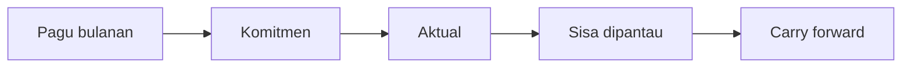

# Plant Monthly Budgeting (PMB)

### Ringkasan Aplikasi — bahan presentasi untuk pengguna

**Divisi Plant · PT. Arkananta** · **Tanggal:** 23 September 2026 · **Versi dokumen:** 1.0

---

## 1. Mengapa aplikasi ini dibuat

Divisi Plant menyerap **± 20–30% dari seluruh belanja perusahaan**. Sebelum ada aplikasi ini, pengendalian anggaran dan pengadaan suku cadang bergantung pada berkas Excel, pesan WhatsApp, dan pemeriksaan manual di SAP. Akibatnya:

- Anggaran bulanan tidak terlihat sampai laporan akhir bulan — **kebablasan baru ketahuan belakangan**.
- Permintaan suku cadang berjalan tanpa pemeriksaan pagu yang konsisten.
- Perbandingan vendor tidak seragam, sehingga sulit dipertanggungjawabkan.
- Status permintaan (sudah jadi PR? sudah jadi PO? barang sudah datang?) hanya bisa dicek satu-satu di SAP.
- Catatan breakdown alat berat tercatat di kertas, sulit direkap per unit.

**PMB hadir sebagai lapisan pengendalian**: setiap permintaan diperiksa terhadap pagu **sebelum** disetujui, setiap keputusan punya jejak, dan setiap rupiah punya catatan.

---

## 2. Apa yang dilakukan aplikasi ini

PMB mengelola **siklus anggaran dan pengadaan suku cadang Divisi Plant dari awal sampai barang diterima**, dengan delapan modul utama:

| # | Modul | Yang dikerjakan |
|---|-------|-----------------|
| 1 | **Anggaran** | Menetapkan pagu bulanan per unit alat berat atau per divisi, toleransi, dan carry forward bulan sebelumnya |
| 2 | **Plant Request** | Permintaan suku cadang dari Planner/Mechanic, lengkap dengan estimasi harga otomatis |
| 3 | **Approval** | Persetujuan berjenjang: Project Manager → Plant Manager |
| 4 | **Tabulation Bid** | Perbandingan 2–3 vendor secara terstruktur (stok, harga, syarat pembayaran) |
| 5 | **Pembuatan PR & PO** | Dokumen dikirim ke SAP dari aplikasi, status dipantau sampai barang diterima |
| 6 | **DMBD** | Catatan harian status alat berat (siap pakai / standby / breakdown) beserta penyebabnya |
| 7 | **Overbudget, Pembatalan, Interchange** | Jalur resmi bila permintaan melebihi pagu, dibatalkan, atau memakai part pengganti (genuine ↔ OEM) |
| 8 | **Dashboard & Laporan** | Angka anggaran, permintaan, pengadaan, dan kondisi unit hari ini; laporan bisa diunduh PDF/CSV |

---

## 3. Alur kerja dari permintaan sampai barang diterima

1. **Planner/Mechanic** membuat permintaan: unit, suku cadang, jumlah, dan alasan. Sistem langsung menampilkan **sisa anggaran unit tersebut** dan harga perkiraan per part number.
2. Sistem memeriksa pagu: bila permintaan masih dalam batas (pagu + toleransi), permintaan bisa diajukan. Bila melebihi, jalur **Overbudget** otomatis diwajibkan.
3. **Project Manager** lalu **Plant Manager** menyetujui. Setelah disetujui, anggaran unit tersebut tercatat sebagai **komitmen** — belum terpakai, tetapi sudah "dipesan".
4. **Buyer/Procurement** membuat perbandingan vendor (Tabulation Bid). **Procurement Manager** meninjau, lalu **Procurement Admin** membuat pesanan ke SAP.
5. Status akhir dipantau di aplikasi: **PR dibuat → PO dibuat → barang diterima** (dengan nomor GRPO dan tanggal terima). Saat barang diterima dan dokumennya terbaca dari SAP, anggaran berpindah dari **komitmen** menjadi **aktual**.

---

## 4. Cara anggaran dijaga

- **Pagu** ditetapkan setiap bulan per unit alat berat atau per divisi, dengan **toleransi standar 10%** (bisa diatur per baris).
- **Komitmen** muncul begitu permintaan disetujui; **aktual** muncul saat barang benar-benar diterima. Jadi selalu jelas mana yang baru direncanakan dan mana yang sudah terbelanja.
- **Tidak ada angka yang bisa ditimpa diam-diam.** Setiap perubahan dicatat sebagai catatan baru; koreksi dilakukan dengan membalik catatan lama lalu mencatat yang baru — cara ini membuat jejak audit selalu utuh.
- Bila permintaan **dibatalkan**, anggaran yang tadinya "dipesan" **kembali utuh**.
- Bila ada sisa, **carry forward** otomatis membawanya ke bulan berikutnya.
- Bulan yang sudah lewat **dikunci**; hanya bulan berjalan (dan bulan ke depan oleh Finance Director) yang bisa diubah.

---

## 5. Persetujuan dan pemisahan tugas

| Jenis keputusan | Siapa yang menyetujui |
|-----------------|----------------------|
| Permintaan suku cadang | Project Manager → Plant Manager |
| Permintaan melebihi pagu (overbudget) | Finance Director → Operation Director |
| Perbandingan vendor | Buyer menyusun → Procurement Manager meninjau |
| Pesanan pembelian (PO) | Procurement Admin membuat → President Director menyetujui |
| Pembatalan permintaan | Kesepakatan Plant **dan** Procurement, hanya bila PO belum dikirim |
| Pemetaan part pengganti (interchange) | Procurement menyusun → sign-off teknis dari Plant |

**Pemisahan tugas yang dijaga sistem:** pembuat perbandingan vendor **tidak boleh** menjadi orang yang membuat pesanan; penetapan pagu anggaran **hanya** Finance Director; persetujuan tidak bisa dilakukan oleh pengaju sendiri.

---

## 6. Siapa memakai apa (menu per peran)

| Peran | Menu yang muncul |
|-------|------------------|
| Planner & Mechanic | Anggaran, Plant Request, DMBD, Overbudget, Pembatalan, Laporan |
| Project Manager | Approvals, Overbudget, Pembatalan, Interchange, Anggaran, DMBD, Laporan |
| Plant Manager | Sama seperti Project Manager |
| Buyer | Tabulation Bid, Pembatalan, Interchange, Laporan |
| Procurement Manager & Admin | Approvals, Tabulation Bid, Pembatalan, Interchange, Laporan |
| Finance Director & Operation Director | Approvals, Overbudget, Anggaran, Laporan |
| President Director | Approvals, Tabulation Bid, Laporan |
| AML Manager | Approvals, Interchange |
| IT Manager | Seluruh modul pemeriksaan |
| Logistic Foreman & PIC | DMBD, Laporan |

Peran yang tidak berhak **tidak melihat menunya**, dan bila alamatnya dibuka langsung akan ditolak dengan pesan yang jelas.

---

## 7. Data yang dipakai — satu sumber, tanpa entri ganda

- **Data unit & proyek** diambil dari **ARKFLEET** (sistem pemantauan alat berat). Saat ini terdaftar **992 unit** (581 siap pakai, 72 tidak aktif, 339 sudah dilepas/skrap) yang tersebar di proyek aktif **021C, 022C, 025C, dan APS**. Contoh: 022C menaungi **194 unit**, 021C **99 unit**, APS **292 unit**.
- **Data pengadaan & harga** diambil dari **SAP**: riwayat permintaan, pesanan, penerimaan barang, dan harga pembelian terakhir per part number. Estimasi harga memakai **harga PO terakhir**, dan bila kosong memakai **harga beli terakhir di data induk barang** — lengkap dengan keterangan sumbernya, sehingga terlihat jelas dari mana angkanya berasal.
- PMB **tidak menyimpan ulang** data ARKFLEET/SAP; aplikasi ini membacanya agar tidak pernah ada dua versi kebenaran.
- **Proyek aktif** ditentukan oleh pengguna (saat ini 021C, 022C, 025C, APS) lewat menu Admin, dan pengguna tanpa ikatan proyek memakai pemilih proyek di bagian atas halaman.

---

## 8. Dashboard dan laporan

- **Dashboard** menampilkan angka nyata hari itu: pagu, terpakai, sisa, dan persentase terpakai bulan berjalan; jumlah permintaan per status; **peringatan "Perlu keputusan Anda"** bagi penyetuju; kondisi pengadaan; dan ringkasan **DMBD hari ini**.
- **Laporan** menyediakan tiga jenis: **Konsumsi Anggaran**, **Kinerja Vendor**, dan **Biaya Peralatan** — semuanya bisa **diunduh PDF atau CSV**. Hak melihat dan hak mengunduh dipisahkan: pengguna yang hanya berhak melihat tetap bisa membaca di layar, tetapi tidak bisa mengunduh.

---

## 9. Status aplikasi saat ini

- Aplikasi **sudah dipakai di lingkungan internal** dan dapat diakses dari jaringan kantor.
- **Seluruh 19 temuan** dari rangkaian pengujian sebelumnya **sudah selesai ditangani**; semua perbaikan sudah aktif di aplikasi, bukan sekadar rencana.
- Dua hal **sengaja belum dibuka penuh**: halaman **SAP Sync** hanya untuk IT Manager, Procurement Manager, dan Finance Director; serta modul **Components & Cannibal** yang masih berstatus uji coba (belum diaktifkan sampai ada persetujuan).
- Satu catatan operasional: setelah tombol **"Tandai Barang Diterima"** ditekan, nomor GRPO tercatat seketika, sedangkan **nilai aktual** anggaran terisi otomatis begitu dokumen penerimaan terbaca dari SAP. Jadi wajar bila sesaat masih tampil sebagai komitmen.

---

## 10. Manfaat yang diharapkan

1. **Tidak ada lagi kebablasan anggaran yang baru ketahuan akhir bulan** — pagu diperiksa saat permintaan dibuat, bukan setelah uang keluar.
2. **Setiap keputusan bisa ditelusuri** — siapa mengajukan, siapa menyetujui, kapan, dan atas dasar apa.
3. **Perbandingan vendor seragam dan siap diaudit.**
4. **Waktu tunggu lebih singkat** karena persetujuan dan pembuatan dokumen tidak lagi berpindah-pindah berkas.
5. **Kondisi alat berat terpantau harian** (siap pakai / standby / breakdown) beserta penyebabnya, sehingga keputusan pemeliharaan lebih cepat.
6. **Angka anggaran dan pengadaan dapat dipercaya** karena berasal dari catatan yang tidak bisa diubah diam-diam.

---

## 11. Langkah berikutnya

1. **Pengenalan dan pelatihan singkat per peran** (Planner/Mechanic, PM/Plant Manager, Procurement, Finance).
2. **Mulai dari data nyata**: tetapkan pagu bulan berjalan, lalu jalankan satu permintaan lengkap dari awal sampai barang diterima sebagai contoh bersama.
3. **Evaluasi bersama setelah satu bulan pemakaian** — khususnya ketepatan pagu, kecepatan persetujuan, dan kelengkapan catatan DMBD.

> **Catatan:** dokumen ini sengaja dibuat tanpa istilah teknis agar bisa dibagikan ke seluruh pengguna. Bila ada hal yang ingin ditambahkan (misalnya data contoh atau tangkapan layar), silakan beri tahu Dea.
