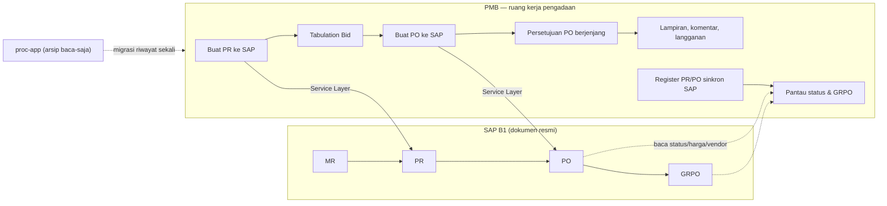

# Integrasi proc-app → PMB (Plant Budget Tracker) — Rencana Implementasi

> **Untuk Hermes/agen pelaksana:** kerjakan tugas per tugas (TDD), commit sering, deploy hanya setelah izin Iwan.
> Dokumen ini disusun 23 September 2026 (WITA), berdasarkan pemeriksaan langsung kedua repo.

**Tujuan:** tim Procurement mengerjakan seluruh urusan PO (pembuatan, persetujuan, lampiran, komunikasi, pantau status SAP) **di aplikasi PMB**, sehingga tidak lagi memakai aplikasi `proc-app`.

**Arsitektur ringkas:** SAP B1 tetap pemegang dokumen resmi (PR/PO/GRPO). PMB menjadi **ruang kerja pengadaan**: membuat PR/PO ke SAP (sudah ada), menambahkan register PR/PO hasil sinkron SAP, rantai persetujuan PO, lampiran, komentar, langganan dokumen (follow), master supplier & harga item, laporan pengadaan. `proc-app` diturunkan menjadi arsip baca-saja lalu dihentikan.

**Teknologi:** PMB — Laravel 11 (PHP 8.2.30 produksi), React 18 + Inertia + Ant Design 5, MySQL, queue Redis, Service Layer SAP untuk penulisan. proc-app — Laravel 11, Blade + AdminLTE 3, MySQL + koneksi baca langsung ke SQL Server SAP.

---

## 1. Kondisi saat ini (hasil pemeriksaan repo, bukan dugaan)

### 1.1 Yang sudah dimiliki PMB

| Kemampuan | Bukti di repo |
|---|---|
| Buat PR ke SAP | `app/Jobs/CreateSapPurchaseRequest.php`, `SapService::createPurchaseRequest()` |
| Buat PO ke SAP (dari Tabulation Bid) | `app/Jobs/CreateSapPurchaseOrder.php`, `SapService::createPurchaseOrder()` |
| Pantau status PO + GRPO | `app/Jobs/PollSapPoStatus.php`, `SapService::getPurchaseOrderStatus()`, `getGrpoByPoEntry()` |
| Baca SAP (MR/PR/PO/harga/vendor) | `app/Services/Sap/SapReadRepository.php` (10 method) |
| Siklus pengadaan setelah PO | `app/Http/Requests/ReceivePlantRequestRequest.php`, kolom `sap_po_id`, `sap_grpo_no`, `received_at` |
| Tabulation Bid (banding vendor) | `app/Models/TabulationBid*.php` (bid, vendor, award) + izin `tabulation_bid.create/review` |
| Rantai persetujuan terpusat | `app/Support/ApprovalChains.php` + `app/Services/Approval/ApprovalEngine.php` |
| Izin & peran | 30 izin, 15 peran (`database/seeders/RoleAndPermissionSeeder.php`); sudah ada `po.create` (procurement_admin) & `po.approve` (president_director) — **`po.approve` belum tersambung ke alur apa pun** |
| Komentar permintaan | `app/Models/RequestComment.php` + halaman permintaan |
| Laporan + unduh PDF/CSV | `app/Http/Controllers/ReportController.php`, `resources/views/pdf/` |
| Sinkron SAP tercatat | `app/Models/SapSyncLog.php`, halaman SAP Sync |
| **Belum ada**: lampiran berkas | tidak ada tabel lampiran, tidak ada pemakaian `UploadedFile` di controller |

### 1.2 Yang dimiliki proc-app (dan belum ada di PMB)

| Kemampuan | Bukti | Catatan |
|---|---|---|
| Register PR & PO hasil sinkron SAP | `app/Services/SapService.php` (baca `sap_sql`), `PrTemp`/`PoTemp` → `copyToPO()` | proc-app **tidak pernah menulis** ke SAP (hanya `select`) |
| Persetujuan PO berjenjang | `purchase_order_approvals`, `approval_levels` (level 1 **Procurement Manager**, level 2 **Director**), `approvers` | 2 tingkat |
| Penugasan dokumen | `po_assignments`, `pr_assignments` + izin "assign document" | |
| Lampiran PO | `po_attachments` + pivot `po_attachment_purchase_order` | lampiran PR sudah dihapus dari skema |
| Komentar + mention + lampiran | `comments`, `comment_mentions`, `comment_attachments` | |
| Langganan dokumen | `po_follows`, `pr_follows` | |
| Master supplier | tabel `suppliers` | |
| Master harga item + riwayat + impor | `item_prices`, `item_price_histories`, `item_price_imports` | Excel via `maatwebsite/excel` |
| Master gudang & jasa item | `warehouses`, `item_services` | |
| Sinkron SAP tercatat | `sync_logs` | |
| Laporan/chart pengadaan | `Reports/ReportsController.php`, `DashboardController` (PR status, PO trend, top suppliers, waktu persetujuan, PR per departemen) | |
| Cakupan | `DepartmentsTableSeeder` (17 departemen: PLANT, PROC, FIN, HCS, IT, LOGW, OPR, DNC, RNC, SHE, IAS, COMM, CORSEC, BOD, RND, ACC, APS), `ProjectsTableSeeder` (000H, 001H, 017C, 021C, 022C, 023C, APS) | **perusahaan-luas, bukan hanya Plant** |
| Peran | superadmin, admin, adminproc, director, buyer, user | |
| Lingkungan produksi | 192.168.32.13 — Windows + XAMPP (Apache 2.4.58, PHP 8.2.12), MySQL 3306, di balik Web Application Firewall | port 8000 di server yang sama menjalankan Laravel lain (PHP 8.4.6) — **bukan** proc-app |

### 1.3 Kesimpulan penting

1. **proc-app bukan sistem yang membuat PO di SAP.** Ia membaca PR/PO dari SAP, menyimpannya sebagai salinan, lalu menjalankan persetujuan + kolaborasi. PO resmi tetap lahir di SAP (kemungkinan diinput manual di SAP).
2. **PMB justru lebih kuat di sisi SAP**: PMB mampu **membuat** PR dan PO ke SAP lewat Service Layer dengan antrean + idempotensi. Jadi memindahkan pekerjaan PO ke PMB bukan sekadar memindahkan layar — ada peningkatan (PO langsung terbentuk di SAP).
3. **Cakupan berbeda**: proc-app melayani 17 departemen; PMB fokus Divisi Plant (dengan konteks proyek 021C/022C/025C/APS). Ini keputusan pertama yang harus diambil (lihat §15).
4. **Yang benar-benar baru untuk PMB**: lampiran berkas, komentar ber-mention, langganan dokumen, master supplier & harga item, register PR/PO sinkron SAP, rantai persetujuan PO yang aktif, laporan pengadaan.

---

## 2. Arsitektur target



Aturan tetap PMB yang harus dipatuhi (dari `.cursorrules` proyek):

- SAP **ditulis** hanya lewat DI API / Service Layer di dalam job antrean dengan idempotensi — **tidak pernah** `INSERT` SQL mentah.
- SAP **dibaca** boleh lewat koneksi baca-saja yang dibungkus repository.
- Jangan menggandakan tabel transaksi SAP; simpan kunci + kolom `_cache` untuk tampilan.
- Anggaran berbasis ledger (setiap peristiwa keuangan = entri ledger bertanda, tanpa ubah saldo langsung).
- Antarmuka bahasa Inggris, tema keuangan profesional, aturan anti-slop (38 aturan), angka ringkas.
- Jangan pasang `maatwebsite/excel` (batasan PHP) — impor harga item memakai CSV asli.

---

## 3. Rencana berfase

Setiap fase berdiri sendiri, dapat diuji, dan tidak mematikan proc-app sebelum fase terakhir.

### Fase 0 — Keputusan & pengukuran awal (0,5 hari)

**Tugas**

1. Catat keputusan Iwan untuk 4 pertanyaan §15 (cakupan, pemetaan Director, siapa yang berhak membuat PO, nasib proc-app).
2. Ukur volume data proc-app untuk perencanaan migrasi. Butuh akses baca MySQL `proc_app` (kredensial dari Iwan). Perintah pengukuran:
   ```
   mysql -h 192.168.32.13 -u <user> -p proc_app -e "
     SELECT 'purchase_orders' t, COUNT(*) n, MIN(doc_date) awal, MAX(doc_date) akhir FROM purchase_orders
     UNION ALL SELECT 'purchase_requests', COUNT(*), MIN(pr_date), MAX(pr_date) FROM purchase_requests
     UNION ALL SELECT 'po_attachments', COUNT(*), NULL, NULL FROM po_attachments
     UNION ALL SELECT 'comments', COUNT(*), NULL, NULL FROM comments
     UNION ALL SELECT 'item_prices', COUNT(*), NULL, NULL FROM item_prices;"
   ```
3. Ukur jumlah berkas lampiran dan total ukurannya (untuk perencanaan pemindahan berkas).
4. Simpan hasil ukur ke `docs/integration-proc-app-baseline.md` di repo PMB.

**Keluaran:** dokumen keputusan + angka dasar (jumlah dokumen, lampiran, komentar, harga item).

### Fase 1 — Register & pemantauan PO di PMB (inti permintaan Iwan)

**Tujuan:** tim Procurement bisa membuka PMB dan melihat seluruh PO (hasil buatan PMB maupun yang lahir di SAP), lengkap dengan status, GRPO, lampiran, komentar, dan penanda langganan.

**Skema baru** (migration di `database/migrations/`, satu migration per tabel):

| Tabel | Kolom kunci | Padanan proc-app |
|---|---|---|
| `sap_purchase_orders` | `sap_doc_entry` (unik), `doc_num`, `doc_date`, `po_delivery_date`, `po_eta`, `pr_no`, `unit_no`, `po_currency`, `total_po_price`, `po_with_vat`, `project_code`, `dept_code`, `po_status`, `po_delivery_status`, `budget_type`, `plant_request_id` (bila berasal dari PMB), `synced_at` | `purchase_orders` |
| `sap_purchase_order_lines` | `sap_purchase_order_id`, `line_num`, `vis_order`, `item_code`, `item_name`, `uom`, `qty`, `price`, `line_total`, `pr_no`, `pr_line_num` | `purchase_order_details` + `add_sap_line_identity_to_po_tables` |
| `po_attachments` | `sap_purchase_order_id`, `original_name`, `stored_path`, `mime`, `size`, `uploaded_by`, `uploaded_at` | `po_attachments` + pivot |
| `po_follows` | `sap_purchase_order_id`, `user_id`, `created_at` (unik pasangan) | `po_follows` |
| `document_comments` | `commentable_type`, `commentable_id`, `user_id`, `body`, `created_at` | `comments` |
| `document_comment_mentions` | `document_comment_id`, `user_id`, `read_at` | `comment_mentions` |
| `document_comment_attachments` | `document_comment_id`, `original_name`, `stored_path`, `mime`, `size` | `comment_attachments` |

Catatan rancangan: komentar & lampiran dibuat **polimorfik** (`commentable_type`) supaya bisa dipakai untuk permintaan plant (yang sudah punya `request_comments`), PO, dan PR tanpa menggandakan tabel. Bila lebih sederhana, `request_comments` yang ada diperluas dengan `commentable_type` (migrasi data kecil).

**Berkas aplikasi**

- `app/Models/SapPurchaseOrder.php`, `SapPurchaseOrderLine.php`, `PoAttachment.php`, `PoFollow.php`, `DocumentComment.php`
- `app/Http/Controllers/Procurement/PurchaseOrderController.php` (daftar, rincian, unduh lampiran, unggah lampiran, tandai follow)
- `app/Services/Sap/SapPurchaseOrderSync.php` (isi register dari SAP)
- `resources/js/Pages/Procurement/PurchaseOrders/Index.tsx`, `Show.tsx`
- `resources/js/Components/AttachmentsPanel.tsx`, `CommentsPanel.tsx`, `FollowButton.tsx` (dipakai ulang di halaman PO/PR/permintaan)
- `database/seeders/RoleAndPermissionSeeder.php`: izin baru `po.view` (semua peran pengadaan + plant), `po.attach`, `po.comment`
- `routes/web.php`: grup `/procurement/purchase-orders`

**Tugas (TDD, satu tugas ≈ satu commit)**

1. Tulis tes gagal `tests/Feature/Procurement/PurchaseOrderRegisterTest.php`: user `procurement_admin` melihat daftar PO; user `mechanic` ditolak 403.
2. Buat migration + model `sap_purchase_orders` / `sap_purchase_order_lines`; jalankan tes → hijau.
3. Tambah `SapPurchaseOrderSync` yang menarik PO dari SAP (halaman + filter tanggal, mengikuti pola `Master/SyncWithSapController` proc-app), simpan idempoten berdasarkan `sap_doc_entry`; tes: sinkron dua kali tidak menggandakan baris.
4. Tambah izin + halaman daftar PO (kolom: No. PO, Tanggal, Proyek, Dept, Supplier, Total, Status, Delivery, PR, GRPO, Aksi) dengan filter; tes inersia props.
5. Tambah halaman rincian PO (baris item, tautan ke permintaan plant bila ada, riwayat status).
6. Tulis tes gagal untuk lampiran; buat tabel `po_attachments` + komponen unggah/unduh; batasi jenis berkas (pdf/xlsx/docx/jpg/png) dan ukuran (usul 10 MB).
7. Tulis tes gagal untuk komentar + mention; buat `document_comments` + panel komentar (pakai ulang pola `request_comments` yang sudah ada).
8. Tulis tes gagal untuk langganan; buat `po_follows` + tombol **Follow** dan daftar "PO yang saya ikuti".
9. Jalankan seluruh suite (`php artisan test`) — target: tetap hijau, ditambah ≥ 25 tes baru.

**Kriteria terima fase 1:** tim Procurement bisa membuka daftar PO di PMB, mencari PO, membuka rincian, mengunggah/mengunduh lampiran, berkomentar, dan menandai PO yang diikuti — di lingkungan uji, dengan data hasil sinkron SAP.

### Fase 2 — Persetujuan PO yang berjalan di PMB

**Tujuan:** alur persetujuan PO yang tadinya di proc-app (Procurement Manager → Director) hidup di PMB dan/atau tersambung ke PO SAP.

**Tugas**

1. Perluas `app/Support/ApprovalChains.php` dengan jenis `PurchaseOrder`: usul `procurement_manager` → `president_director` (atau `operation_director`, tergantung keputusan §15) + ambang nilai (mis. > Rp 100 juta wajib tingkat direktur).
2. Migration `po_approvals` (atau pakai ulang `request_approvals` polimorfik) + model.
3. `PurchaseOrderController::submit/approve/reject` memakai `ApprovalEngine` (sudah ada) — **jangan** membuat mesin baru.
4. Halaman **PO Approvals** untuk Procurement Manager & President Director, plus kartu "Perlu keputusan Anda" di Dashboard (pola ini sudah dipakai di PMB untuk permintaan plant).
5. Tes: rantai berurutan, tolak di tingkat 1 menghentikan alur, izin salah → 403, ambang nilai menentukan jumlah tingkat.
6. Bila PO dibuat lewat PMB (Tabulation Bid → Buat PO), persetujuan **sebelum** penulisan ke SAP; bila PO datang dari SAP (sudah ada di SAP), persetujuan bersifat pencatatan tata kelola + status.

**Kriteria terima fase 2:** PO baru dari PMB tidak terkirim ke SAP sebelum disetujui sesuai rantai; setiap keputusan tercatat dengan pelaku, waktu, dan catatan.

### Fase 3 — Master supplier & harga item

**Tugas**

1. `sap_suppliers` (cache vendor master: `card_code`, `card_name`, `payment_terms`, `currency`, `synced_at`) dari `SapService::getVendorMaster()`; halaman daftar supplier (baca-saja).
2. `item_prices`, `item_price_histories`, `item_price_imports` (padanan proc-app) + impor **CSV** (bukan Excel, sesuai batasan PHP proyek).
3. Sambungkan ke halaman permintaan plant: harga item memakai hierarki yang sudah ada (PO terakhir → harga item master → histori → "belum ada") dan riwayat impor harga tampil di rincian item.
4. Tes: impor CSV dua kali tidak menggandakan baris; harga terbaru menang; riwayat tersimpan.

**Kriteria terima fase 3:** tim Procurement memperbarui harga item massal lewat CSV di PMB dan supplier tampil sebagai master baca-saja.

### Fase 4 — Register PR + laporan pengadaan

**Tugas**

1. `sap_purchase_requests` + baris (padanan `purchase_requests`/`purchase_request_details`: `pr_draft_no`, `pr_no`, `pr_date`, `pr_rev_no`, `pr_type`, `project_code`, `dept_name`, `for_unit`, `hours_meter`, `required_date`, `requestor`, `remarks`, `pr_status`, `closed_status`).
2. Sinkron PR dari SAP (halaman + filter tanggal + `SapSyncLog`).
3. Laporan pengadaan di PMB (padanan 5 laporan proc-app): status PR, tren PO, supplier teratas, waktu persetujuan, PR per departemen — plus tombol **Download PDF/CSV** mengikuti infrastruktur laporan PMB yang sudah ada.
4. Halaman **Daily PR** (padanan `Master/DailyPRController`).

**Kriteria terima fase 4:** keempat laporan proc-app tersedia di PMB dengan ekspor PDF/CSV dan angkanya sama dengan proc-app untuk periode yang sama (diuji berdampingan).

### Fase 5 — Migrasi riwayat, jalan berdampingan, dan pensiun proc-app

**Tugas**

1. Perintah artisan `proc-app:import-legacy` (khusus lingkungan uji dulu): impor riwayat `purchase_orders`, `purchase_order_details`, `purchase_requests`, `purchase_order_approvals` ke tabel PMB dengan penanda `legacy_source='proc_app'`; idempoten (kunci `sap_doc_entry` + `line_num`).
2. Pindahkan berkas lampiran (tarik dari server 13 → simpan di storage PMB), verifikasi jumlah & ukuran berkas cocok.
3. Impor komentar, mention, langganan, dan harga item.
4. Rekonsiliasi: bandingkan jumlah dokumen, total nilai per proyek, jumlah lampiran, jumlah komentar antara proc-app dan PMB; tulis hasilnya di `docs/integration-proc-app-migration-report.md`.
5. **Jalan berdampingan 1 bulan:** proc-app tetap hidup tetapi hanya baca (hapus tombol unggah lampiran/komentar/persetujuan dari tampilannya), sementara semua pekerjaan baru dilakukan di PMB.
6. Setelah Iwan menyatakan stabil: matikan login proc-app (halaman pemeliharaan), simpan basis datanya sebagai arsip, dan hapus jadwal sinkronnya.

**Kriteria terima fase 5:** tidak ada dokumen yang hilang atau berganda (jumlah & nilai cocok), lampiran utuh, dan tim Procurement bekerja penuh di PMB selama ≥ 1 bulan tanpa kembali ke proc-app.

---

## 4. Pemetaan peran & izin

| proc-app | PMB (peran) | Izin baru yang perlu ditambah |
|---|---|---|
| `adminproc` (Admin Procurement) | `procurement_admin` | sudah ada `po.create`; tambah `po.view`, `po.attach`, `po.comment`, `item_price.manage`, `sap_sync.run` |
| `buyer` | `buyer` | `po.view`, `po.attach`, `po.comment` |
| `director` (tingkat 2 persetujuan) | `president_director` (usul, §15) | sudah ada `po.approve` — **perlu disambungkan** ke `ApprovalChains` |
| `admin` / `superadmin` | `it_manager` | `sap_sync.run`, `user.manage` (sudah ada) |
| `user` (pemohon) | `planner` / `mechanic` / `logistic_*` | `po.view` (hanya PO milik proyeknya) |
| — | `procurement_manager` | `po.view`, `po.approve.mgr`, `po.attach`, `po.comment` |

Catatan penting: PMB punya 15 peran; proc-app hanya 6. Jangan memaksa persamaan satu-satu — yang dibutuhkan adalah **fungsi** yang sama tersedia bagi peran pengadaan yang sudah ada di PMB.

---

## 5. Persetujuan PO — usul rantai

| Nilai PO | Rantai usulan | Padanan proc-app |
|---|---|---|
| ≤ Rp 100.000.000 | Procurement Manager | level 1 |
| > Rp 100.000.000 | Procurement Manager → President Director | level 1 → level 2 (Director) |

Bila PMB menerima PO yang sudah terbit di SAP (hasil sinkron), persetujuan di PMB dicatat sebagai **governance trail** (bukan syarat penulisan SAP) dan diberi penanda "sudah terbit di SAP".

Ambang nilai di atas adalah usulan — angkanya perlu keputusan Iwan.

---

## 6. Detail teknis SAP di PMB

- **Tulis (create PR/PO):** tetap `SapService` + job antrean (`CreateSapPurchaseRequest`, `CreateSapPurchaseOrder`) dengan idempotensi yang sudah ada (`SapCircuitBreaker`, `SapSyncLog`).
- **Baca massal (register PR/PO):** dua opsi —
  1. **Service Layer dengan paging** (`GET /b1s/v1/PurchaseOrders?$filter=...&$skip=..&$top=..`) — tidak perlu kredensial baru, konsisten dengan cara PMB bekerja; aman untuk volume kecil–sedang.
  2. **Koneksi baca-saja ke SQL Server SAP** (meniru `list_po.sql` / `list_pr_generated.sql` proc-app) — cepat untuk volume besar, tetapi menambah kredensial & ketergantungan skema.
  Usul: mulai opsi 1; ukur waktu sinkron pada Fase 1; pindah ke opsi 2 hanya bila durasi melebihi ± 2 menit untuk 1 bulan data. Bila pindah, koneksi diberi nama `sap_read_sql`, pengguna baca-saja, dan dibungkus `SapBulkReadRepository` (tidak ada penulisan).
- **Penjadwalan:** job sinkron PO tiap 15 menit di `scheduler-plantbudget`; job status PO (`PollSapPoStatus`) sudah ada — cukup diperluas agar ikut mengisi register.
- **Anti-ganda baris:** ikuti pelajaran proc-app — simpan identitas baris SAP (`doc_entry`, `line_num`, `vis_order`) dan lakukan `updateOrCreate` berdasarkan kunci itu (lihat `add_sap_line_identity_to_po_tables` di proc-app).

---

## 7. Antarmuka (React + Inertia + AntD, bahasa Inggris)

| Layar baru di PMB | Padanan proc-app | Catatan tampilan |
|---|---|---|
| `/procurement/purchase-orders` | PO index | kolom mengikuti PMB: angka ringkas (Rp 1,2 jt), filter proyek/dept/supplier/status/tanggal, tag status warna |
| `/procurement/purchase-orders/{id}` | PO show | baris item, kartu lampiran, panel komentar + mention, tombol Follow, riwayat persetujuan, tautan dokumen SAP |
| `/procurement/purchase-requests` | PR index | daftar PR hasil sinkron + PR yang lahir dari permintaan plant |
| `/procurement/approvals` | PO approvals | antrean sesuai peran |
| `/procurement/suppliers` | supplier master | baca-saja dari vendor master SAP |
| `/procurement/item-prices` | item price | daftar, riwayat, impor CSV |
| `/procurement/sap-sync` | Master → Sync With SAP | perluas halaman SAP Sync PMB yang sudah ada |
| `/procurement/reports/*` | 5 laporan | pakai infrastruktur laporan PMB (PDF/CSV) |

Tetap mematuhi standar tampilan PMB yang sudah berlaku: bahasa Inggris, tema keuangan profesional (teal/emerald), aturan anti-slop, tanpa grafik berlebihan, dan menu sidebar menyorot halaman aktif (sudah diperbaiki).

---

## 8. Pengujian & verifikasi

- Setiap tugas: tes fitur gagal → implementasi → hijau; suite penuh (`php artisan test`) harus tetap hijau (saat ini 222 tes / 1.021 asersi).
- `npm run build` sebelum commit; deploy prod hanya setelah izin Iwan.
- Verifikasi lapangan (setelah deploy ke uji): sinkron 1 bulan PO dari SAP; cocokkan jumlah & total dengan proc-app; unggah lampiran; komentar + mention; jalankan satu persetujuan penuh; ekspor 5 laporan.
- Untuk setiap penulisan SAP: uji di lingkungan uji lebih dulu, dan pastikan job antrean memakai idempotensi (sinkron ulang tidak boleh menghasilkan dokumen kedua).
- Tidak membuat data transaksi palsu di produksi; semua uji penulisan memakai proyek/periode uji lalu dibersihkan.

---

## 9. Risiko & penanganan

| Risiko | Dampak | Penanganan |
|---|---|---|
| Cakupan proc-app perusahaan-luas vs PMB Plant | Modul PO PMB jadi tidak lengkap untuk departemen lain | Keputusan §15 lebih dulu; bila perusahaan-luas, tambahkan dimensi departemen pada register PR/PO dan longgarkan keterkaitan wajib ke anggaran Plant |
| Dua sumber kebenaran selama transisi | Dokumen diproses di dua tempat | proc-app dibekukan jadi baca-saja saat Fase 5 mulai; ada tanggal henti yang tegas |
| Kredensial & akses server 13 | Migrasi riwayat tidak bisa jalan | Minta kredensial di Fase 0 (Dea belum punya) |
| Volume sinkron SAP besar | Halaman lambat | Paging Service Layer + cache; pindah ke koneksi baca-saja bila perlu |
| Lampiran besar | Penyimpanan & unggahan gagal | Batas ukuran/jenis berkas, simpan di storage PMB, sertakan pemeriksaan ukuran saat migrasi |
| Persetujuan PO yang sudah terbit di SAP | Rantai tidak bisa membatalkan PO SAP | Jelas dibedakan: approval PMB = tata kelola; pembatalan lewat alur Cancellation yang sudah ada |
| Perubahan skema SAP | Sinkron pecah | Bungkus di repository + tes pemetaan kolom; `SapSyncLog` mencatat kegagalan |

---

## 10. Pertanyaan terbuka (butuh keputusan Iwan)

1. **Cakupan:** apakah PMB mengambil alih PO untuk **hanya Divisi Plant**, atau **seluruh departemen** (17 departemen seperti di proc-app)? Ini menentukan besar pekerjaan (bagian ini bisa menambah 30–50%).
2. **Tingkat persetujuan direktur:** proc-app memakai "Director". Di PMB padanannya President Director, Operation Director, atau keduanya, dan berapa ambang nilai yang mewajibkan tingkat direktur?
3. **Siapa yang berhak menekan "Create PO"** (tulis ke SAP) di PMB — tetap Procurement Admin (seperti sekarang: izin `po.create`), atau Procurement Manager?
4. **Nasib proc-app:** dihentikan total setelah migrasi, atau tetap hidup sebagai arsip baca-saja untuk data sebelum 2026?
5. **Kredensial:** Dea butuh akses baca basis data `proc_app` (dan cara menarik berkas lampiran dari server 13) untuk mengukur dan memigrasikan riwayat.

---

## 13. Hasil pengukuran awal (Fase 0 — sudah dijalankan 23 September 2026)

Basis data: `procapp` di 192.168.32.13 (MariaDB 10.4.32), akses baca-saja. Rincian penuh di
`docs/integration-proc-app-baseline.md`. Ringkasnya:

- **10.904 PO** (2025-06-05 → 2026-09-23) dan **14.147 PR**; baris PO 35.453 dengan nilai baris
  **Rp 838,26 miliar**.
- **Nilai PO tidak tersimpan di kepala dokumen** (`total_po_price` nol untuk semua baris) — hanya ada
  di baris item. Register PMB harus menjumlahkan dari baris atau mengambil dari SAP.
- **Lampiran: 3.146 berkas / 639 MB di disk** untuk PO, **ditambah 22.296 berkas / 7,1 GB untuk PR**
  (tabel `pr_attachments` masih dipakai, 21.984 baris) → total ± 7,7 GB yang perlu dimigrasikan.
  Terverifikasi lewat SSH: commit produksi `2c0614d` identik dengan repo, `DB_DATABASE=procapp`.
- **Fitur kolaborasi tidak terpakai**: `comments`, `comment_mentions`, `comment_attachments` = 0 baris,
  `po_follows` = 1 baris. Tidak ada riwayat komunikasi yang perlu dimigrasikan.
- **Cakupan 97% proyek Plant** (022C, 017C, 021C, 025C, APS, 000H). Per departemen:
  PLANT 7.130 · LOGW 2.529 · HCS 588 · SHE 179 · IT 151 · sisanya < 150.
- **Pemakai: 13 akun** (buyer 8, admin 1, adminproc 1, director 1, logistic 1, superadmin 1).
- Pola identitas baris SAP (`sap_doc_entry`, `sap_line_num`, `sap_vis_order`, `line_identity`) sudah
  dipakai proc-app dan harus ditiru PMB agar sinkron ulang tidak menggandakan baris.

---

## 11. Perkiraan usaha

| Fase | Isi | Perkiraan |
|---|---|---|
| 0 | Keputusan + pengukuran | 0,5 hari |
| 1 | Register PO + lampiran + komentar + follow | 5–7 hari |
| 2 | Rantai persetujuan PO | 3–4 hari |
| 3 | Supplier + harga item (CSV) | 3–4 hari |
| 4 | Register PR + 5 laporan | 4–5 hari |
| 5 | Migrasi riwayat + jalan berdampingan + pensiun | 3–5 hari |
| | **Total** | **± 19–26 hari kerja** (+30–50% bila cakupan seluruh departemen) |

---

## 12. Urutan yang Dea usulkan

Fase 1 lebih dulu (paling terasa manfaatnya bagi tim Procurement dan tidak menyentuh penulisan SAP), lalu Fase 2 (persetujuan), baru master & laporan, dan terakhir migrasi + pensiun proc-app. Setiap fase: uji di lingkungan uji, tunjukkan ke Iwan, baru lanjut.
